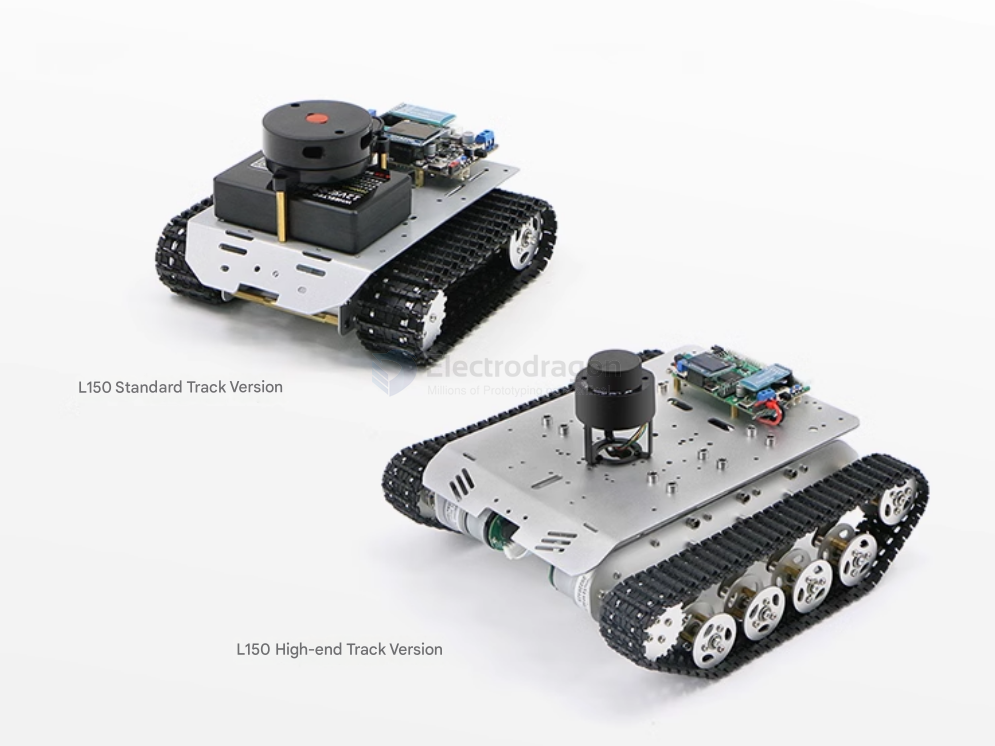
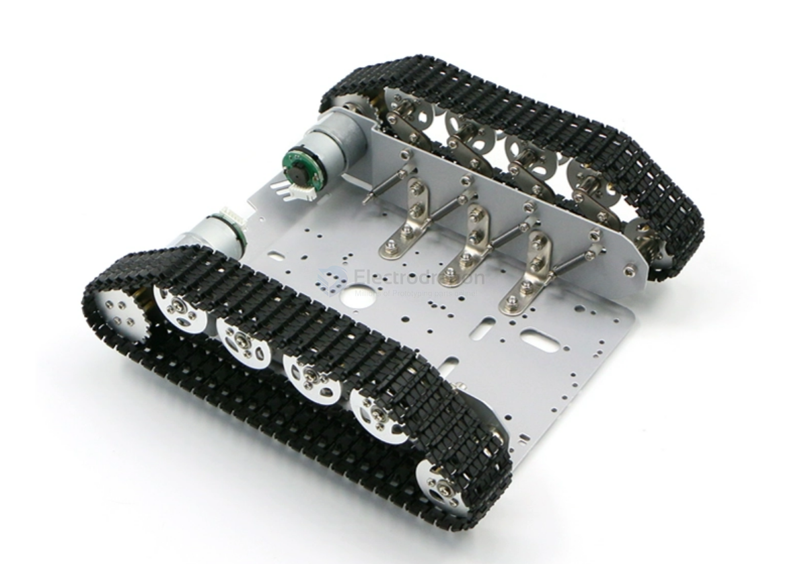
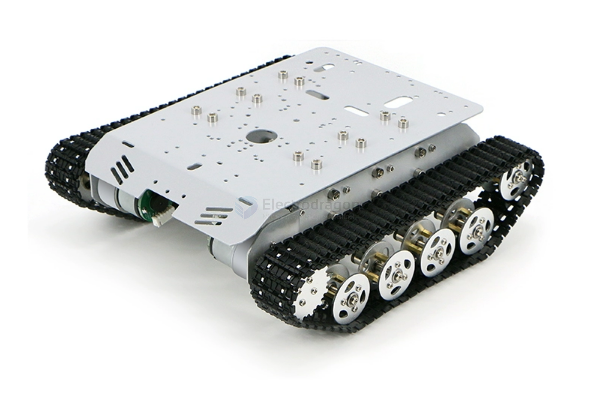
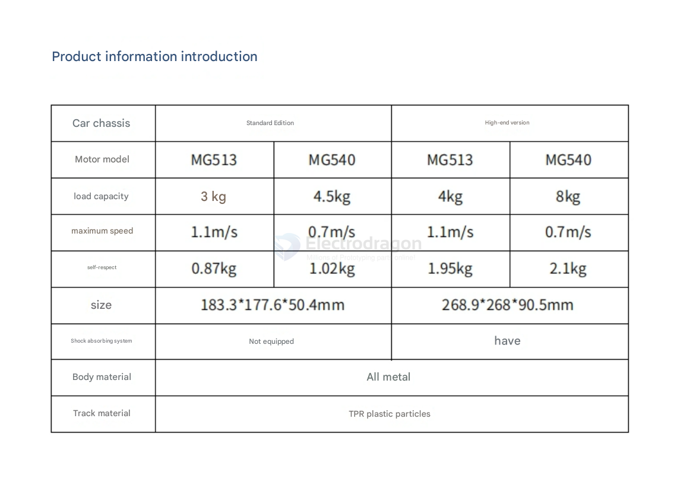
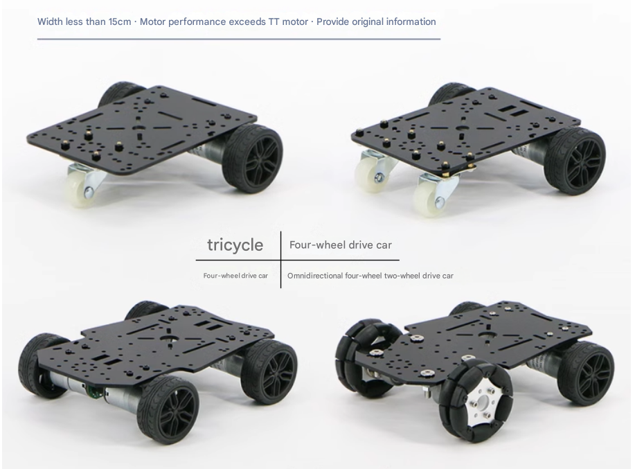

# RC-car-dat

- [[video-RC-car-dat]]

basic [[tech-dat]] - [[robot-dat]]

## Tracked robot platform 

## tricycle / four-wheels platform

tricycle

Four-wheel two-drive car

Four-wheel drive car

Omnidirectional four-wheel two-wheel drive car

## other 

### robot tank with camera 

- https://github.com/YahboomTechnology/Raspberry-pi-G1-Tank

## read 

- [Tear down and Learn a good-build $20 RC Toy Car](https://www.electrodragon.com/disassemble-and-learn-a-good-build-20-rc-toy-car/)

## ref 

- [[RC-car]]