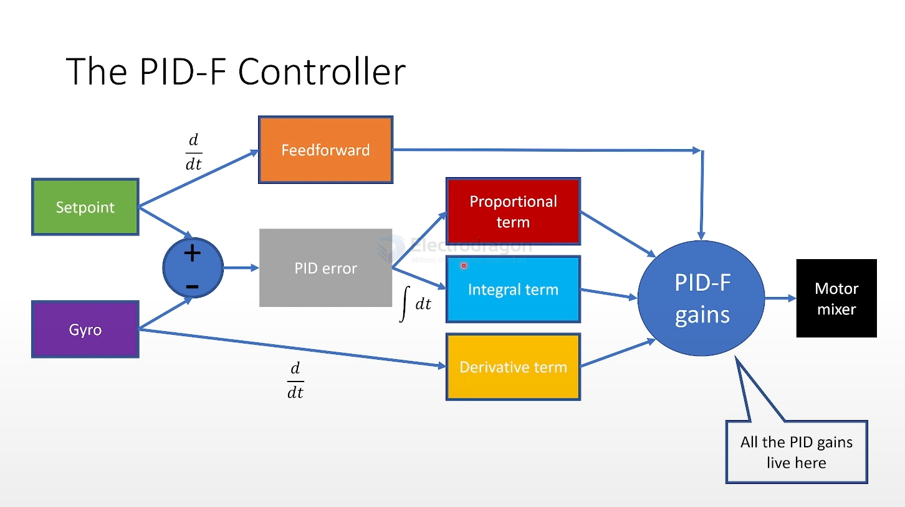
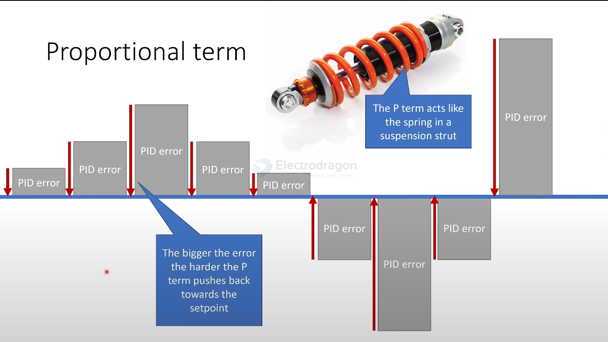
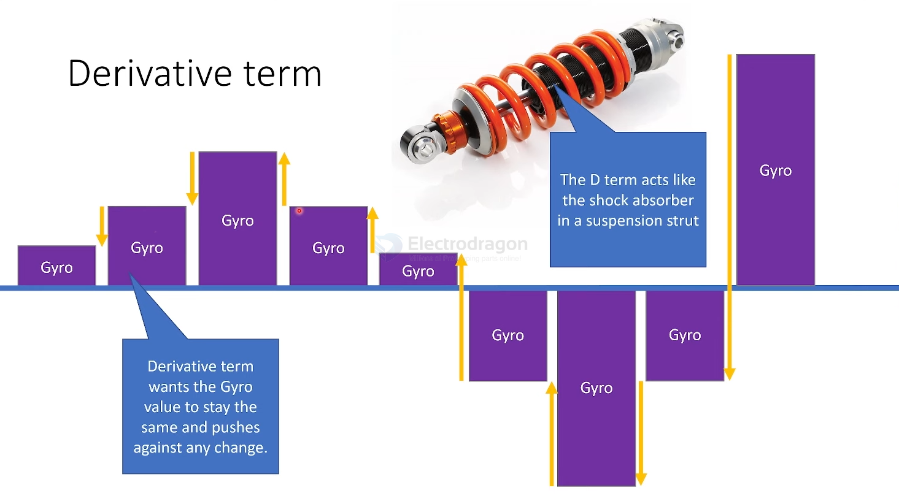
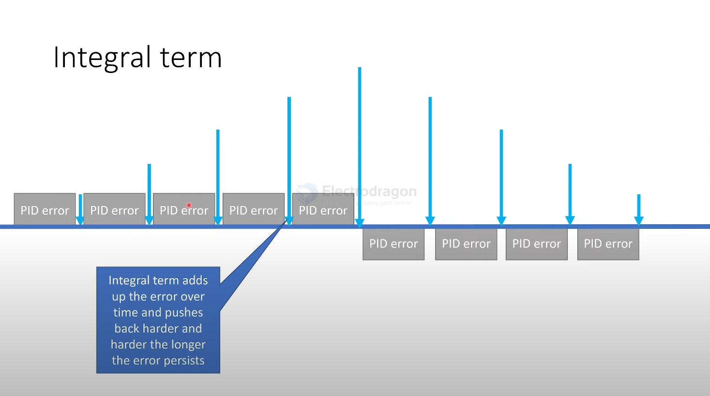
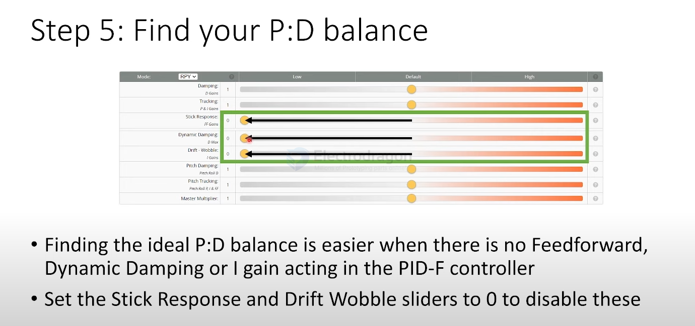
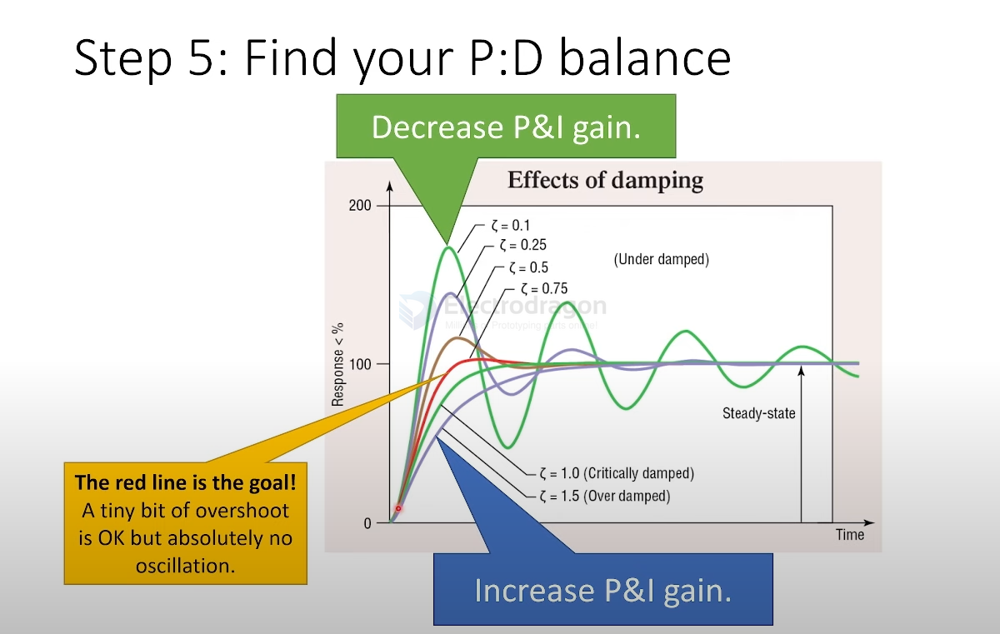
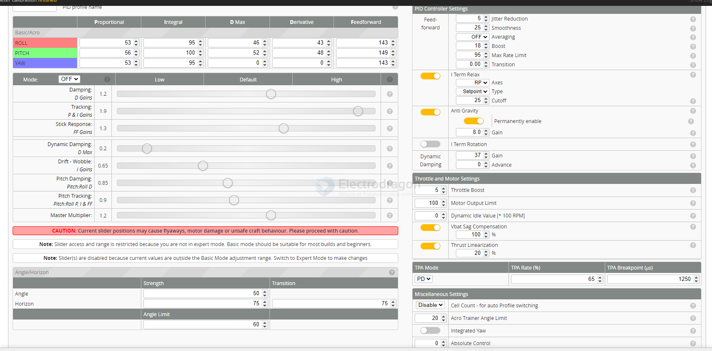
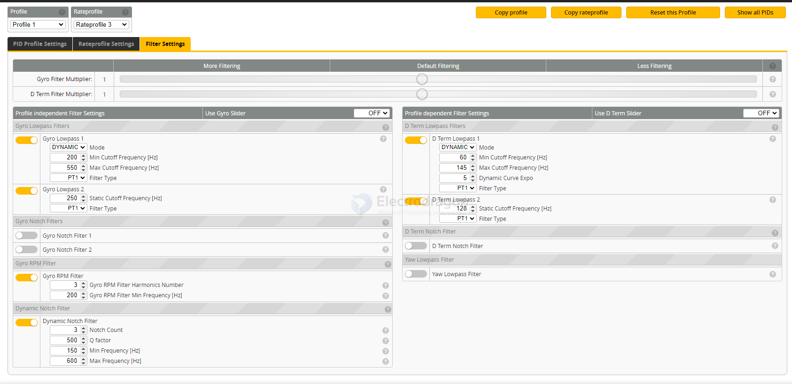
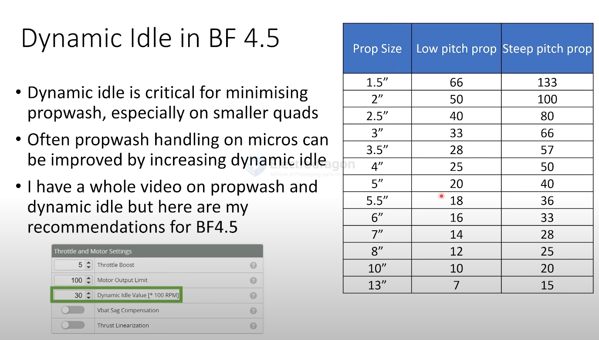

# PID-dat

- [[betaflight-PID-fliter-dat]]

- [[betaflight-rateprofile-dat]]

- [[indoor-fly-PID-tuning-dat]]

## works 

- suspension == spring + damper

## mobula8 for example 

default profile 

| value      | Proportional | Integral | D Max | Derivative | Feedforward |
| ---------- | ------------ | -------- | ----- | ---------- | ----------- |
| Basic/Acro |              |          |       |            |             |
| ROLL       | 53           | 95       | 46    | 43         | 143         |
| PITCH      | 56           | 100      | 52    | 48         | 149         |
| YAW        | 53           | 95       | 00    | 0          | 143         |

**Proportional (P):** Controls how strongly the quad reacts to the difference between the current and desired position (error). Higher P means faster correction, but too high can cause oscillations.

**Integral (I):** Corrects for small, persistent errors over time (like wind drift). It accumulates error and helps the quad hold its attitude. Too much I can cause slow oscillations or “wind-up.”

**D Max:** The maximum value the Derivative (D) term can reach during fast movements. It helps control overshoot and quick direction changes, especially when Damping is set low.

**Derivative (D):** Reacts to how quickly the error is changing (rate of change). It damps rapid movements and helps prevent overshoot and oscillations. Too much D can make motors hot or noisy.

**Feedforward (FF):** Predicts and responds to your stick inputs directly, making the quad feel more responsive and “snappy.” It doesn’t rely on error, so it improves stick tracking and reduces latency.

tuned profile 

| value      | Proportional | Integral | D Max | Derivative | Feedforward |
| ---------- | ------------ | -------- | ----- | ---------- | ----------- |
| Basic/Acro |              |          |       |            |             |
| ROLL       | 48           | 100      | 41    | 43         | 143         |
| PITCH      | 41           | 105      | 48    | 48         | 149         |
| YAW        | 53           | 95       | 00    | 0          | 143         |

## slider 

PID Tuning Slider Mode

ID tuning slider mode can
be:
- OFF - no sliders, enter values manually
- RP - sliders control Roll and Pitch only, enter Yaw values manually
- RPY - sliders control all PID

Warning: Going from RP to RPY mode will overwrite Yaw settings with firmware settings.

| set                                  | value |                                              |
| ------------------------------------ | ----- | -------------------------------------------- |
| Damping: D Gains                     | 1.4   |                                              |
| Tracking: P & I Gains                | 1     |                                              |
| Stick Response: FF Gains             | 0     |                                              |
| Dynamic Damping: D Max               | 0     | starting from 0                              |
| Drift - Wobble: /Gains               | 0     |                                              |
| Pitch Damping: Pitch:Roll D          |       |                                              |
| Pitch Tracking: Pitch:Roll P, I & FF |       |                                              |
| Master Multiplier:                   | 1.6   | Indoor: keep lower to avoid twitchy behavior |

### Damping: D Gains 

Relatively high D-gain will dampen stick responsiveness and may make motors hot, but should help control fast oscillations and will improve prop-wash. 

Relatively low D-term gives quicker stick responsiveness, but will weaken prop-wash performance and reacting to external forces (wind).

### Tracking: P & I Gains 

Increase the Tracking slider to sharpen the quads response to your influences; avoiding the nose of the quad going off course in any condition. 

Lower 'Tracking' values will will go off course on stick moves and in prop wash. 

High 'Tracking' may result in oscillation and fast bounceback (hard to see but you canhear). 

Excessive Tracking may result in oscillations and hot motors.

### Stick Response: FF Gains

Lower Stick Response will increase the **latency** of the quad movements to commands and may result in slow bounceback at the end of a flip or roll.

Higher Stick Response will give snappier quad response to sharp stick moves. Too much Stick Response can cause flip or roll.

Note: "I-term Relax" can reduce authority quads or if low Stick Response Gains are used.

### Dynamic Damping: D Max  

Increases D max, the maximum amount that D can increase to during faster movements.

For race quads, where the main Damping slider has been set low to minimize motor heat, moving this slider to the **right** will improve overshoot control for quick direction changes.

For HD or cinematic quads, instability in forward flight is best addressed by moving the Damping slider (not the Dynamic Damping slider) to the **right**. Check for motor heat and listen for weird noises during quick inputs when moving this slider to the right.

For freestyle quads, especially heavier builds, moving this slider to the **right** may help control overshoot in flips and rolls.

Note: Generally overshoot in flips and rolls is due to not enough 'i-Term Relax', or motor desyncs, or inadequate authority (a.k.a. Motor Saturation). If you find that moving the Damping Boost slider to the right doesn't improve flip or roll overshoot, put it back to the normal position, and seek out the reason for the overshoot or wobble.

use PIDtoolbox to find the best value

### Master Multiplier

- hear motor sound and feel the response

- Start to gradually increase your Master Slider from ~0.5
- Pay attention to motor temperature, the sound of the motors, and propwash handling

### Angle/Horizon

| set         | Strength | Transition |
| ----------- | -------- | ---------- |
| Angle       | 50       |            |
| Horizon     | 75       | 75         |
| Angle Limit | 60       |            |

optimized for indoor fly 

| set         | Strength | Transition |
| ----------- | -------- | ---------- |
| Angle       | 32       |            |
| Horizon     | 50       | 75         |
| Angle Limit | 45       |            |

- angle mode == can not full roll or flip 
- Angle == less respone 
- Angle Limit == less speed and angle, but inability to fly in wind

### slider screenshort 

CAUTioN: Current sllder positlons may cause flyaways, motor damage or unsafe craft behaviour. Please proceed with cautlon.

Note: Slider access and range is restricted because you are not in expert mode. Basic mode should be suitable for most builds and beginners.

Note: Slider(s) are disabled because current values are outside the Basic Mode adjustment range. Switch to Expert Mode to make changes

## PID controller settings 

- Feedforward transition
- Acro Trainer Angle Limit
- Throttle Boost
- Dynamic Idle Value [* 100 RPM]
- Absolute Control
- I Term Rotation
- Vbat PID Compensation
- Integrated Yaw
- I Term Relax
  - RP - Axes
  - Setpoint - Type
  - 5 - Cutoff - [[indoor-fly-dat]]

A feature that reduces (relaxes) the effect of the I-term (integral) in the PID controller during fast stick movements, helping to avoid overshoot and improve flight feel.

- D Min

## PID Controller Settings

### feed-foward in PID Controller Settings

  set f_pitch = 160
  set f_roll  = 155
  set f_yaw   = 150
  set feedforward_boost = 20
  save

If you prefer a softer, more stable indoor tune

  set f_pitch = 135
  set f_roll  = 130
  set f_yaw   = 130
  set feedforward_boost = 10
  save

### Anti Gravity

- [x] Permanently enable Anti Gravity
- [x] Smooth [x] support - Mode
- 10 - Gain - [[indoor-fly-dat]]

A feature that temporarily boosts the I-term (integral) of the PID controller during rapid throttle changes to help maintain stable flight and prevent sudden altitude drops or surges.

Enable anti-gravity for **stable throttle changes**.

## Throttle and Motor Settings 

| set                   | value | expalination                                                                            |
| --------------------- | ----- | --------------------------------------------------------------------------------------- |
| Throttle Boost        | 5     | Increases throttle response when you make quick stick movements.                        |
| Motor Output Limit    | 100   | Limits the maximum power sent to the motors (as a percentage).                          |
| Dynamic Idle          | 35    | Sets a minimum motor RPM (as a percentage of throttle) when the throttle is at zero.    |
| Vbat Sag Compensation | 100%  | Compensates for voltage drop (“sag”) as the battery drains.                             |
| Thrust Linearization  | 40%   | Adjusts throttle curve to make thrust output more linear (proportional) to stick input. |

indoor 

  set throttle_limit_percent = 75 ## rateprofile

  set throttle_boost = 7 ## ? 
  # set throttle_boost = 0 ## ? 

  set dyn_idle_min_rpm = 30
  set dshot_idle_value = 600 ## ?

  set motor_output_limit = 75
  save

#### dynamic idle

- 2" == 30

## TPA (Throttle PID Attenuation) Explained

→ **TPA = Throttle PID Attenuation**  
- Reduces the influence of **P, I, D** at high throttle  
- Prevents aggressive PID corrections when motors are near full power  

→ **TPA Breakpoint**  
- Defines the **throttle point (%)** where TPA starts reducing PID  
- Example: TPA Breakpoint = 1500 → above 1500/2000 throttle, PID attenuation begins  

→ **How it Works**  
- At low/mid throttle → full PID control → precise, stable hover  
- At high throttle → PID reduced → prevents oscillations caused by strong motor output  

→ **Indoor Fly Recommendation**  
- TPA can be **0–0.1** for small indoor quads → usually not needed  
- Breakpoint → not critical for indoor hover, keep default  

## ref 

- [[PID]] - [[tech]]

- [damping tuning on meteor75](https://www.youtube.com/watch?v=CsD5sV7xOPc)

- [Betaflight 4.5 PID Tuning](https://www.youtube.com/watch?v=1oYoVE4xu1U)