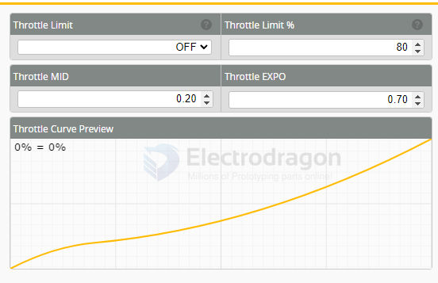

# betaflight-dat

- [[FPV-dat]] - [[mobula8-dat]]

- [[radiomaster-dat]]

- [[betaflight-presents-dat]] 

- [[betaflight-PID-dat]]

- [[indoor-fly-dat]]

## betaflight supports 

| model                   | supported | from               |
| ----------------------- | --------- | ------------------ |
| [[Mobula8-dat]] / 7 / 6 | yes       | [[happymodel-dat]] |
| [[aquila16-dat]]        | no        | [[betaFPV-dat]]    |
| [[Meteor65-Pro-dat]]    | yes       | [[betaFPV-dat]]    |

## CLI 

    # version
    # Betaflight / STM32F411 (S411) 4.4.2 Jun  1 2023 / 02:20:34 (23d066d08) MSP API: 1.45

    # config: YES
    # board: manufacturer_id: HAMO, board_name: CRAZYBEEF4SX1280

board == CRAZY BEE F4SX1280

## flash 

- CRAZYBEEF4SX1280 - [[CRAZYBEEF4SX1280-dat]]
- 4.5.2 [19-Mar-2025]

- Radio Protocol == CRSF
- Other Options ==  xAcro Trainer / xGPS / xLED Strip / xOSD (Analog) / xOSD (Digital) / xPin 10 / xVTX
- Telemetry Protocol == Automatically Included
- Motor Protocol == DSHOT

## SETUP 

- THE MOST IMPORTANT STEP: CALIBRATE ACCELEROMETER
- **NO NOT CALIBRATE ON A TABLE**, PUT THE WHOOP ON THE FLOOR, MAKE SURE IT IS LEVEL
- AFTER CALIBRATION, TURN ON MOTORS OR HOLD BY FINGERS, RECHECK
- IF NEEDED, REPEAT CALIBRATION PROCESS UNTIL SATISFIED
- 

## ports 

## Configuration

### Accelerometer Trim

- Accelerometer Roll Trim
- Accelerometer Pitch Trim

| roll  | roll trim | pitch | pitch trim |
| ----- | --------- | ----- | ---------- |
| left  | --        | back  | --         |
| right | ++        | front | ++         |

#### 1. Accelerometer Trim
- General setting that shifts the "zero level" of the accelerometer.  
- Used if your quad drifts in Angle/Horizon mode even after calibration.  
- Instead of recalibrating, you can apply a small trim value here.

---

#### 2. Accelerometer Roll Trim
- Adjusts the accelerometer’s idea of "level" on the **Roll axis** (left ↔ right).  
- Example:
  - Drone drifts **right** in Angle Mode → add **positive Roll Trim**.  
  - Drone drifts **left** → add **negative Roll Trim**.  

---

#### 3. Accelerometer Pitch Trim
- Adjusts the accelerometer’s "level" on the **Pitch axis** (forward ↔ backward).  
- Example:
  - Drone drifts **forward** in Angle Mode → add **positive Pitch Trim**.  
  - Drone drifts **backward** → add **negative Pitch Trim**.  

### Board and Sensor Alignment
- 0 == Roll Degrees - 0 Pitch Degrees - 0 Yaw Degrees
- **First** GYRO/ACCEL - **CW 90°** First GYRO
- **Default** <MAG Alignment

### System configuration

Note: Make sure your FC is able to operate at these speeds! Check CPU and cycletime stability. Changing this may require PID re-tuning. TIP: Disable Accelerometer and other sensors to gain more performance.

- 8.00 kHzGyro update frequency
- 1.00 kHz PID loop frequency
- Accelerometer
- Barometer (if supported)
- Magnetometer (if supported)

### Dshot Beacon Configuration

Beacon Tone
RX_LOSTBeeps when TX is turned off or signal lost (repeat until TX is okay)
RX_SETBeeps when aux channel is set for beep

### other features 

- air mode - consider turn this off, it may cause the whoop bump (hop round) when touch the ground

- [] INFLIGHT_ACC_CAL
- [] SERVO_TILT
- [x] SOFT SERIAL
- [] SONAR
- [] LED_STRIP
- [] DISPLAY
- [x] OSD
- [] CHANNEL_FORWARDING
- [] TRANSPONDER
- [] AIRMODE
- [?] DYNAMIC_FILTER

### Beeper Configuration

### logs 

- ESC/Motor Features == ONE SHOT 125

- gyro update frequency == 2kHz

- PID loop frequency == 1kHz

- accelerometer == ON

- telemetry == ON

- reiceiver == Serial-based receiver

## failsafe 

- console - failsafe mode - no pulse 

## PID 

- keep all default 

## receiver 

## Modes 

- ARM == AUX 1 
- angle == AUX 2 HIGH
- Horizon == AUX 2 
- Air Mode == AUX 1, air mode only in arco mode 
- beeper - also in AUX 1 

Arco mode is very stable, good for beginners

- beeper == AUX3
- Air Mode == AUX2 LOW
- FPV ANGLE MIX == AUX2 HIGH
- FLIP OVER AFTER CLASH == AUX4 HIGH

## motors 

- mixer 

### ✅ Recommended ESC/Motor Protocol for Mobula8
- **DSHOT600** → most common, reliable, and default for Mobula8.

### ⚡ Alternatives (if you have issues)
- **DSHOT300** → safer fallback if you experience desyncs or motor twitching.  
- **DSHOT1200** → possible on some boards, but not necessary (no real benefit on Mobula8).  

test 
- [x] DSHOT 300
- [x] DSHOT 600

### settings 

DSHOT300 -- ESC/Motor protocol

[] - MOTOR_STOP Don't spin the motors when armed 
[] - ESC_SENSOR Use KISS/BLHeli_32 ESC telemetry over a separate wlre
[x] - Bidirectional Dshot (requires supported ESC firmware)
12 - Motor poles (number of magnets on the motor bell)
0 - Dynamic Idle Value [* 100 RPM]
8% - Motor Idle ( %, static)

EX1103 - KV11000 == Standard tiny whoop motors like EX1103 11000KV have 6 poles / 3-phase, but some high-torque variations may use 12 poles.

### What is ESC Bi-Directional DShot?

#### 1. DShot Protocol (normal)
- A **digital protocol** to send throttle signals from the flight controller (FC) to the ESC.
- More reliable than analog PWM or Oneshot/Multishot.
- Normally one-way: FC → ESC only.

#### 2. Bi-Directional DShot
- Extension of DShot where communication is **two-way**:
  - FC → ESC (throttle command)
  - ESC → FC (motor feedback data)

#### 3. What Data Comes Back?
- **RPM (motor speed)** in real-time
- **Current, voltage, temperature** (if ESC supports it)
- This allows the FC to know exactly how fast each motor is spinning.

#### 4. Why is it Useful?
- Enables **RPM Filtering** in Betaflight / INAV:
  - Filters gyro noise at exact motor frequencies.
  - Makes flight smoother and more efficient.
- More accurate telemetry than traditional ESC sensors.
- Helps with diagnostics (e.g., if one motor is desyncing).

---

#### Summary
**Bi-Directional DShot = digital two-way protocol between FC and ESC.**  
It not only controls motors, but also lets ESC report **real-time motor RPM & telemetry** back, enabling advanced features like **RPM filtering** for smoother flights.

#### 2. How to Check in Betaflight
1. Plug Mobula8 into Betaflight Configurator.
2. Go to **Configuration tab → ESC/Motor Features**.
3. Look for **"Bidirectional DShot"** checkbox.
   - If available, try enabling it.
4. Save & reboot.

#### 3. Verify in Motors Tab
- Go to **Motors tab** in Betaflight.
- If bi-directional DShot works, you should see **motor RPM values** in real time.
- If you only see throttle % but no RPM, your ESC firmware doesn’t support it.

## reset 

The following problems with your configuration were detected:

o there Is no motor output protocol selected.
 Please select a motor output protocol appropriate for your ESCs in 'EsC/Motor Features' on the 'Motors' tab.
Cautlon: Selecting a motor output protocolthat is notsupported by your ESCs can lead to the EsCssplnnlng up as soon as a battery ls connected.For this reason,
always make sure to remove the props before connectlng a battery for the first tlme after changlng the motor output protocol.

ed but It Is not callbrated.
If you plan to use the accelerometer, please follow the instructions for 'Calibrate Accelerometer' on the 'Setup' tab. If any function that requires the accelerometer (auto
level modes, GPS rescue, .) is enabled, arming of the craft will be disabled until the accelerometer has been calibrated.
If you are not planning on using the accelerometer it is recommended that you disable it in 'System configuration' on the 'Configuration' tab.
You need to fix these problems before attemptlng to fly your craft.

## error log 

    status
    MCU F411 Clock=108MHz (PLLP-HSE), Vref=3.31V, Core temp=71degC
    Stack size: 2048, Stack address: 0x2001fff0
    Configuration: CONFIGURED, size: 3630, max available: 16384
    Devices detected: SPI:1, I2C:0
    Gyros detected: gyro 1 locked dma
    GYRO=ICM42688P, ACC=ICM42688P
    OSD: MAX7456 (30 x 13)
    BUILD KEY: ec13320be6dfb3454403e841b0669684 (4.4.2)
    System Uptime: 50 seconds, Current Time: 2025-09-02T09:08:26.240+00:00
    CPU:22%, cycle time: 124, GYRO rate: 8064, RX rate: 249, System rate: 9
    Voltage: 731 * 0.01V (2S battery - OK)
    I2C Errors: 0
    Arming disable flags: BADRX ANGLE CLI ARMSWITCH

Arming disable flags: BADRX ANGLE CLI ARMSWITCH 

- BADRX is the most common cause when telemetry works but motors don’t spin.
- ANGLE prevents arming if FC is not level — always flat on table for first arm.
- Don’t arm with props attached until confirmed on table.

Arming disable flags: THROTTLE CLI MSP

## Other setup 

### What is Air Mode?
- Air Mode is a **Betaflight flight feature** that keeps the motors active and responsive even at **zero throttle**.  
- Without Air Mode:  
  - When you cut throttle, motors almost stop spinning.  
  - The quad loses control authority and can "fall" or tumble.  
- With Air Mode ON:  
  - Motors always maintain some thrust (idle speed).  
  - You can still control pitch, roll, and yaw when throttle stick is at minimum.  

### Why Use Air Mode on Whoops?
- ✅ Smoother hovering and stable control, even at low throttle.  
- ✅ Prevents sudden drop when you release throttle indoors.  
- ✅ Essential for flips, rolls, or freestyle tricks.  
- ⚠️ For very small **brushed whoops**, it can make them bounce indoors (too sensitive).  

## black box 

Outboard serial logging device
You can log to an external logging device (such as an OpenLager) by using a serial port. Configure the port on the Ports tab.

# betaflight-dat.md

Betaflight is an open-source firmware for drones and other unmanned aerial vehicles (UAVs). It is designed to provide advanced flight control capabilities, making it popular among hobbyists and enthusiasts in the drone community. Betaflight is known for its flexibility, configurability, and support for a wide range of hardware platforms.

- [[betaflight-configurator-dat/betaflight-dat]]

## commerlized projects 

- **speedybee** == https://www.speedybee.com/ == SpeedyBee is a company that specializes in providing high-quality drone components and accessories, including flight controllers, ESCs, and other related products. They are known for their innovative designs and user-friendly interfaces, making them a popular choice among drone enthusiasts.
- **betafpv** == https://www.betafpv.com/ == BETAFPV is a company that focuses on producing small and lightweight drones, particularly for FPV (First Person View) racing and freestyle flying. They offer a range of products, including flight controllers, cameras, and other accessories tailored for FPV enthusiasts.
- happymodel
- iFlight
- Holybro
- TBS
- Flywoo
- HGLRC
- Diatone
- GepRC
- Racerstar
- Emax
- Eachine
- HGLRC
- Racerstar

