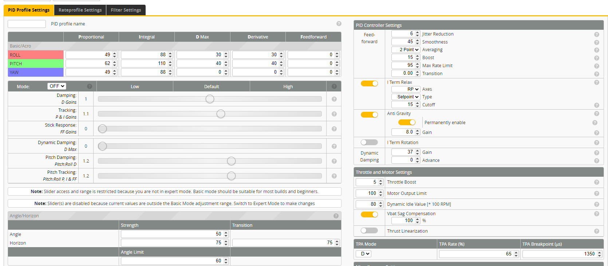
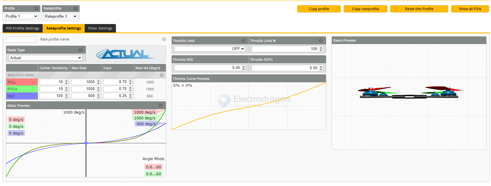
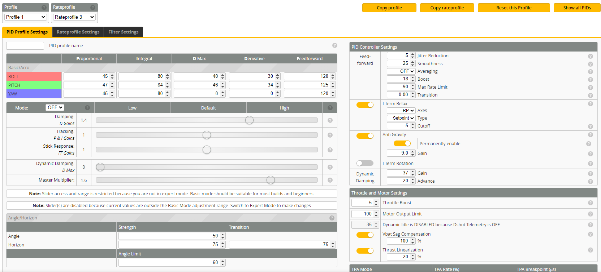
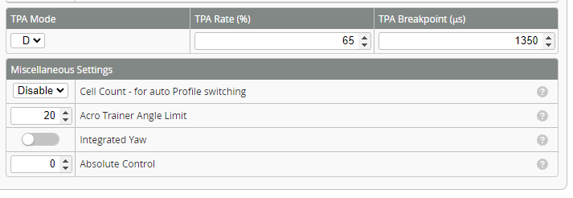

# betaflight-presents-dat

- [[betaflight-dat]]

- [[FPV-dat]]

- [] BNF
- [x] FILTERS
  - Gyro filters
  - D-term filters
  - RPM filters (if bidirectional DShot is enabled)
- [] LEDS
- [] MODES
- [] OSD
- [] OTHER
- [x] RATES
  - **Roll / Pitch / Yaw rates**
  - **Expo / RC rate**
  - **Rate profiles** for different flight styles
- [x] RC_LINK
- [x] TUNE == **PID controller settings**
- [] VTX

common used for a flight - [x] TUNE - [x] RATES - [x] FILTERS 

## RC_LINK 

- Generic 250Hz Ultra Cinematic

## Generic 250Hz Cinematic - Author:Ivan Efimov (Limon)

Generic RC link settings for cinematic flying with 250Hz RC link.
WARNING: make ABSOLUTELY SURE that the OpenTx or EdgeTx Hardware ADC Filter is un-checked!
WARNING: check that you are using a compatible version of EdgeTx or OpenTx!

## by Chris Rosser

### tune 

- AOs Cine20 tune by Chris Rosser

Filters
- [x] AOs Filters (Recommended)
- [x] **RPM Filter Weights** for **triblade props**
- [] RPM Filter Weights for other props

Motor Settlngs
- [x] DShot Motor Beeping (Recommended)
- [x] 12 pole motors (Most 1404 motors have 12 poles)

Rates
- [x] Cinematic Rates (Recommended)

Typical Board Alignment for 25mm AlO
- [x] Typical Board Alignment for 25mm AlO (Test in setup tab BEFORE take-off!)

EXCLUSIVE): Choose your RC llnk (or apply another preset separately)
- [x] ELRS_250HZ (Recommended)
- [] ELRS_500HZ
- [] DJI Normal
- [] DJI SBUS FAST
- [] Crossfire 50Hz
- [] Crossfire 150Hz

Check all of these (recommended)
- [x] Full battery sag compensation
- [] No stick deadband
- [] Arm at any angle
- [] Props out (check motor direction!)

### filter 

- AOS Cine20 Filters

Developed for the AOS Cine20 based on a build with 1303 6000KV motors and 550mAh 4S battery.
NOTE this needs bidirectional Dshot support and RPM filtering active to use. DO NOT ATEMPT TO USE WITHOUT RPM FILTERING!
Follow the usual process of hover testing and safely checking out your tune before using. USE AT YOUR OWN RISK.

## UAV tech preset

https://www.youtube.com/@uavtech

### rates 

UAV Tech Rates (w/ Cinematic/Whoop Options)

### tune 

#### UAV Tech - Micro (2" to 4")

#### UAV Tech - Whoop (1S&2S)

- Set **48kHz** for a good balance (smoother + longer flight time).
- Use **96kHz** if you want maximum efficiency indoors (at the cost of a little punch).

#### UAV Tech - Cinewhoop 

- [[UAV_tech_Cinewhoop.txt]]

Prior to selecting the "RPM Filter" or "Dynamic Idle" options, Bi-Directional DShot must be setup for your quad. If you have not setup yet, click "CANCEL" and setup first (PROPS OFF to test). If you have NO selected the "RPM Filter" or "Dynamic Idle" options, YOU CAN IGNORE THIS MESSAGE.

https://github.com/betaflight/firmware-presets/pull/208

https://github.com/betaflight/firmware-presets/blob/master/presets/4.5/tune/uav_tech/UAV_tech_Cinewhoop.txt

(EXCLUSIVE) ESC PWM Optlons...
- [] 16 & 24k ESC PWM Settings
- [] 48k ESC PWM Settings
- [] 96k+ ESC PWM Settings

- [[motor-FPV-dat]]

Given what I know about Mobula8 (a small whoop / micro style quad), here’s what I think:

If your ESC & frame / airflow are decent and you mostly fly indoors or want quieter motors: go with 48 kHz. It’s a safe, good all-round choice.

If you want the quietest possible operation and are willing to manage heat, 96 kHz+ may be okay if your ESC supports it and you monitor temps.

If you fly outdoors a lot, or you want max efficiency (battery life, less heat), and don’t mind a little noise / less silky low-throttle, 16-24 kHz might be more reliable.

- [[Mobula8-Tune.txt]] == https://www.reddit.com/r/TinyWhoop/comments/1lguely/mobula_8_pilots/

PropWash Performance Booster..

- [] Dynamic Idle (EsC bi-directional Dshot required)

#### CaddxBNF Gofilm20

## FPV_CAM 

### tune 

#### UWL 75mmWhoop Tuneby FreshBread

## other presents 

- freestyle 

ExpressLRS250Hz

AOS Cine25 tune by Chris Rosser

## Prop Wash Performance Booster (PWPF)

### 1) Prop Wash Performance Booster (PWPF)

### What it does
- Helps stabilize the quad in **prop wash / turbulence** (low-speed yaw/pitch/roll oscillations caused by disturbed airflow).
- Mainly improves **tiny whoop or cinewhoop stability** during hover or close-quarter flight.

### Requirements
- **FC:** Betaflight 4.3+ (most Mobula8 FCs can run this)
- **Motor & ESC:** Works with any brushless motors + DShot or multishot PWM ESCs
- **Notes:** Very useful for **indoor 1S Mobula8**, smooths hover & slow flight.

### How to enable
- Betaflight Configurator → Configuration → “Prop Wash Performance Booster” → enable
- Adjust “PWPF Strength” in PID tuning → Motor tab if needed

---

### 2) Dynamic Idle

### What it does
- Reduces idle motor throttle **automatically** during flight to reduce prop wash, save battery, and smooth low-throttle flight.
- Improves **hover stability**, especially in micro FPV like 85mm Mobula8.

### Requirements
- **FC:** Betaflight 4.3+ (Configurable in Motors tab)
- **ESC:** Must support **bidirectional DShot** or at least **telemetry** for accurate RPM sensing.
- If your Mobula8 has **BLHeli_S ESC without telemetry**, Dynamic Idle will be **limited or less effective**.
- Works better with **Bluejay or BLHeli_32 ESCs**.

### How to enable
- Betaflight Configurator → Configuration → Motors → Dynamic Idle → enable
- Adjust min motor idle and gain if necessary

## ref 

- [[betaflight-configurator-dat/betaflight-dat]]