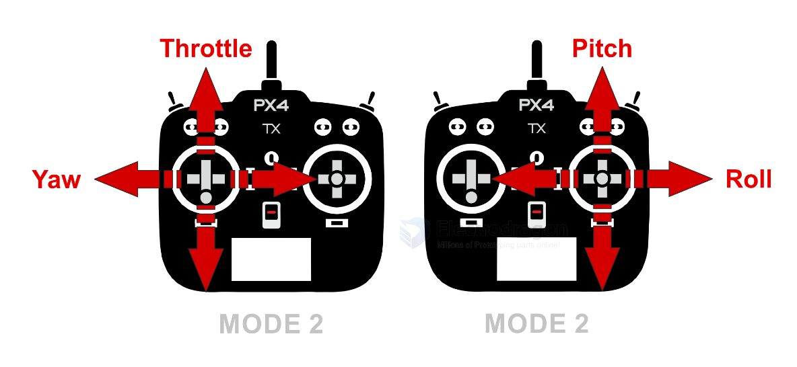

# RC-link-dat

- [[Wfly-dat]] - [[WFT06x-dat]] - [[WFR06S-dat]]

## RC Tx 

- [[PX4-dat]] 

## RC Receiver 

When you push the **RC console (joystick or stick) up and down**, you're typically controlling the throttle or elevator channel, depending on the mode of your transmitter. The PWM (Pulse Width Modulation) signal output sent to the receiver or flight controller varies accordingly:

PWM signal range: ~1000 µs (microseconds) to ~2000 µs

    Center/stick neutral: ~1500 µs

    Stick fully down: ~1000 µs

    Stick fully up: ~2000 µs

Example:

If you're using Mode 2 (common mode):

Left stick up/down = Throttle

    Stick down = 1000 µs (zero throttle)

    Stick up = 2000 µs (full throttle)

If it's controlling elevator (pitch):

    Stick down (nose down) = 1000 µs

    Stick up (nose up) = 2000 µs

## ref 

- https://docs.px4.io/v1.11/en/getting_started/rc_transmitter_receiver.html

- [[RC-dat]]