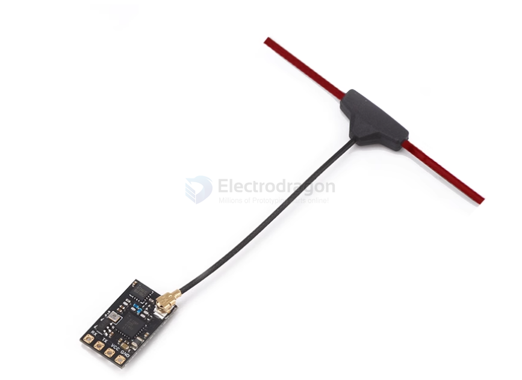

# ELRS-RX-dat

## T-anntena version 

## SMD antenna version 

## info 

Nano2400-RX receiver with power amplifier (PA+LNA).

Therefore, it has 100mW telemetry output and better sensitivity at longer distances.

It uses an IPEX1 antenna connector.

Paired with an external dipole T-antenna (customized by a professional factory, each antenna is tested with professional instruments to ensure quality, lightness, and durability).

The CYCLONE series receivers are based on the open-source architecture and program of ExpressLRS.

We have released 3 types of RX receiver modules. All use the [[ESP8285-dat]] [[MCU-dat]]. You can upgrade the firmware via [[WIFI-dat]], which is very user-friendly.

Typically, after powering the receiver and with the remote controller turned off, the ExpressLRS hotspot can be found after a default of 60 seconds. Connect to this hotspot using a computer or mobile phone.

The password is "expresslrs", and then you can access 10.0.0.1 to upload the receiver firmware.

## Product Features

-   High refresh rate 100mW telemetry output;
-   Supports convenient and fast firmware flashing via WIFI connection;
-   Firmware Version: 3.3.0 [BETAFPVLite2400RX]
-   Equipped with a power amplifier (PA+LNA), providing 100mW telemetry output and better response speed;
-   Theoretically compatible with most ELRS 2.4G transmitter modules on the market (requires firmware version 2.0 or above).

## ref 

- [[ELRS-dat]]