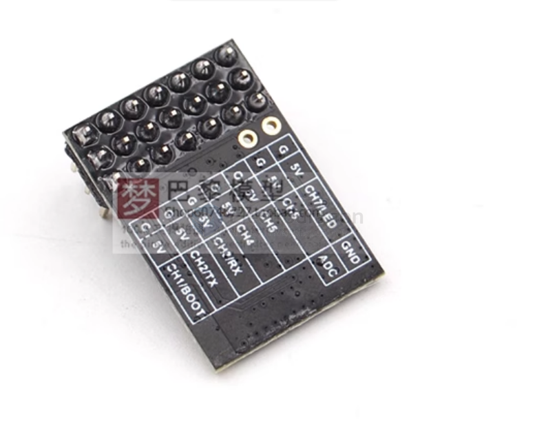
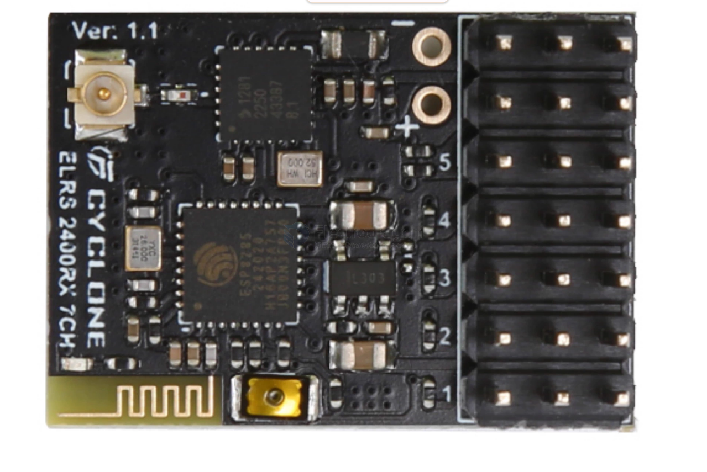

# ELRS-CHS-PWM-dat.md

## Electrodragon 7CH PWM ELRS Receiver

Electrodragon ELRS 2.4G Receiver, Seven-Channel PWM Receiver

This receiver features independent PWM channel outputs, suitable for fixed-wing aircraft, cars, boats, and other models. It also supports CRSF output. The two output signals (PWM and CRSF) can be switched without re-flashing the firmware.

Follow these steps to switch between PWM (6CH/7CH) and CRSF modes:

**Accessing the Receiver's Wi-Fi Network:**

1.  **If connected to the high-frequency head (transmitter module):** Use the transmitter's LUA script menu to activate the receiver's Wi-Fi.
2.  **If not connected to the high-frequency head:** Power on the receiver and wait for one minute. The receiver will automatically enter Wi-Fi mode.

**Connecting to the Receiver's Wi-Fi:**

*   Search for Wi-Fi networks on your computer or phone.
*   **Wi-Fi Hotspot Name (SSID):** `EXPRESSLRSRX`
*   **Connection Password (all lowercase):** `expresslrs`

**Accessing the Configuration Page:**

*   Open a web browser and go to: `http://10.0.0.1/hardware.html`

**Configuring the Receiver:**

*   This will take you to the ELRS hardware configuration page where you can import hardware configuration files.
*   **Caution:** Do not modify parameters yourself unless you fully understand their meaning.
*   Import the provided configuration file for either `PWM7CH` or `CRSF`.
*   Click the button at the bottom of the page and wait for the receiver to restart automatically.

## ref 

- [[ELRS-PWM]] - [[ELRS]]
