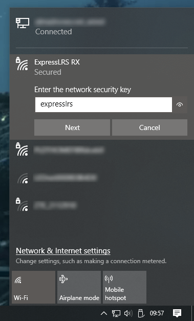
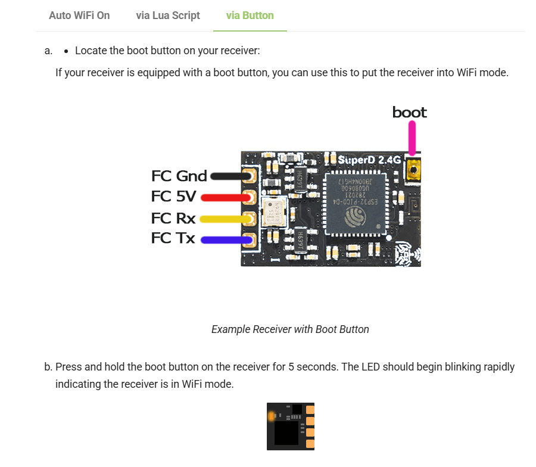

# ELRS-dat

Info - [[ELRS-frequency-dat]] - [[ELRS-faq-dat]]

## ELRS-link 

ELRS-remote-console-tx 

- BETAFPV literadio 3
- BETAFPV literadio 2

- [[edge-tx-dat]] - [[radiomaster-dat]] - [[lightradio-dat]]

- [[ELRS-RX-dat]] - [[SX1276-dat]] - [[ESP8285-dat]] - [[ESP32-dat]] - [[SX1281-dat]] - [[SX1208-dat]]

protocol output -  - [[CRSF-dat]]

- [[CC2500-dat]]

- [[ELRS-TX-dat]] - [[ELRS-915M-dat]] - [[ELRS-PWM-dat]] - [[ELRS-2.4Ghz-dat]] 

- [[ELRS]]

## resources 

https://github.com/ExpressLRS/ExpressLRS

https://www.expresslrs.org/quick-start/getting-started/

[ExpressLRS-Configurator-releases](https://github.com/ExpressLRS/ExpressLRS-Configurator/releases)

## **ExpressLRS (ELRS) 2.4GHz Standard Explained**  

**ExpressLRS (ELRS) 2.4GHz** is an open-source **long-range, low-latency radio control link** developed for FPV drones and RC applications. It offers **high performance, ultra-fast response times, and robust signal reliability** compared to traditional RC protocols like FrSky, Crossfire, and Ghost.  

---

### **🔹 Key Features of ELRS 2.4GHz**
- **Ultra-Low Latency** (~5ms in high-speed mode).  
- **Long-Range Performance** (Up to **30km+** with proper setup).  
- **High Packet Rate (Up to 1000Hz)** for **smooth & responsive controls**.  
- **Open-Source & Customizable** (Community-driven development).  
- **Affordable Hardware** (Compared to Crossfire or Ghost).  
- **Wide Compatibility** (Supported on many **radio transmitters & receivers**).  

---

### **🔹 ELRS 2.4GHz vs. Other RC Links**
| Feature         | ELRS 2.4GHz  | TBS Crossfire | Ghost 2.4GHz | FrSky R9M   |
| --------------- | ------------ | ------------- | ------------ | ----------- |
| **Frequency**   | 2.4GHz       | 900MHz        | 2.4GHz       | 900MHz      |
| **Max Range**   | ~30km+       | ~50km+        | ~15km        | ~10-20km    |
| **Latency**     | 5-7ms        | 15-50ms       | ~4ms         | ~20ms       |
| **Packet Rate** | Up to 1000Hz | 50-150Hz      | 500Hz        | ~100Hz      |
| **Open Source** | ✅ Yes        | ❌ No          | ❌ No         | ❌ No        |
| **Cost**        | 💰 Affordable | 💰💰 Expensive  | 💰💰 Expensive | 💰 Mid-Range |

---

### **🔹 ELRS 2.4GHz Modes & Performance**
| Mode      | Packet Rate | Latency | Range                 |
| --------- | ----------- | ------- | --------------------- |
| **500Hz** | 500Hz       | ~5ms    | Short (~3km)          |
| **250Hz** | 250Hz       | ~7ms    | Mid (~10km)           |
| **150Hz** | 150Hz       | ~10ms   | Long (~20km)          |
| **50Hz**  | 50Hz        | ~20ms   | Extreme Long (~30km+) |

🔹 **Higher packet rate = Lower latency, but reduced range**  
🔹 **Lower packet rate = Higher range, but increased latency**  

---

### **🔹 Recommended ExpressLRS 2.4GHz Hardware**
#### **🛠️ Transmitters (TX)**
- **RadioMaster Zorro ELRS 2.4GHz**  
- **Jumper T20S (Built-in ELRS)**  
- **Happymodel ES24TX Pro (External ELRS Module)**  
- **BetaFPV ELRS Micro TX Module**  

#### **📡 Receivers (RX)**
- **Happymodel EP2 (Tiny, best for micro quads)**  
- **BetaFPV ELRS 2.4GHz Nano RX**  
- **Radiomaster RP1 / RP2 RX (Great range & reliability)**  

---

### **🔹 Why Choose ELRS 2.4GHz?**
✅ **Best for FPV Racing & Freestyle** → **Low latency & fast response**  
✅ **Perfect for Long-Range FPV** → **Good range at lower packet rates**  
✅ **Affordable & Open-Source** → **Cheaper than Crossfire & Ghost**  

🚀 **If you need ultra-low latency for FPV racing or long-range performance at an affordable price, ExpressLRS 2.4GHz is the best choice!** 🔥  

## 2.4hz compare to LORA 915mhz

| Feature                     | DJI NC3 (OcuSync 2.0)     | ELRS 2.4GHz (100mW)          | ELRS 915MHz (100mW, SX1276)   |
|----------------------------|---------------------------|------------------------------|-------------------------------|
| Protocol Type              | Proprietary digital (DJI) | Open-source LoRa/FLRC        | Open-source LoRa              |
| Frequency Band             | 2.4GHz + 5.8GHz           | 2.4GHz                        | 915MHz                        |
| Max Packet Rate            | N/A (digital control/video)| Up to 500Hz                  | Up to 50Hz                    |
| Latency (best-case)        | ~120 ms (control + video) | ~2.5 ms (500Hz)              | ~20 ms (50Hz)                 |
| Typical Latency            | ~120–150 ms               | ~6–13 ms                     | ~22–30 ms                     |
| Max Range (LOS, FCC)       | ~10 km                    | ~2 km                        | ~10 km                        |
| Penetration (Obstacles)    | Moderate                  | Moderate                     | Strong                        |
| Interference Resistance    | High (hopping + digital)  | Moderate                     | Strong                        |
| Video Support              | Yes (integrated)          | No                           | No                            |
| Use Case                   | DJI drones (Mini, Air)    | FPV racing, freestyle        | Long-range FPV, endurance     |
| Antenna Size               | Small                     | Small                        | Larger                        |
| Custom Flight Controllers  | Not supported             | Fully supported              | Fully supported               |

❌ No — ELRS does not support 5.8GHz (as of now).

- [[LORA-dat]] - [[RF-2.4ghz-dat]]

- [[5.8Ghz-dat]]

## WebUI Configurator

[ExpressLRS Configurator](https://github.com/ExpressLRS/ExpressLRS-Configurator/releases/)

[github](https://github.com/ExpressLRS/ExpressLRS) 

### Via "ExpressLRS RX" Access Point

Load the Web UI on your browser using these addresses:

http://10.0.0.1/ - If you have connected to the ExpressLRS RX Access Point

### Via button press 

## Code 

| Method        | Arduino-Friendly? | Notes                                      |
|---------------|-------------------|--------------------------------------------|
| PWM Output    | ✅ Yes            | Easiest to use. Limited channels.          |
| SBUS/PPM      | ✅ Yes (with lib) | Good middle ground.                        |
| CRSF over UART| ⚠️ Difficult      | Only feasible on fast boards (ESP32/STM32).|

### ✅ Use PWM output from ELRS receiver for arduino 

Some ELRS receivers support PWM output, which can be read with Arduino pulseIn() or interrupts.

This is much easier but limits you to a few channels (e.g., 4–8).

### ✅ Use CRSF over UART (advanced)
If you use a faster board like Teensy, ESP32, or STM32:

These can handle high baud rates and may be able to parse CRSF messages.

You’d need to write or port a CRSF parser for Arduino/Teensy/ESP32.

## ref 

- [[FPV-dat]] 

- [[ELRS]]