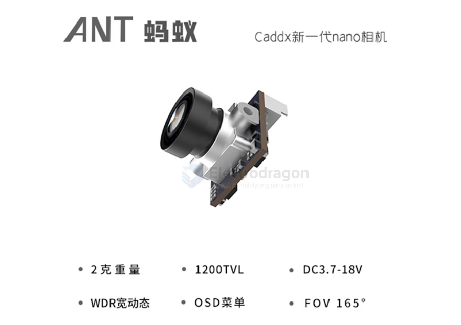
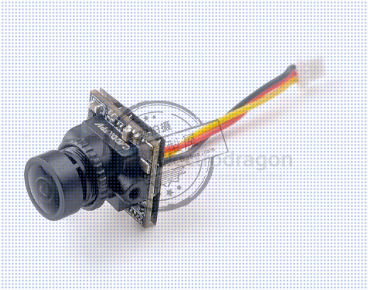

# caddxFPV-dat

- [[walksnail-dat]] is a brand of caddxFPV

## nano CADDX 蜗牛 Nano

## ratel 2

Caddx蜗牛平头哥二代穿越机摄像头fpv摄像机夜视镜头无人机ratel2

- Caddx ANT 1200TVL
- caddx nano 
- Baby Ratel2

Several companies make digital FPV systems that can compete with or complement DJI O4. Here’s a detailed overview:

---

### 1. **Caddx FPV Systems**

| Model | Features | Notes |
|-------|----------|-------|
| **Caddx Nebula Pro / Vista** | HD 1080p or 4K video, low-latency digital feed, small form factor | Requires compatible goggles (Fat Shark or Caddx) |
| **Caddx Nebula Nano** | Ultra-lightweight for micro quads | Limited range (~500–800 m) |
| **Caddx Vista HD** | HDMI input, supports OSD | Compatible with multiple cameras, low latency (~30 ms) |

---

### 2. **Walksnail Avatar Series**

| Model | Features | Notes |
|-------|----------|-------|
| **Walksnail Avatar Kit / Module** | HD digital video, Wi-Fi phone viewing, low-latency (~100–200 ms) | Works with phone or tablet directly; good for casual FPV |
| **Walksnail Avatar Nano** | Micro lightweight module | For 2–3” frames, similar features |

- moonlight kit 

---

## caddx 

- [[mobula8-dat]] == Caddx ANT 1200TVL == 4:3

## goggles 

- goggles HD

