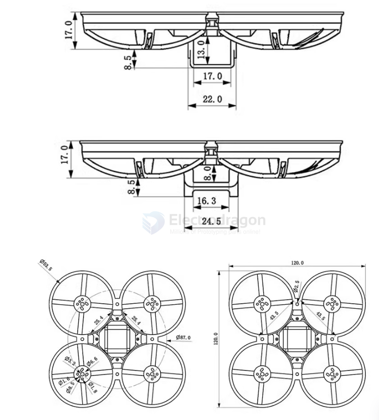
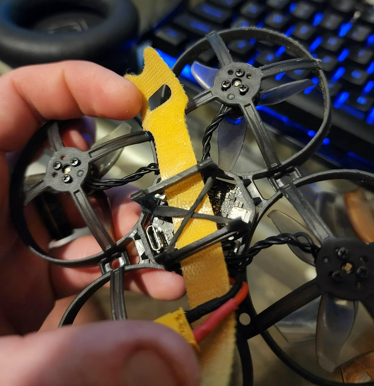
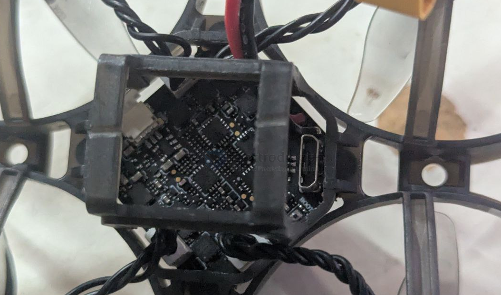
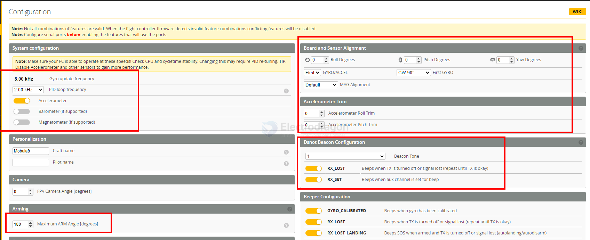
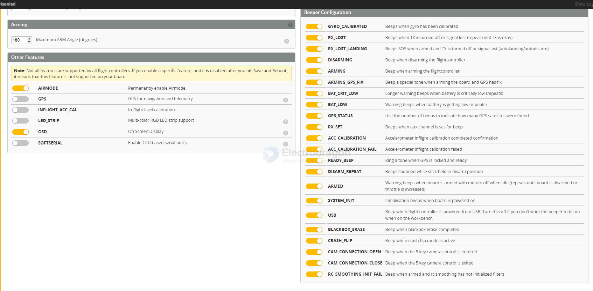
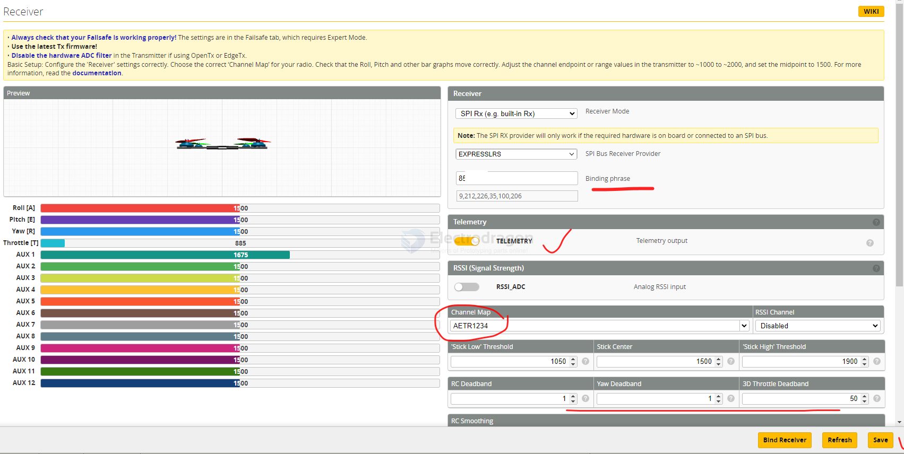
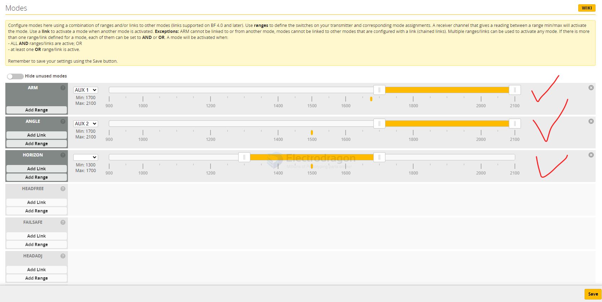
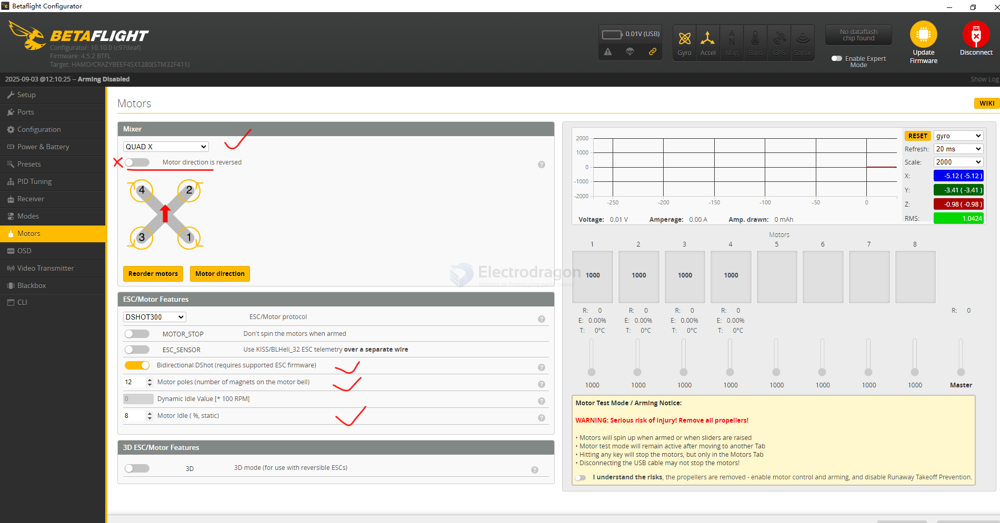

# mobula8-dat

- [[FPV-dat]]

- [[battery-pack-dat]] - [[flight-controller-dat]] - [[PID-dat]]

- [[betaflight-presents-dat]]

- [[FPV-accesories-dat]]

- [[EX1103-dat]] - [[motor-dat]] - [[Thrust-dat]] - [[motor-FPV-dat]]

## pre-note 

REMOVE PROPS before first flight !! 

install propeller - [[propeller-dat]] - [[motor-dat]]

## dimension of the frame 

## tuning 

- [total default stock tuning, running 1S? ](https://www.reddit.com/r/TinyWhoop/comments/146r0v6/happymodel_mobula_8_first_test_flights/)

## hack 

battery holder to strap 

## how to use 

[[RC-binding-mode-dat]]

config by [[USB-dat]] USB port 

- [[betaflight-configurator-dat/betaflight-dat]]

[user manual](https://www.happymodel.cn/wp-content/uploads/2023/04/Manual-for-Mobula8-SPI-ELRS-1-2S-85mm-Micro-FPV-whoop-drone.pdf) 

- [[radiomaster-dat]] how to bind with it

## betaflight correct setup to match [[radiomaster-dat]]

- [[betaflight-configurator-dat/betaflight-dat]]

### configuration

### receiver 

- AETR1234 

- [[RC-controller-dat]]

### modes setup 

### motors setup 

## info 

Mobula8 
- 1-2S 
- 85mm无刷穿越机 
- X12飞控  - [[X12-dat]] - [[flight-controller-dat]]
- 400mw图传 
- 1103电机 
- ELRS

- 400mw VTX, 1103 Motor, ELRS
- **Packing List & Product Parameters:**
    - Mobula8 Frame * 1, Brand Name: Happymodel
    - EX1103 KV11000 Brushless Motor, Item Name: Mobula8 1-2S 85mm - [[EX1103-dat]]
    - Gemfan 2023 Three-blade Propellers (4CW+4CCW), Wheelbase: 85mm
    - Caddx ANT 1200TVL Camera, Size: 120mm*120mm*50mm - [[VTX-dat]]
    - Onboard 5.8G OpenVTX 0mw~400mw VTX * 1, Weight: 43g
    - Canopy for 14mmx14mm camera * 1
    - Screwdriver * 1
- **Packing List:**
    - Mobula8 Frame * 1
    - EX1103 KV11000 Brushless Motor
    - Gemfan 2023 Three-blade Propellers (4CW+4CCW)

- **Frame wheelbase:** 85 mm (motor-to-motor diagonal)
- **Typical prop size:** 2 inches
- **Reason:**  
  - 65 mm whoops → ~31 mm props (≈1.2 inch)  
  - 75 mm whoops → ~40 mm props (≈1.6 inch)  
  - 85 mm whoops → ~48 mm props (≈2 inch)  

## battery 

95C 2S1P 550mAH 

2S 厚17× 宽13× 长80mm 34克 

XT30

- ✅ 2S (7.4V LiPo / 8.7V LiHV) → Official recommended setup
- ⚠️ 3S (11.1V LiPo / 13.05V LiHV)
  - Technically possible but **NOT recommended** with 11000KV motors
  - Motors will run hot, risk of burning out
  - Frame is very light → too much power, hard to control indoors
- ❌ 4S (14.8V LiPo / 17.4V LiHV)
  - **Not supported**
  - Will instantly overheat or fry ESC/motors

## problems 

### 🚁 Why Throttle Feels Jumpy on Mobula8

1. **No Altitude Hold**
   - Mobula8 + Betaflight does not have barometer/alt-hold.
   - Throttle is fully manual: up = climb, down = descend.

2. **Throttle Center**
   - Hover point is usually not at 50%.
   - For Mobula8 (2S), hover is often around **30–40% throttle**.

3. **Tiny Quad Sensitivity**
   - Small quads react fast to throttle changes.
   - Even small stick movement = big altitude change.

### 🛠️ How to Make Hovering Easier

1. Enable Angle Mode

Betaflight Configurator → Modes Tab.

Add ANGLE mode to a switch on your Radiomaster Pocket.

Angle mode keeps the quad level so you only need to manage throttle.

2. Adjust Throttle Curve / Expo

On Radiomaster Pocket (EdgeTX):

Go to Model Setup → Inputs → Throttle.

Add Expo (20–30%) or a custom curve.

This makes mid-throttle less sensitive, easier to hover.

3. Set Proper Motor Idle

Betaflight → Configuration Tab.

Motor Idle Throttle Value: ~5% (default too low/high can cause jumps).

4. Practice Hover

Hover indoors at waist height.

Slowly adjust throttle until you find the "sweet spot".

Remember: FPV drones require constant micro-adjustments.

##  Best Preset Build for Mobula8 — Tuning Overview

### 1. Base Tune (Factory Defaults)
- Stick with the **factory PID and rates** unless you fly aggressively past stock performance.  
  - Many experienced pilots, including reviewers, report that “the default PIDs and rates felt dialed” for smooth flight :contentReference[oaicite:0]{index=0}.

---

### 2. Recommended Flight Modes
- **Angle Mode** for stable, slow, and cinematic flight.  
- Optional: **Motor Beacon** (helps find your quad when disarmed) :contentReference[oaicite:1]{index=1}.

---

### 3. Essential Configuration Settings
- **Configuration →**
  - **Arming Angle**: Set to **180** to allow arming from uneven ground
  - **Thrust Linearization**: Useful for smooth low-throttle response; a small boost (~20%) helps

---

### 4. PID Adjustments (Optional, For Smoother Flight)
If you want even smoother, gentle flight:
- On Mobula6 users reported:
  - **Roll / Pitch** P: ~18–20
  - **I**: 30
  - **Feedforward / Damping tweaks** apply similarly well to Mobula8

---

### 5. Rate Settings for Smooth Control
- Custom builds often use **higher rates** (e.g. roll & pitch ~850, yaw ~700) with expo to mellow control lines :contentReference[oaicite:5]{index=5}.  
- Adjust RC Expo to around **0.5** for soft response at stick center (common for smooth flight profiles).

---

### 6. Filtering and RPM Output
- Many users dial down **gyro/D-term filter multipliers** (e.g., from 0.9 → 0.8 → 0.7) to reduce vibration and jello :contentReference[oaicite:6]{index=6}.  
- Stick with **DSHOT300 or 600**, add some **RPM filtering** if your ESC supports it :contentReference[oaicite:7]{index=7}.

---

### 7. Preset Summary (In One Table)

| Feature             | Recommendation                            |
|--------------------|--------------------------------------------|
| PID               | Stock factory (default)                    |
| Flight Modes       | Angle mode + Motor Beacon                  |
| Arming Angle       | Max: 180°                                  |
| Thrust Linear      | ~20% boost for smooth low throttle         |
| Optional PID tweak | P ≈ 18–20, I = 30 for gentle flight        |
| Rates              | Roll/Pitch ~850, Yaw ~700, Expo ~0.5       |
| Filtering          | Gyro/D-term filter ~0.8 multiplier         |

## sorted English 

- Mobula8, this is Happymodel's first attempt on an 85mm frame.
- It uses the X12 series flight controller, 1103 KV11000 motors with Gemfan Hurricane 2023 three-blade propellers, providing excellent power and extremely smooth flight.
- **Features:**
    - X12 5-in-1 AIO flight controller with built-in 2.4G ELRS V2.0 and OPENVTX.
    - VTX power up to 400mw.
    - ELRS V2.0 (default), firmware supporting ELRS V3.0 available.
    - EX1103 KV110000 motors.
    - CaddxFPV Ant FPV camera.
    - Smooth and powerful.
    - Compatible with 1S-2S Lipo/LIHV batteries.
    - Recommended to use 2S 450mah/550mah/650mah batteries (not included).
- **Specifications:**
    - Brand Name: Happymodel
    - Item Name: Mobula8 1-2S 85mm Micro FPV Whoop Drone
    - Wheelbase: 85mm
    - Size: 120mm*120mm*50mm
    - Weight: 43g
- **Receiver Options:**
    - 2.4G ELRS SPI (supports ELRS v2.0, firmware compatible with ELRS v3.0 available)
    - SPI Frsky D8/D16 (not compatible with EMAX E6 radio)
    - SPI Flysky AFHDS2A
    - PNP (no onboard receiver)
    - TBS version (external TBS CRSF NANO RX)
- **Package Includes:**
    - Item Name Quantity
    - Mobula8 Frame 1
    - Option 1: X12 ELRS V2.1 flight controller with built-in SPI ELRS 2.4G receiver
    - Option 2: X12 Frsky V2.1 flight controller with built-in SPI Frsky 2.4G receiver
    - Option 3: X12 Flysky V1.0 flight controller with built-in SPI Flysky 2.4G receiver
    - Option 4: X12 PNP V1.1 flight controller without onboard receiver
    - Option 5: X12 PNP V1.1 flight controller with TBS CRSF NANO RX
    - EX1103 KV11000 brushless motor
    - Gemfan 2023 three-blade propellers (4cw+4ccw)
    - Caddx ANT 1200TVL camera
    - Onboard 5.8G OpenVTX 0mw~400mw VTX 1
    - Canopy for 14mmx14mm camera 1
    - Screwdriver 1
- **Spare Parts Specifications:**
    - **Motor:**
        - Model: EX1103 KV11000
        - Configuration: 9N12P
        - Stator Diameter: 11mm
        - Stator Length: 3mm
        - Shaft Diameter: Φ1.5mm
        - Motor Dimensions (Dia.*Len): Φ13.5mm*15.5mm
        - Weight (g): 3.8g
        - Applicable Battery: 1-2S
    - **Propeller:**
        - Weight: 0.88g
        - Material: PC
        - Pitch: 2.3 inches
        - Prop Dia: 52.17mm
        - Center Thickness: 5mm
        - Center Hole Dia: 1.5mm
    - **Flight Controller:**
        - X12 ELRS V2.1 built-in ELRS 2.4G receiver target: CRAZYBEEF4SX1280
        - X12 Frsky V2.1 flight controller built-in SPI Frsky 2.4G receiver target: CRAZYBEEF4FR
        - X12 Flysky V1.0 flight controller built-in SPI Flysky 2.4G receiver target: CRAZYBEEF4FS
        - X12 PNP V1.1 flight controller without onboard receiver target: CRAZYBEEF4DX
        - MCU: STM32F411CEU6 (100MHz, 512K FLASH)
        - Sensor: ICM20689 or ICM42688P (SPI connection)
        - Mounting hole size: 25.5mm*25.5mm
        - Power supply: 1-2S battery input (DC 2.9V-8.7V)
        - Built-in 12A (each) Blheli_S 4in1 ESC
        - Built-in Betaflight OSD (SPI Control)
        - Built-in 5.8G OpenVTX 0mw~400mw
        - Built-in ExpressLRS 2.4G, Frsky D8/D16, Flysky AFHDS 2A
        - Built-in voltage detection
        - Built-in current sensor
    - **Onboard 4in1 ESC:**
        - Power supply: 1-2S LiPo/LiPo HV
        - Current: 12A continuous peak 15A (3 seconds)
        - Supports BLHeliSuite programmable
        - Firmware target: Z_H_30
        - Default protocol: DSHOT300
        - Supports Bluejay firmware
    - **Onboard SPI ExpressLRS 2.4GHz Receiver:**
        - Packet Rate options: 50Hz/150Hz/250Hz/500Hz
        - Firmware version: V2.0
        - RF Frequency: 2.4GHz
        - Antenna: SMD antenna
        - Telemetry output power: <12dBm
        - Receiver protocol: SPI ExpressLRS
        - Compatible with ExpressLRS V2.0 TX module
        - Cannot flash ExpressLRS firmware separately
        - Can flash FC firmware to support ExpressLRS v3.0 TX module
    - **Onboard SPI Frsky D8/D16 Receiver Version:**
        - SPI BUS receiver Frsky D8/D16 compatible
        - Compatible with non-EU transmitter D8/D16 models
        - Channels: 8ch/16ch
    - **Onboard SPI Flysky Receiver Version:**
        - SPI BUS receiver
        - Protocol: AFHDS-2A
        - Channels: 14ch (AFHDS-2A)
        - Failsafe support
    - **PNP Version (No onboard receiver):**
        - External receiver full UART1
        - Supports CRSF/GHOST/SBUS/IBUS/DSMX protocols
        - IR1 pad (inverted RX1) for SBUS input
    - **External TBS CRSF Nano Receiver Version:**
        - Original TBS CROSSFIRE receiver
        - CRSF protocol
        - Official TBS transmitter compatible
    - **Onboard 5.8g OPENVTX:**
        - Firmware version: OPENVTX
        - Smartaudio v2.1
        - PIT mode support
        - RCE mode support
        - Channels: 48ch
        - Transmission power: 0/RCE/25mw/100mw/400mw
        - Power supply: DC 5V
        - Current (5v): <650ma (400mw)
    - **Caddx ANT 1200TVL Camera:**
        - Image Sensor: 1/3" CMOS Sensor
        - Horizontal Resolution: 1200TVL
        - TV System: NTSC or PAL
        - Image: 16:9 or 4:3
        - Synchronization: Internal
        - Electronic Shutter: PAL: 1/50~100,000; NTSC: 1/60~100,000
        - S/N Ratio: >52dB (AGC OFF)
        - Video Output: CVBS
        - Lens: 1.8mm
        - Min. Illumination: 0.001Lux@F1.2
        - Auto Gain Control: Yes
        - WDR: Global WDR
        - DNR: 3D DNR
        - Dimensions: 14*14mm (with bracket to 19*19mm)
        - Wide Power Input: DC 3.7-18V
        - Weight: 2g (N.W.)

## raw info 
Mobula8,这是Happymodel首次尝试在85mmframe上的尝试
采用X12系列飞控，1103KV11000的电机配合GemfanHur
ricane2023三叶螺旋桨，动力表现优异，飞行极其顺畅。
特点:
X125合1AIO飞行控制器内置2.4GELRSV2.0和OPENVTX
VTX功率高达400mw
ELRSV2.0(默认)，提供支持ELRSV3.0的固件
EX1103KV110000电机
caddxfpv蚂蚁FPV摄像机
平稳有力
兼容1S-2SLipo/LIHV电池
推荐使用2S450mah/550mah/650mah电池(不含）
规格：
品牌名称:Happymodel
项目名称:Mobula81-2S85mm微型FPVWhoop无人机
轴距：85毫米
大小:120mm*120mm*50毫米
重量:43克
接收机选择：
2.4GELRSSPI(支持ELRSv2.0，提供兼容ELRSv3.O的固件)
SPIFrskyD8/D16与EMAXE6无线电不兼容
SPI Flysky AFHDS2A
PNP(无板载接收机)
TBS版本(外接TBSCRSFNANORX)
包包括：
项目名称数量
Mobula8机架1
选项1:X12ELRSV2.1飞行控制器内置SPIELRS2.4G接收器
Option2:X12FrskyV2.1飞行控制器内置SPIFrsky2.4G接收器
Option3:X12FlyskyV1.0飞行控制器内置SPlFlysky2.4G接收
器
选项4:无机载接收机的X12PNPV1.1飞行控制器
选项5:X12PNPV1.1飞行控制器与TBSCRSFNANORX
EX1103KV11000无刷电机
乾丰2023三叶螺旋桨(4cw+4ccw)
caddxANT1200TVL摄像机
板载5.8GOpenvtx0mw~400mwvtx1
用于14mmx14mm相机头罩1
螺丝刀1
备件规格：
电机模式:EX1103KV11000
Configu-ration: 9 n12p
定子直径：11毫米
定子长度：3毫米
轴直径:Φ1.5毫米
电机尺寸(Dia。。*Len):Φ13.5毫米*15.5毫米
重量(克):3.8g
适用电池:1-2S
螺旋桨重量:0.88g
材料:PC
节距:2.3英寸
道具Dia:52.17毫米
中心厚度：5毫米
中心孔直径：1.5mm
飞行控制器X12ELRSV2.1内置ELRS2.4G接收机目标:CRAZYBE
EF4SX1280
X12FrskyV2.1飞行控制器内置SPIFrsky2.4G接收器目标:CRA
ZYBEEF4FR
X12FlyskyV1.0飞行控制器内置SPIFlysky2.4G接收器目标:CR
AZYBEEF4FS
无机载接收机的X12PNPV1.1飞行控制器目标:CRAZYBEEF4DX
MCU: Stm32f411ceu6 (100mhz, 512k闪存)
传感器：ICM20689或ICM42688P(SPI连接)
安装孔尺寸：25.5mm*25.5mm
电源:1-2S电池输入(直流2.9V-8.7V)
内置12A(每个)BIheli_S4in1ESC
内置betflight OSD(SPI控制)
内置5.8GOpenVTX0mw~400mw
内置ExpressLRS 2.4G,frysky D8/D16,Flysky AFHDS 2A
内置电压检测
内置电流传感器
板载4in1 esc电源:1-2SLiPo/LiPoHV
电流:12A连续峰值15A(3秒)
支持BLHeliSuite可编程
固件目标:Z_H_30
默认协议：DSHOT300
支持蓝鸟固件
板载SPIExpressLRS2.4GHz接收器包速率选项:50Hz/150Hz/2
50Hz/500Hz
固件版本:V2.0
射频频率:2.4GHz
天线：SMD天线
遥测输出功率:<12dBm
接收协议:SPIExpressLRS
兼容ExpressLRSV2.0 TX模块
无法单独flashExpressLRS固件
可以flashFC固件支持ExpressLRSv3.0TX模块
板载SPIFrskyD8/D16接收器版本SPIBUS接收器FrskyD8/D1
6兼容
兼容非欧盟发射机D8/D16型号通道：8ch/16ch
板载SPIFlysky接收器版本SPIBUS接收器
协议：AFHDS-2A
通道:14 ch (AFHDS-2A)
失控保护支持
PNP型版本
(无板载接收器)外部接收器满UART1
支持CRSF/GHOST/SBUS/IBUS/DSMX协议
IR1 pad(反向RX1)，用于SBUS输入
外部TBSCRSF纳米接收器版本原始TBSCROSSFIRE接收器，C
RSF协议，官方TBS发射器兼容
板载5.8gOPENVTX固件版本:OPENVTX
Smartaudio v2.1
PIT模式支持
RCE模式支持
渠道:48ch
发射功率:0/RCE/25mw/100mw/400mw
电源：直流5V
电流(5v):<650ma (400mw)
cadxANT1200tvI相机图像传感器：1/3"CMOS传感器
水平分辨率:1200TVL
电视系统：NTSC或PAL
图像：16:9或4:3
同步:内部
电子快门:PAL:1/50~100,000;NTSC:1/60～100000
信噪比:>52dB(AGC OFF)
视频输出:CVBS
镜头:1.8毫米
最小照度:0.001Lux@F1.2
自动增益控制:是的
WDR:Global WDR
Dnr: 3d Dnr
尺寸:14*14mm(带支架至19*19mm)
宽电源输入:DC3.7-18V
重量:2g (N.W.)

## ref 

- [[happymodel-dat]] - [[mobula8]]