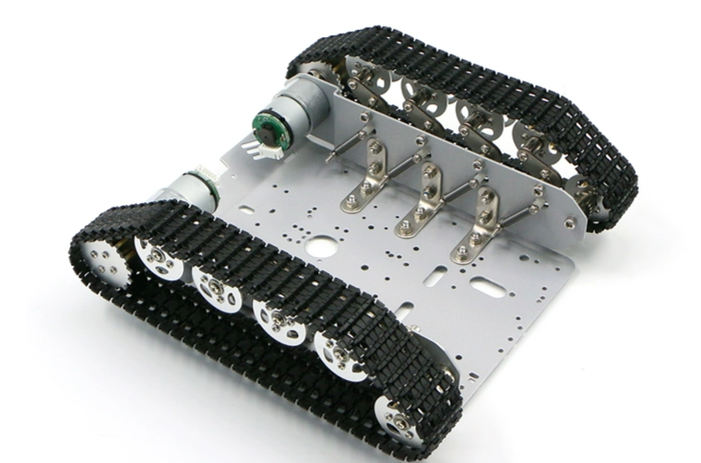
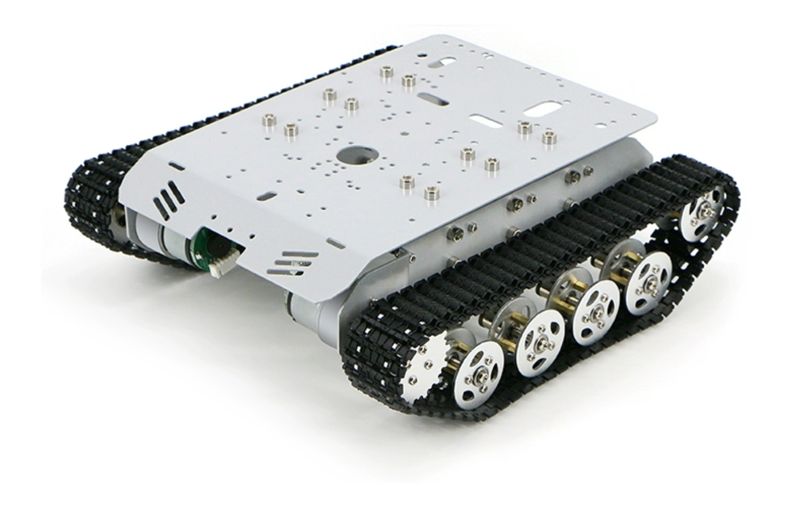

# Tank-dat

- [[dc-gear-motor-dat]] - [[MG513-dat]]

- [[tank-track-dat]]

## tank platform 1 

- Each wheel has an independent suspension spring 
- six rogs each side 

## 3D 

- tank track and [[robot-arm-dat]] - [3D model](https://cad.onshape.com/documents/74b490fd20a2a4c684736444/w/df7ed99939a49695aecaa97f/e/90154fe41bafe724913e360f?renderMode=0&uiState=68301af9be87bf505c7ca7d0)

## ref 

- [[RC]] - [[tank]]