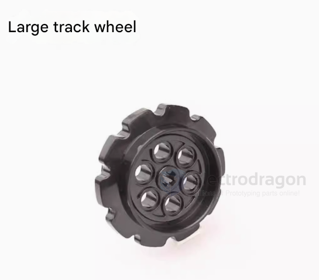
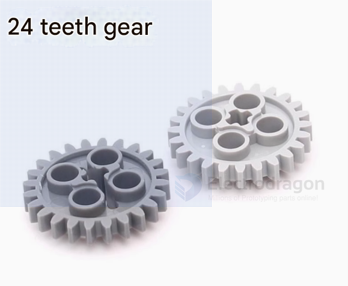
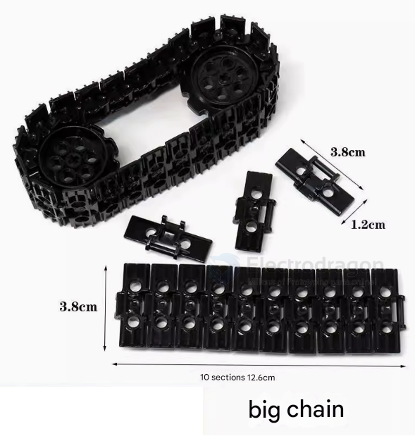

# tank-track-dat

## ✅ When Tank Tracks Are Better
- **Soft Terrain** (sand, mud, snow):
  - Tracks distribute weight over a larger surface, preventing sinking.
- **Uneven Terrain** (rocks, slopes, obstacles):
  - Tracks provide better grip and stability.
- **Heavy Loads**:
  - Tracks can support and move heavier equipment with more traction.

## ✅ When Wheels Are Better
- **Hard, Flat Terrain** (pavement, concrete):
  - Wheels are faster and more energy-efficient.
- **Speed & Efficiency**:
  - Wheeled systems are usually lighter and less power-hungry.
- **Maintenance & Cost**:
  - Wheels are simpler, cheaper, and easier to repair.

## 🔍 Summary Table

| Feature           | Tank Tracks                     | Wheels                           |
|------------------|----------------------------------|----------------------------------|
| Traction          | Excellent on rough terrain       | Good on hard surfaces            |
| Speed             | Slower                           | Faster                           |
| Efficiency        | Lower (more friction)            | Higher                           |
| Terrain Handling  | Superior on soft/uneven ground   | Best on smooth/hard ground       |
| Weight Support    | High                             | Moderate                         |
| Maintenance       | More complex and expensive       | Easier and cheaper               |

## BOMS 

Cogs

Chains 

## guide 

- [tank #track disassemble and re-assemble](https://t.me/electrodragon3/371)

## ref 

- [[robot-dat]] - [[tank-dat]]