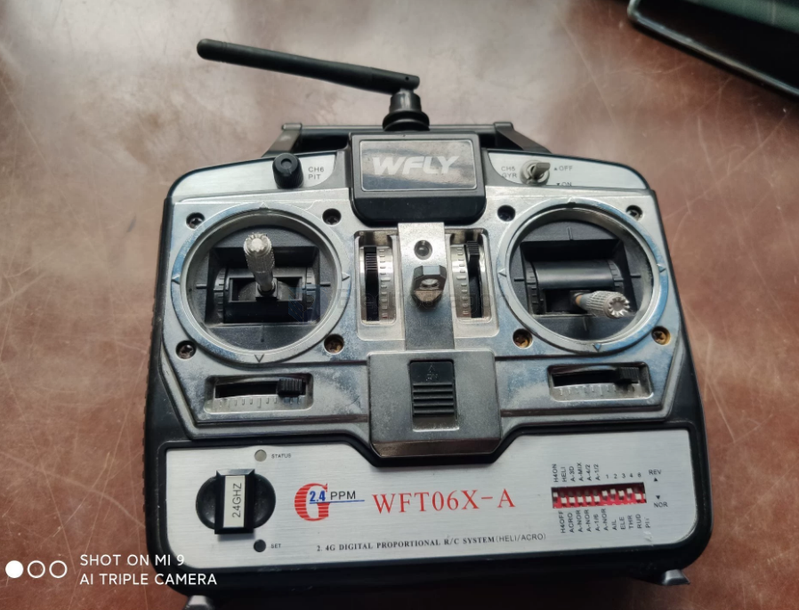
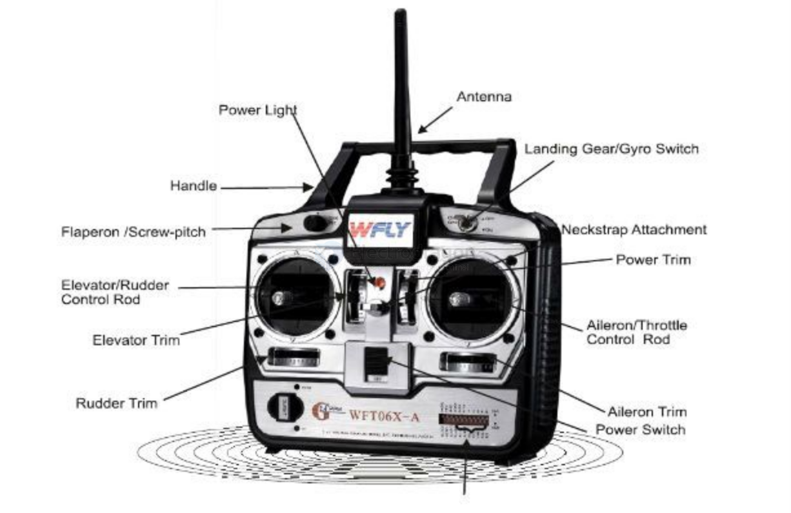
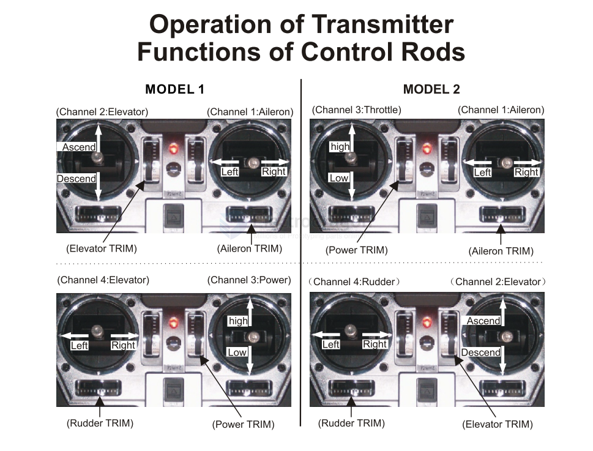
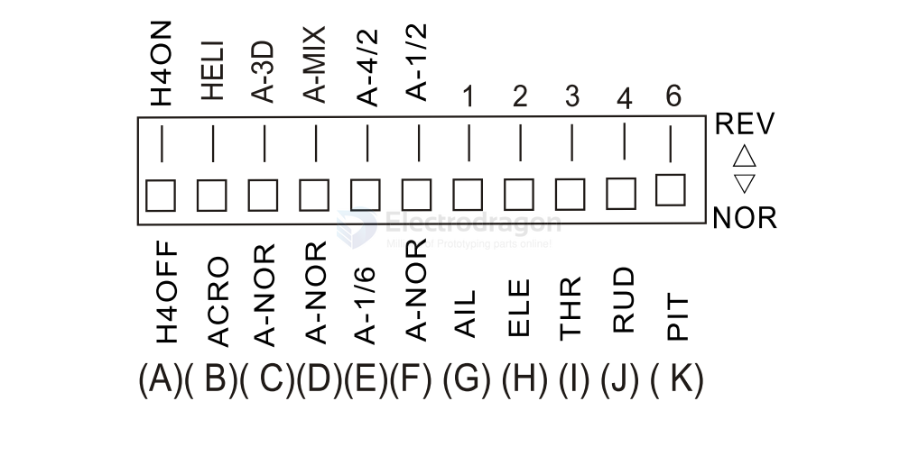

# WFLY-dat

- [[PPM-dat]]

- the manual == [[WFLY-WFT06X_Mannual.pdf]]
- [fccd.io manual link](https://fccid.io/TZVWFT06XWFT08S/User-Manual/User-Manual-1-1119279.pdf) 

## Info 

- WFT06X-A: 6 channels airplane,mixfunction,D/R,HDE helicopter.
- WFT06X-B: 4 channesl airplane, mix function,D/R, HDE helicopter.
- WFT06X-C: 6 channels CCPMhelicopter,airplane.

## Models 

- [[airplane-dat]]

## toggle switches 

| Switch      | State      |                             | Up                                 | Down                               |
| :---------- | :--------- | --------------------------- | :--------------------------------- | :--------------------------------- |
| A           | Helicopter | Ch3 to Ch4 mixture. (note1) | Enables                            | Disables                           |
| B           | N/A        |                             | Selects Helicopter state.          | Selects Airplane state.            |
| C (1,2,4,6) | Airplane   |                             | Dual Rate set to ±125%.            | Dual Rate set to ±100%.            |
| D           | Airplane   |                             | Enables mixture functions (E, F).  | Disables mixture functions (E, F). |
| E           | Airplane   |                             | Enables Ch2 & Ch4 mixture (note3)  | Enables Ch1 & Ch6 mixture (note3)  |
| F           | Airplane   |                             | Enables Ch1 & Ch2 mixture (note2). | N/A                                |
| G (Ch1)     | N/A        |                             | Reverse Mode.                      | Normal Mode.                       |
| H (Ch2)     | N/A        |                             | Reverse Mode.                      | Normal Mode.                       |
| I (Ch3)     | N/A        |                             | Reverse Mode.                      | Normal Mode.                       |
| J (Ch4)     | N/A        |                             | Reverse Mode.                      | Normal Mode.                       |
| K (Ch6)     | N/A        |                             | Reverse Mode.                      | Normal Mode.                       |

note1 == Ch3 to Ch6 mix always active

note2 == (Elevon/Delta Wing) (Requires D Up, overrides D)

note3 == (V-Tail) (Requires D Up).

Switch Function Instruction

- (A）At helicopterstate,pulling A down to put offmixturefunction of channel3to channel4,when pulling it up it willcomebackthefunction.Butthemixturefunctiontochannel 6isstable,whichisirrelevant with this switch.
- (B) Pulling B down is airplane state and pulling it up is helicopter state.
- (C) At airplane state, pulling 1, 2, 4, 6 down the dual rate is ±100%; when pulling them up, the dual rate will be ±125%.
- (D) At airplane state, pulling D down make switches have no mixture function, but pulling it up will cause them have thefunction.
- (E) At airplane state, when D is pulled up, pulling E down cause channel 1 & 6 mixture function (Flaperon); pulling E up will cause channel 2 & 4 mixture function(V-TAIL）.
- (F) At airplane state,when D is pulled up,pulling F up it works as the mixture function of channel 1&2(TrianglewingELEVON),and Dfunctiondoesn'tworkat that moment.
- (G) Channel 1 is reverse switch for aileron.Pulling G down is to make it in normal mode,and pulling it up is to make it act in reverse.
- (H) Channel 2 is reverse switch for elevator. Pulling H down is to make it in normal mode, and pulling it up is to make it act in reverse.
- (I) Channel 3 is reverse switch for power. Pulling I down is to make it in normal mode, and pulling it up is to make it act in reverse.
- (J) Channel 4 is reverse switch for rudder. Pulling J down is to make it in normal mode, and pulling it up is to makeitactinreverse.
- (K) Channel 6 is reverse switch for screw-pitch/ flaperon.Pulling K down is to make it in normal mode, and pulling it up is to make it act in reverse.

## Binding Instructions:

1.  **Receiver:** Press and hold the "SET" button until the orange "STATUS" light flashes slowly. The receiver is now waiting for the transmitter's binding command.
2.  **Transmitter:** Press and hold the "SET" button while powering on the transmitter. Press the SET button once more to enter the binding function (the orange "STATUS" light will be solid). Then, press and hold the SET button until the orange light flashes slowly, entering the binding state.
3.  **Binding Successful:** The transmitter's green light will turn solid, and the receiver's indicator light will turn off.

## Failsafe Setup:

1.  Power on the receiver.
2.  Press and hold the "SET" button while powering on the transmitter. Then, press and hold the SET button for about 2 seconds to enter the failsafe setup state (the green light will flash).
3.  The receiver's green light will flash quickly. The data currently being output by the transmitter will be set as the failsafe output data for the receiver.
4.  **Failsafe Active State:** The receiver's red light will be solid.

## Technical Parameters:

*   **Application:** Fixed-wing aircraft, HDE helicopters, fixed-pitch helicopters, cars, boats
*   **Frequency Band:** 2.400 - 2.483 GHz
*   **Transmit Power:** ≤ 100mW
*   **Operating Current:** ≤ 160mA
*   **Encoding:** PPM
*   **RF Module:** Built-in
*   **Power Supply:** 9.6 - 12V
*   **Dual Rate/Expo Range:** 100% ~ 125%
*   **Mixing:**
    *   Flaperon (Channel 6 and Channel 1 mix)
    *   V-Tail (Channel 4 and Channel 2 mix)
    *   Delta Wing (Elevon) (Channel 1 and Channel 2 mix)
    *   HDE Helicopter (Channel 3 to Channel 4 & 6 mix)
    *   HDE Helicopter (Channel 3 to Channel 6 mix)
*   **Reverse Switches:**
    *   Channel 1: Aileron 副翼
    *   Channel 2: Elevator 升降舵
    *   Channel 3: Throttle 油门
    *   Channel 4: Rudder 方向舵
    *   Channel 6: Flap/Pitch 襟翼/螺距
*   **Low Voltage Alarm (Visual & Audible):**
    *   Battery Voltage < 8.8V: Power indicator flashes once per second with beeping.
    *   Battery Voltage < 8.3V: Power indicator flashes twice per second (0.5s interval) with beeping.
*   **Charging Jack:** Yes
*   **Simulator Jack:** Yes

## Beeping 

According to the document, the device will provide a sound-and-light notification when the battery voltage is low.   

**When the battery voltage is below 8.8V**, the power indicator light will glitter and buzz at a rate of 1S/1S.   

**When the battery voltage drops below 8.3V**, the power indicator light will glitter and buzz at a rate of 0.5S/1S.   

Additionally, the WFT06X-C model transmitter will alarm if it is turned on in an Idle-up state with no output.   

## demo video 

- [how to binding WFLY in chinese ](https://www.bilibili.com/video/BV1Mh4y1c7FS/?vd_source=74a6b8b9bfcd41c5946a742815bf71ae)

## ref 

- [[WFLY]] - [[lightradio]] - [[radiomaster]]