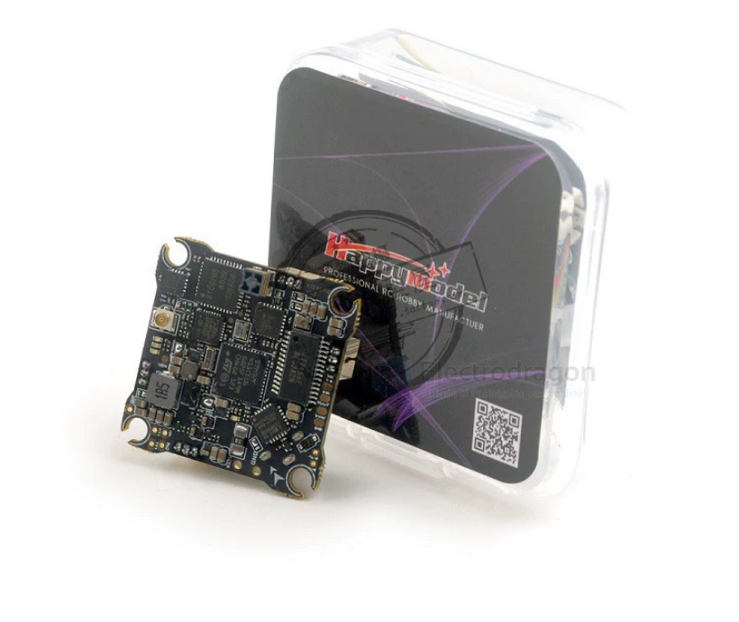
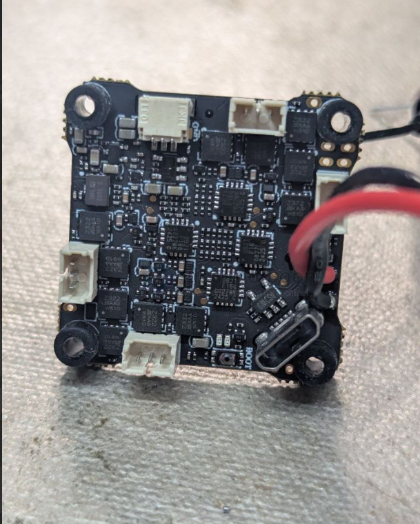
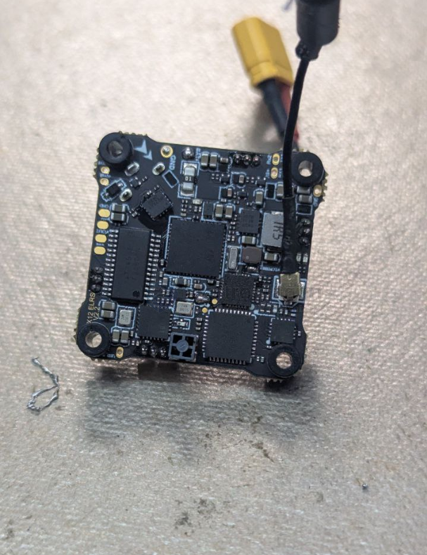
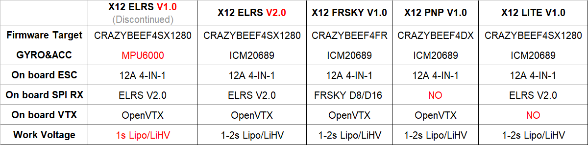
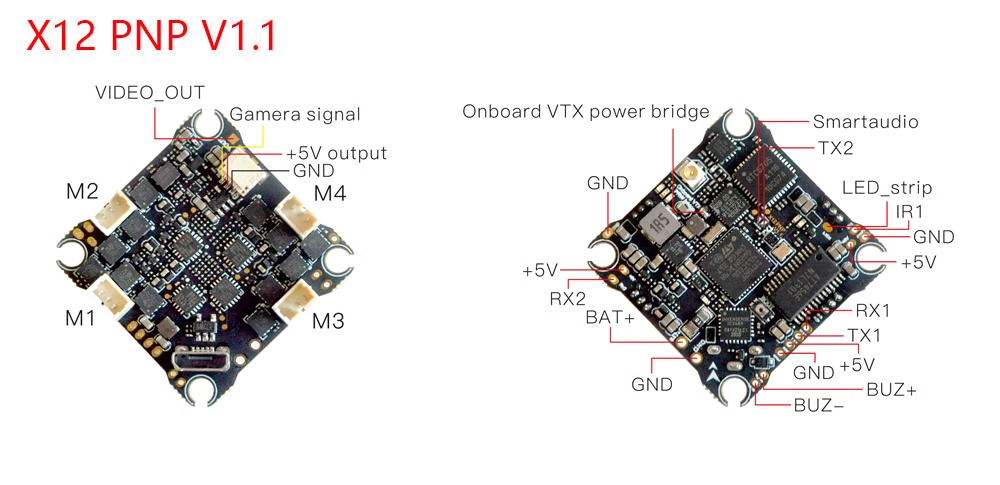
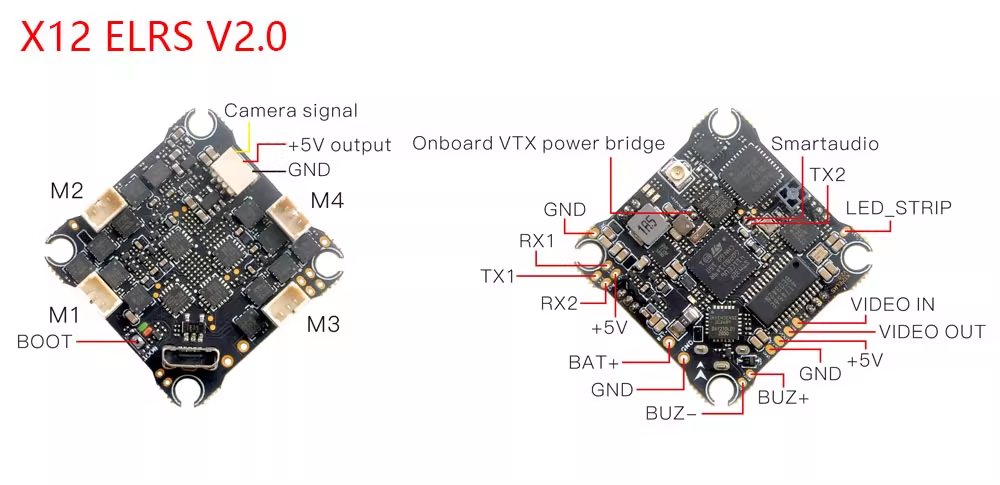
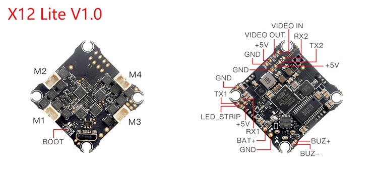

# X12-dat

## X12 ELRS V2.2 

## Version 

## Info 
# X12-dat

-   **Product Name:** X12 AIO 5-IN-1 Flight controller built-in 12A ESC and OPENVTX
-   **Brand Name:** Happymodel
-   **Overview:**
    -   The world's first 5-IN-1 AIO flight controller.
    -   Features OPENVTX (up to 400mW), 12A Brushless Blheli_S ESC, and Betaflight OSD.
    -   It comes with an onboard SPI ELRS receiver which supports ELRS TX module 2.x firmware.
    -   It also provides other receiver options like SPI Frsky receiver which support Frsky D8/D16, REDPINE, and SFHSS.
    -   This is an amazing flight controller for Brushless whoop. You could get unbelievable RX and VTX range by using this flight controller.
-   **General Specifications:**
    -   VTX antenna: U.FL
    -   Weight: 5.1g
    -   Size: 30mm*30mm*8mm

## Flight Controller Details

-   **Betaflight Firmware Targets:**
    -   ELRS Version: CRAZYBEEF4SX1280
    -   FRSKY Version: CRAZYBEEF4FR
    -   PNP Version: CRAZYBEEF4DX
    -   LITE Version: CRAZYBEEF4SX1280
-   **Specific Versions & Targets:**
    -   X12 ELRS V2.0 flight controller built-in ELRS 2.4G receiver Target: CRAZYBEEF4SX1280
    -   X12 Frsky V1.0 flight controller built-in FRSKY 2.4G receiver Target: CRAZYBEEF4FR
    -   X12 PNP V1.0 flight controller without onboard receiver Target: CRAZYBEEF4DX
    -   X12 LITE V1.0 flight controller built-in ELRS 2.4G receiver Target: CRAZYBEEF4SX1280
-   **MCU:** STM32F411CEU6 (100MHZ, 512K FLASH)
-   **Sensor:** MPU6000 or ICM20689 or BMI270 (SPI connection)
-   **Mounting hole size:** 25.5mm*25.5mm
-   **Power supply:** 1-2S battery input (DC 2.9V-8.7V)
-   **Built-in Features:**
    -   12A (each) Blheli_S 4in1 ESC
    -   Betaflight OSD (SPI Control)
    -   5.8G OpenVTX (0mW~400mW)
    -   ExpressLRS 2.4G, Frsky D8/D16
    -   Voltage meter sensor (voltage meter scale 110)
    -   Current meter sensor (current meter scale 470)

## Onboard 4in1 ESC

-   **Power supply:** 1-2S LiPo/LiPo HV
-   **Current:** 12A continuous, peak 15A (3 seconds)
-   **Programmability:** Supports BLHeliSuite
-   **Factory firmware:** Z_H_30_REV16_7.HEX
-   **Default protocol:** DSHOT300
-   **Bluejay Firmware Support:**
    -   Supports Bluejay firmware.
    -   When using Bluejay firmware with 48kHz, startup power should be set to 1100/1200.

## Onboard SPI ExpressLRS 2.4GHz Receiver

-   **Packet Rate options:** 50Hz/150Hz/250Hz/500Hz
-   **ExpressLRS Firmware version:** V2.0
-   **RF Frequency:** 2.4GHz
-   **Antenna:** SMD antenna
-   **Telemetry output Power:** <12dBm
-   **Receiver protocol:** SPI ExpressLRS
-   **Compatibility:** Compatible with ExpressLRS V2.0 TX Module
-   **Firmware Flashing:** Cannot flash ExpressLRS firmware separately.

## Onboard Frsky SPI D8/D16 Receiver Version

-   **Receiver Type:** SPI BUS receiver
-   **RF Chip:** CC2500 RF
-   **Compatibility:** Compatible with Non-EU transmitter D8 model
-   **Channels:** 8ch
-   **Range:** No ground interference (Transmitter and receiver 1m from the ground): 200 meters
-   **Failsafe:** Failsafe support
-   **Supported Protocols:** Frsky D8/D16, Redpine, SFHSS

## Onboard 5.8g OPENVTX

-   **Firmware version:** OPENVTX
-   **Smartaudio:** v2.1
-   **Modes:**
    -   PIT Mode support
    -   RCE Mode support
-   **Channels:** 48ch
-   **Transmitting Power:** 0/RCE/25mW/100mW/400mW
-   **Power supply:** DC 5V
-   **Current (5V):** <650mA (at 400mW)
-   **Antenna connector:** U.FL