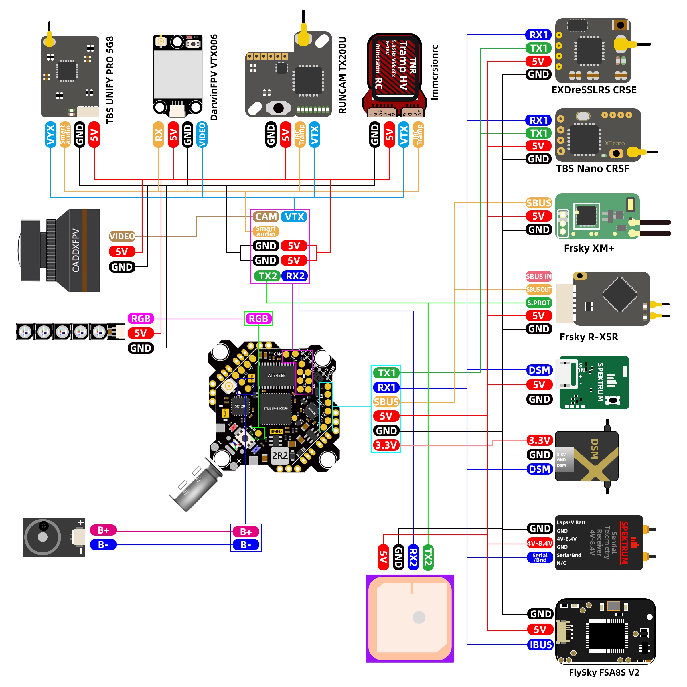

# flight-controller-dat

- **Flight Controller**: The brain of the drone, responsible for stabilizing and controlling the flight. It processes data from sensors and executes commands from the pilot or autopilot system.

ALL-in-One Option 

- [[ELRS-dat]] - [[radio-dat]]
- [[Flight-controller-dat]] 
- [[ESC-dat]] - [[motor-FPV-dat]]
- [[VTX-dat]] - [[camera-dat]]

- [[X12-dat]] - [[CRAZYBEEF4SX1280-dat]]

## FC AIO = flight controller all in one

## ref 

- [[motor-dat]] - [[VTX-dat]]

