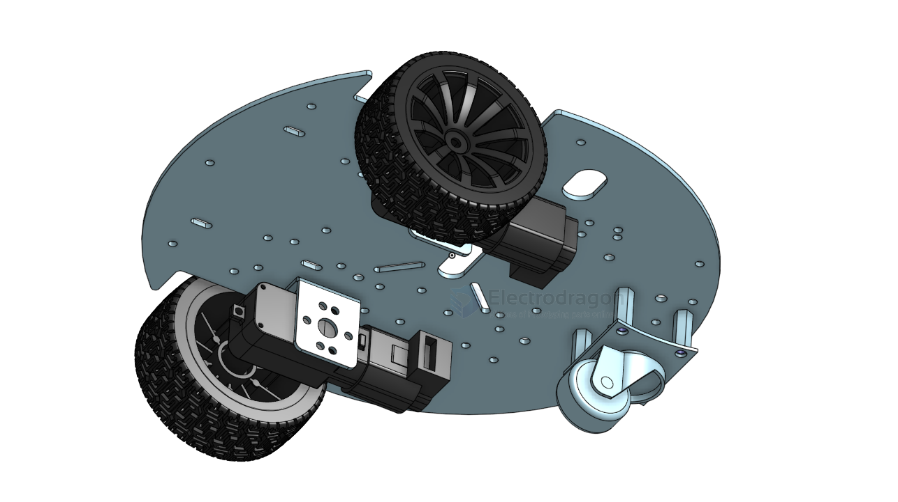

# rover-dat

- [[ardupilot-dat]] - [[rc-dat]]

https://ardupilot.org/rover/index.html

- [[RC-car-dat]] - [[rover-dat]] - [[RC-car-hack-dat]]

- [[rc-signal-dat]]

- ARKV6X Flight Controller Overview
- ARK FPV Flight Controller Overview == STM32H743IIK6 MCU
- CUAV V5 Plus Overview == STM32F765

## boards 

- [[SDR1064-dat]]

## 3D printed 

- [[markus-rover-dat]]

## 3D files 

[differential drive robot](https://cad.onshape.com/documents/78baf3d450629341539223b8/w/67b1d15167c8efd1d8242192/e/0e64a58d61cf14a49375d9c6?renderMode=0&uiState=68301fdbbe87bf505c7cb858)

[TT Motor 4WD Car Mecanum wheel](https://cad.onshape.com/documents/ffe6ad9ac868a2e0b125a547/w/06961ea3665cb10f47c1f6fe/e/c6b6790270216188fea6ddec?renderMode=0&uiState=6830205c37d051363fada807)

[Another TT Motor 4WD Car Mecanum wheel](https://cad.onshape.com/documents/3fc9a68709b7b211c126b7b0/w/fd59e3cfbe0cf012d3264ef8/e/f35859a1e063a8642be26811?renderMode=0&uiState=68302088624d574aaab00cc0)

## board 

- [[SDR1064-dat]] 

Parts - [[TT-motor-dat]] - [[mecanum-wheel-dat]]

## ref 

- [[dc-motor-dat]]

- [[rc-car]] - [[maker]]