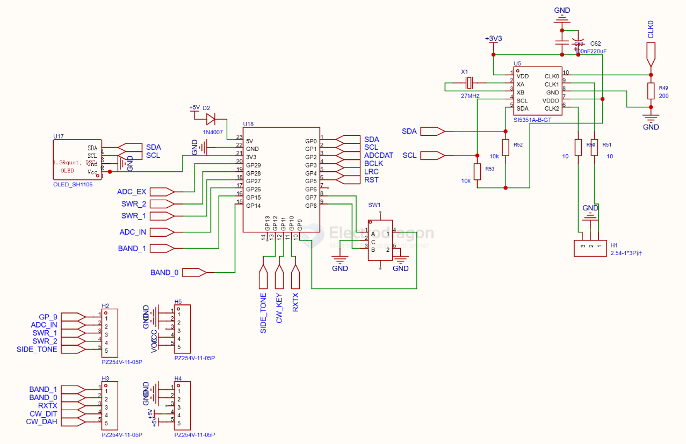

# SDR-dat

software defined radio

## tech 

- [[frequency-dat]] - [[oscillator-dat]] - [[Oscilloscope-dat]] - [[band-dat]]

- [[band-SSB-dat]]

- [[radio-dat]] - [[radio-AM-dat]] - [[radio-FM-dat]]

## chip 

- [[SI5351-dat]] - [[silicon-labs-dat]]

- [[SI4732-dat]] - [[silicon-labs-dat]]

## build 

- [[RP2040-dat]] - [[SI5351-dat]]

## ref 

- [[network-dat]]

- [[radio-dat]]

https://www.riyas.org/2026/06/the-rp2040-minimalist-hf-transceiver.html?m=1