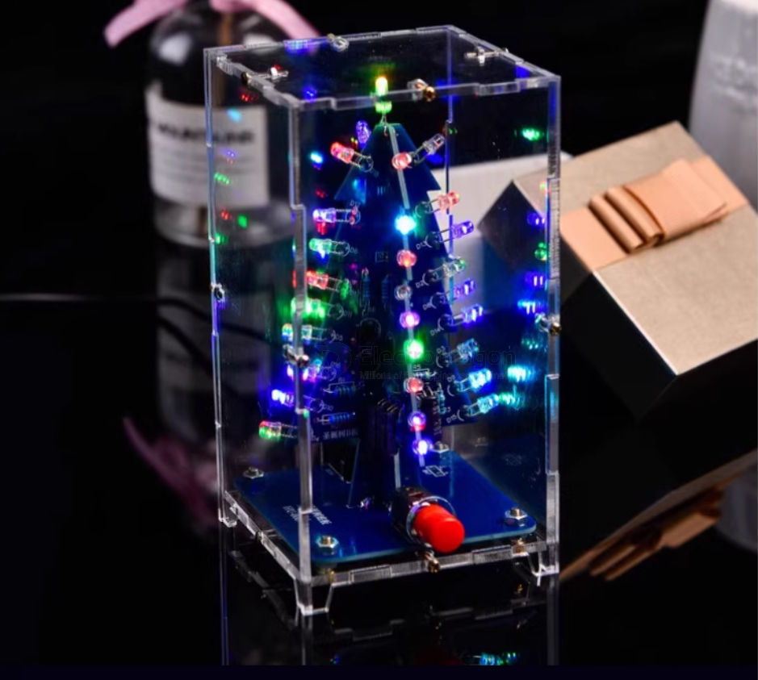

# christmas-tree-dat

## Working Principle

When powered by 3–5V, the 37 LEDs are divided into 4 groups. When the power is turned on, 4 transistors compete to turn on first. Due to component differences, only one transistor (let's assume Q1) turns on first:

### Step-by-Step Operation

1. **Q1 Turns On**
   - LED group 1 lights up.
   - Q1's collector voltage drops.
   - The left side of capacitor C2 drops close to 0V.
   - Capacitor voltage cannot change instantly, so Q2's base is also pulled near 0V.
   - Q2 is off, and LED group 2 is off.

2. **Q3 Turns On**
   - Q2's high voltage passes through capacitor C3, raising Q3's collector voltage.
   - Q3 quickly turns on, lighting up LED group 3.
   - For a short time, both Q1 and Q3 collectors are low, so LED groups 1 and 3 are on, while group 2 is off.

3. **Q2 Turns On**
   - Power charges C2 through resistor R2, Q2's base voltage gradually rises.
   - When Q2's base voltage exceeds 0.7V, Q2 turns on.
   - Q2's collector voltage drops, and LED group 2 lights up.
   - Q2's collector drop passes through C3, lowering Q3's base voltage.
   - Q3 turns off, its collector voltage rises, and LED group 3 turns off.

4. **Cycle Repeats**
   - The circuit repeats this process, so the three groups of 18 LEDs light up in turn.
   - At any moment, two groups are lit.
   - The LEDs are arranged in a heart shape and flash in a flowing pattern for a dynamic display effect.

## ref 

- [[app-dat]]