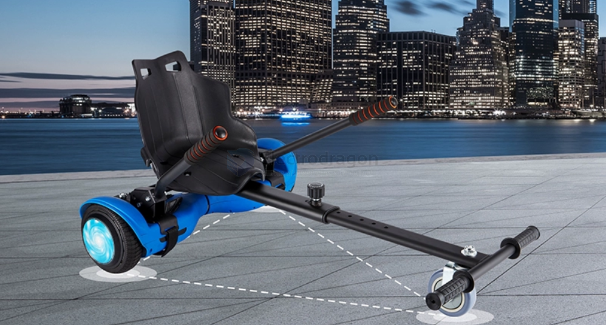

# electric-kart-dat

Go-kart

- [[motor-dat]] - [[wheel-dat]]

- [[lithium-power-battery-dat]]

- [[Drum-brake-motor-dat]]

## electric tri-cycle

flexible, quick and sneak 

## electric balancer kart to try-cycle

cheap to add to a balancer kart, price is around 30 usd with damper 

## kit toy kart with electric motors

### solution 1 

based on a kit cart modified, price is around 100~150 usd. 

already had a steering system. 

## electric go-kart

with suspension system, and [[Alu_Extrusion-dat]] [[frame-dat]]

highly customizable, you can add a seat, and a steering wheel, and even a brake system.

you can even hook another cart behind it.

### version 2 

price is around 300-400 usd

### version 1 

## ref 

- [[electric-kart]]