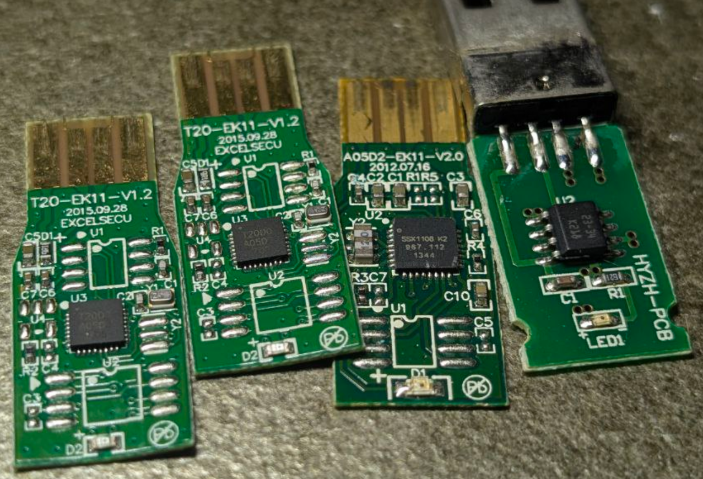

# encryption-key-dat

[[USB-dat]] - [[encryption-key-dat]] - [[encryption-dat]]

- T2000
- SSX1108 - [[patent-dat]] == https://patents.google.com/patent/CN103246494A/zh == 一种抵抗能量分析和错误攻击的安全模幂计算方法

https://www.aisinochip.com/index.php/product/show/id/24/catid/126.html

智能安全芯片 == ACH512是一款基于安全算法的高性能SoC芯片，广泛应用于税务、大容量存储、高速USBKEY、物联网、生物识别市场。

- [[aisinochip-dat]]

