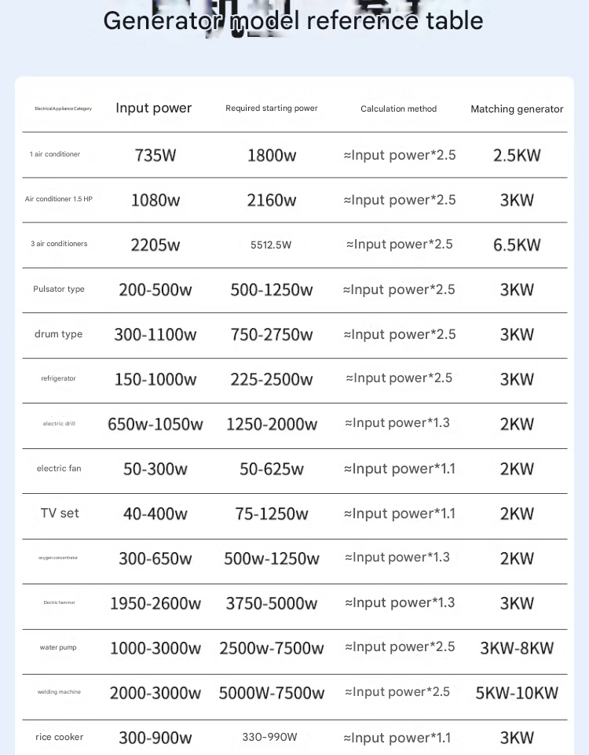

# generator-dat

## Specifications

- Rated Power: 8.5KW
- Weight: 105 KG
- Remote Control, Electric Start (Commercial Emergency / 33L Extra-large Fuel Tank)
- 5.5L fuel tank ~ 7 hours runtime (at half load)
- 33L = ~ 40 hours runtime (at half load)
- price 1100 usd 

### Power Output Reference

- 1 hour = 8.5KW
- 3 hours = 25.5KW
- 6 hours = 51KW

### applications to use 

## Version 2

- 7L fuel tank
- 24V automatic start/stop
- 3000W rated power
- LCD adjustable voltage
- Remote control model

## ref 

- [[solar-power-dat]]

- [[app]] - [[generator]]
