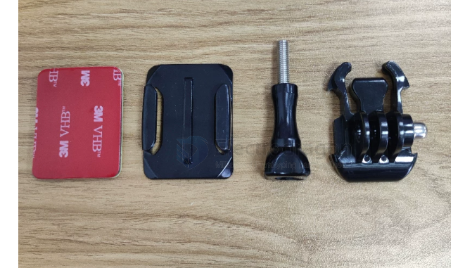
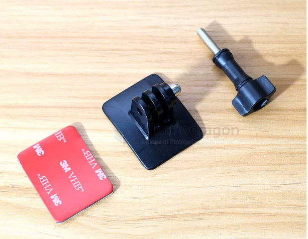
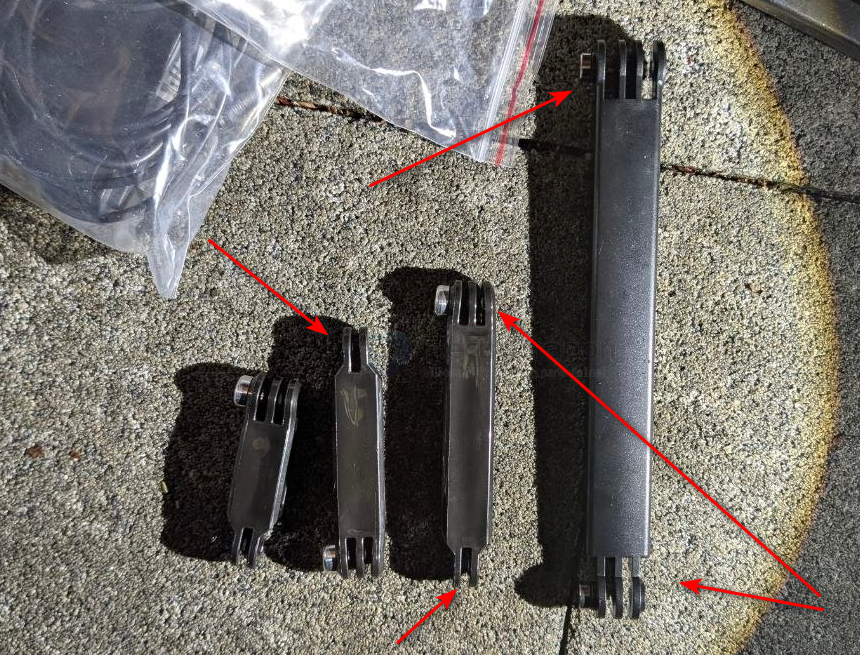
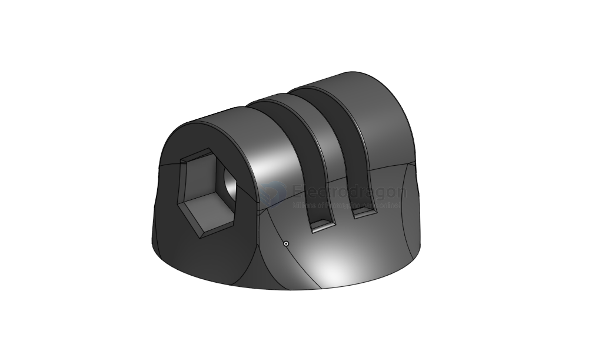
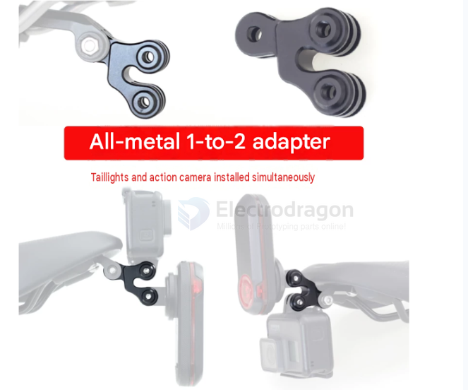
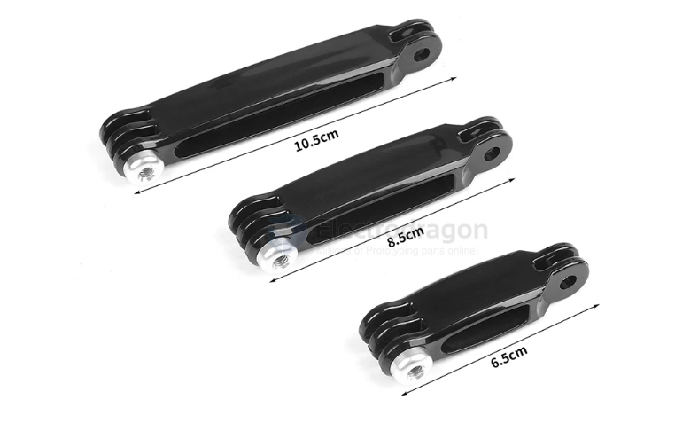
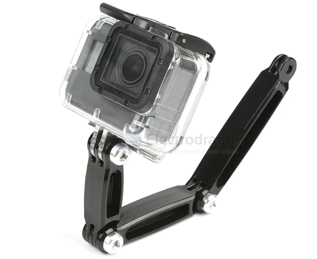

# gopro-amount-dat

- [[insta360-go-rack-dat]] - [[insta360-dat]] - [[camera-rack-dat]] - [[gopro-dat]] - [[gopro-amount-dat]]

## surface amount 

[[tape-dat]] + base + quick amount + [[screw-dat]]

integrated 

## three-teeth / two-teeth / four-teeth 

## base that has a Nut placeholder 

## 1-to-2 adapter 

## extension bar 

## ref 

- [[insta360]] - [[gopro]] - [[insta360-go-rack]] - [[gopro-amount]]
