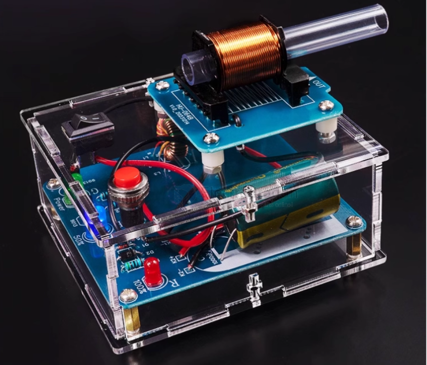
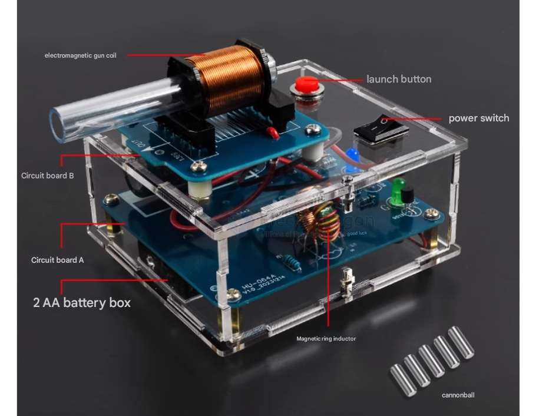
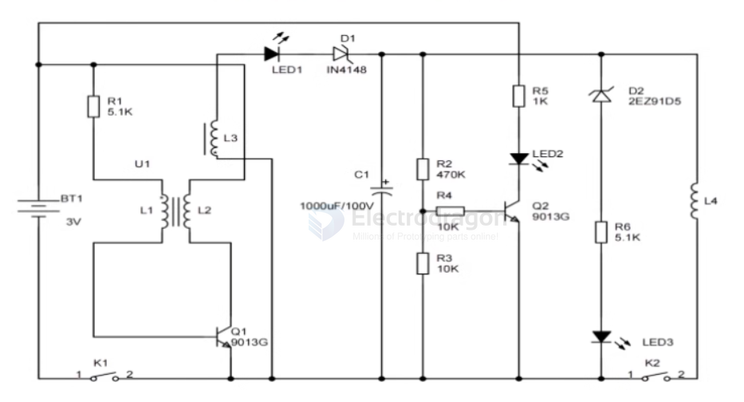
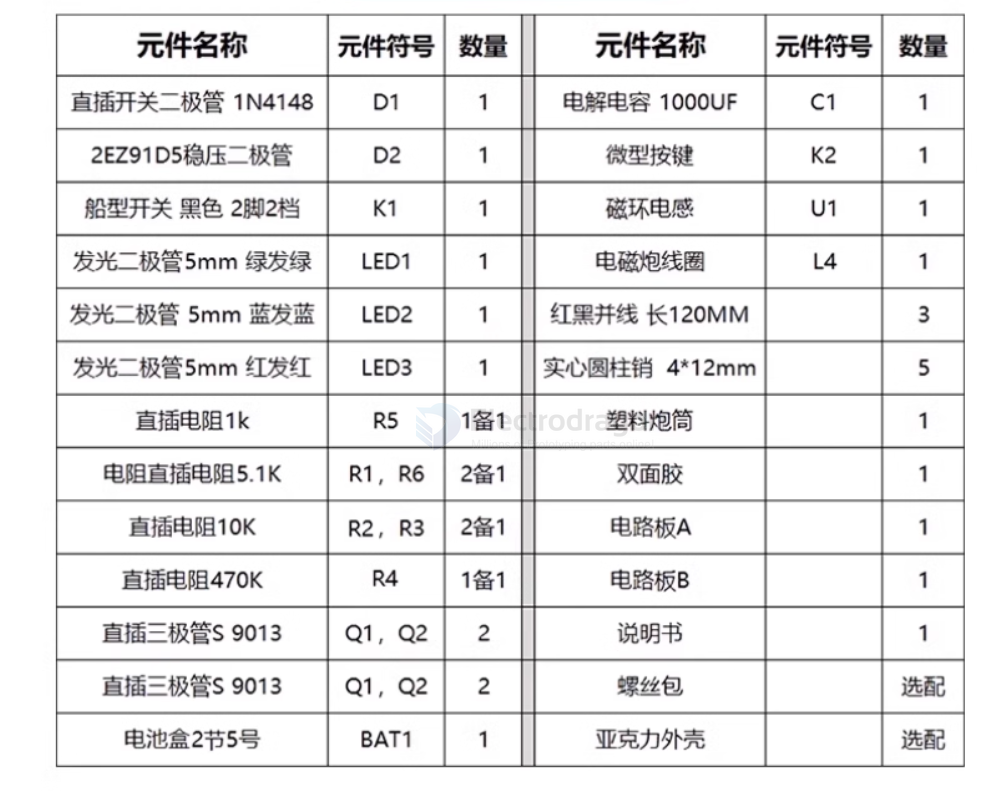
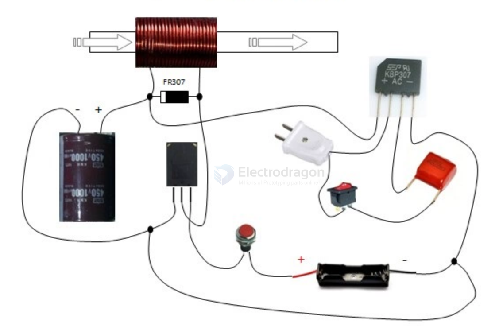
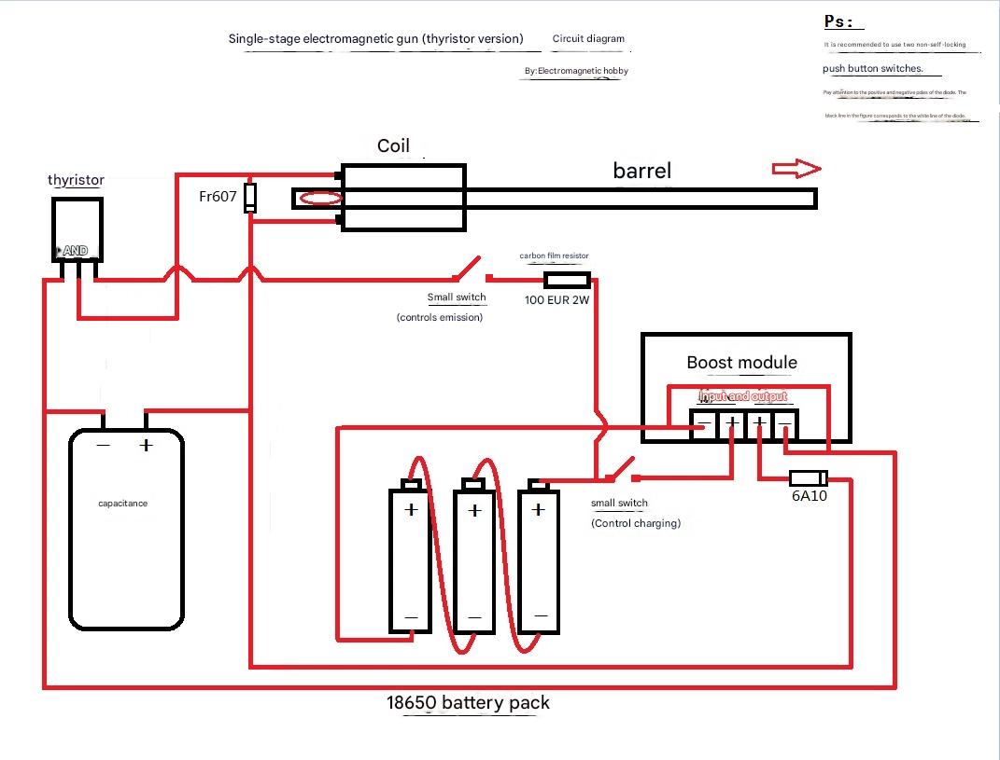
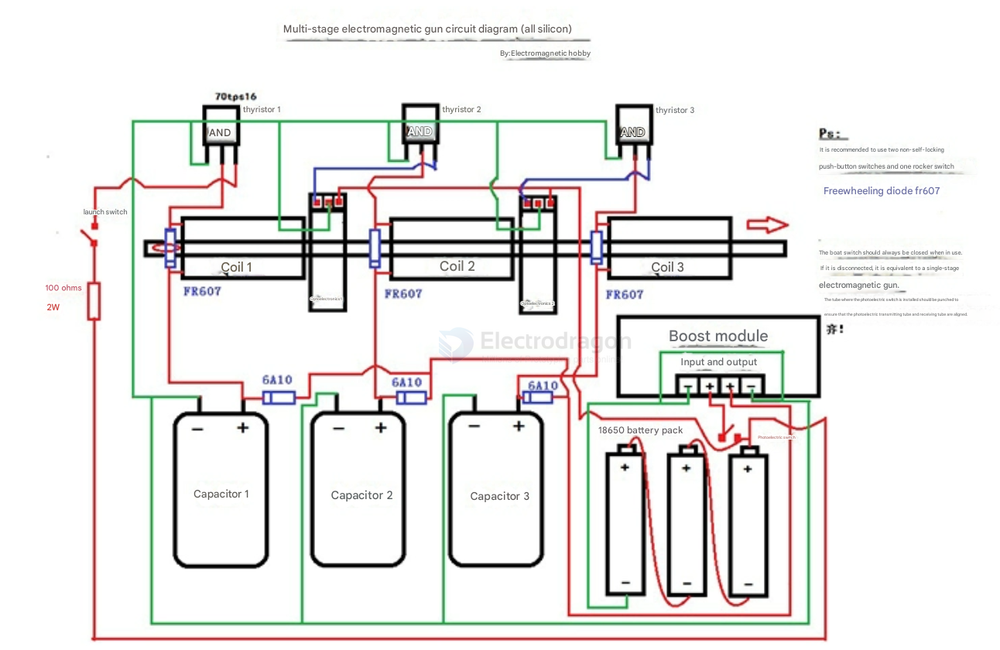

# coilgun-dat

== Gauss gun

- [[coil-dat]] - [[23-coilgun]]

## basic toy version 

### Basic Operation Steps

1. Turn on the power switch (rocker switch K1). The green LED will light up.
2. Wait about 10–30 seconds. The blue LED will light up, indicating the charge is about halfway.
3. Insert the projectile into the rear of the barrel. Press the fire button (round button K2) to launch the projectile.

**Note:**
- When the coilgun is fully charged, the red LED will light up. Because charging takes a long time and battery power decreases, the red LED may not light. If the blue LED is on, you can fire. **High voltage—danger**!
- Before installing capacitors or if you need to re-solder during use, always discharge the capacitors first. Use a wire with plastic insulation, exposing copper at both ends. Hold the plastic part and touch both capacitor terminals with the copper ends to discharge. Otherwise, the capacitor may short-circuit and cause danger!

### Main Technologies of Coilgun

- **Power System:** Provides high-voltage power for strong electromagnetic force. Common systems include capacitors or battery packs.
- **Electromagnetic Accelerator:** Accelerates the projectile using coils and supports. When current flows through the coil, a strong magnetic field is generated to accelerate the projectile.
- **Control System:** Precisely controls the firing process, including trigger and speed monitoring.

BOM list 

## revolved tech 

- [[sensor-photoelectric-dat]]

- [[diode-dat]] - [[diode-rectifier-dat]] - [[BOM-dat]]

- [[transistor-dat]]

## multiple stages coilgun design tips 

1. try using some kind of **ferrite washer caps at the both wnds of each coil**, to help focusing the magnetic field.

2. the main issue and also misunderstanding about your design is that theoretically adding more stages to the design won't increase the speed.
   
- Here is why: as the bullet passes through the stages it gains more speed, thus the required run time of each coil will be different. the early stages need more run time thus bigger inductance and capacitor values, **and the few last stages will have a lot less run time due to the high speed of the bullet, so you should use smaller values of inductors and capacitors values.**

- If you apply the same values to each stage, adventually the last stages will reduce the speed and efficiency of the coilgun drastically, because of the suck back effect that they cause due to exceeding the required run time of the coil.

3. try to minimize the airgap between the bullet and the barrel, aslo use **non-conductive barrel** to get rid of induced current losses.

4. The pcb traces add a noticable amount of resistance to the current path, so using a thicker and wider trackes covered with solder is a better choice.

5. calculate the values for the capacitor and inductor of each stage based on the bullet speed of the previous stage.

6. try using a stepped coil geometry for the coil of the first stage.

## why a simple coil connected to DC power supply cannot launch an iron projectile

Directly connecting a coil to a DC power supply **does create a static magnetic field**, but this **will not launch** an iron projectile. Reasons: (1) a steady DC field **pulls the projectile into the coil and holds it**, rather than pushing it out; (2) launching requires **a short, large-current pulse plus precise timing (cut-off after the projectile passes the coil center)** and enough energy — an ordinary DC supply and simple coil cannot do that.

### Physical principles (detailed)
1. **DC current → magnetic field, but steady**  
   A DC current through a coil produces a steady magnetic field. A steady (time-invariant) magnetic field exerts forces that pull magnetic (or magnetizable) objects toward positions of lower magnetic potential energy (usually into the coil center or onto an iron core). That is an **attractive** effect, not a push, so the projectile is pulled in and then stopped — it does not get expelled.

2. **Source of force: position dependence of magnetic energy**  
   The magnetic energy of the coil-projectile system can be written as
   \[
   E_m=\tfrac{1}{2}L(x)I^2,
   \]
   where \(L(x)\) is the coil inductance which depends on the projectile position \(x\). The magnetic force is the derivative of energy with respect to position:
   \[
   F(x)=\frac{d}{dx}\Big(\tfrac{1}{2}L(x)I^2\Big)=\tfrac{1}{2}I^2\frac{dL}{dx}.
   \]
   Usually \(\frac{dL}{dx}>0\) as the projectile approaches the coil, so the force pulls the projectile toward positions with larger inductance (i.e., into the coil).

3. **To launch the projectile you need time-varying fields and timing**  
   - To accelerate a projectile *through* the coil and have it exit, you must remove the coil current (or invert the field) **after** the projectile passes the coil center. If the current remains, the coil will re-attract and stop or decelerate the projectile.  
   - Practical coilguns use a large-energy storage element (capacitor bank) to discharge a **high-current pulse** into the coil, plus sensors or precise timing circuits to **cut current when the projectile reaches the center**. A steady DC connection lacks this essential timed cut-off.

4. **Energy / current / timescale limits**
   - Launching requires high instantaneous energy (high current) delivered over a short time. Typical DC supplies are limited in current and cannot produce the required short, high-power pulse.  
   - Coil inductance \(L\) resists rapid current change (\(V=L\,dI/dt\)). With limited supply voltage, current cannot rise fast enough to produce a strong, timely force.  
   - Real-world losses also matter: magnetic saturation of materials, resistive heating of the coil, and if the projectile is conductive, **eddy currents** that oppose changes in magnetic flux and create braking forces. All reduce or negate net acceleration.

5. **If the projectile is a conductor rather than ferromagnetic**
   - For non-magnetic conductive projectiles, a changing magnetic field induces eddy currents. By Lenz's law these induced fields oppose the change and usually produce a **damping (braking)** force instead of propulsion, unless the system is specifically engineered otherwise.

### Summary — why a simple DC coil connection won't fire an iron projectile

- A DC coil creates a steady field that **attracts and traps** the projectile rather than launching it.  
- Firing requires a **short, large current pulse** and **precise timing** (turn off after center) so the projectile keeps its forward momentum instead of being recaptured.  
- Practical limitations — supply current limits, inductance-limited rise time, eddy currents, magnetic saturation, and heating — make a plain DC hookup ineffective for launching.

### Safety and alternatives

- If your goal is learning or demonstration, do simple safe experiments such as using a coil to **pick up paper clips or small nails** to observe how force scales with current and coil turns. This is educational and safe.  
- If studying the physics of coil launchers, read about **coilguns** / **magnetic accelerators** in textbooks and public resources — but **I will not provide step-by-step instructions to build devices intended to cause harm or that function as weapons**.  
- I can, however, help with non-harmful theoretical calculations or demonstrations (for example: estimating magnetic force for a given coil geometry and current, or plotting force vs. position). Tell me which calculation or demonstration you want and I’ll provide it for educational purposes.

## SCH V2  AC version 

3.本套件是220V市电供电的，如需改电池供电要加ZVS升压模块，店内搜ZVS便是，买55那一项。

4.本店配套ZVS对电源要求较高，供电能力最好是25A以上才能比较稳定，比如3S航电，12V铅酸电瓶，12V25A以上开关电源皆可用。

5.这两种套件最远可以发射20米远，足够比赛之用。不用担心。

6.因批次原因，实际收到元器件参数可能会有些许差异属正常，不影响正常实验效果。不再另行更新配件清单。

## SCH chained 

- resistor 2W

multiple coils 

## BOM 

- 1n个成品线圈（自己绕的话买漆包线，一个线圈约50g)3
- 2n个隔离二极管6A103
- 3n个续流二极管Fr6073
- 4炮管*1（abs或者不锈钢都可以，一般三级20cm，六级4020cm
- 5ZVS电磁炮充电器*1(单级/多级款均可)单级*1
- 618650锂电池*33
- 718650三串电池盒*11
- 818650锂电池充电器*11
- 9非自锁按钮开关*22
- 10450v1000uf电容*n（450v680uf耐压高，多级适用）3
- 1170tps12*n (70tps16也可以)3
- 12光电开关*(n-1个)2
- 13触发电阻100欧*11
- 14500V电压表*1 (最少一个，可以每级都配一个)1
- 15除此之外还可以配备激光头和炮弹若干

## ref 

- [[app]] - [[gun]] - [[coilgun]]