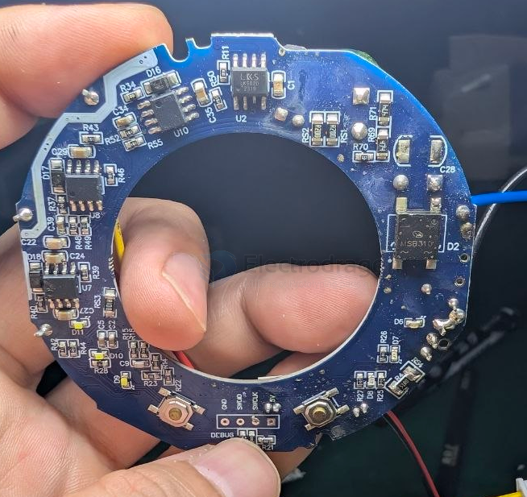
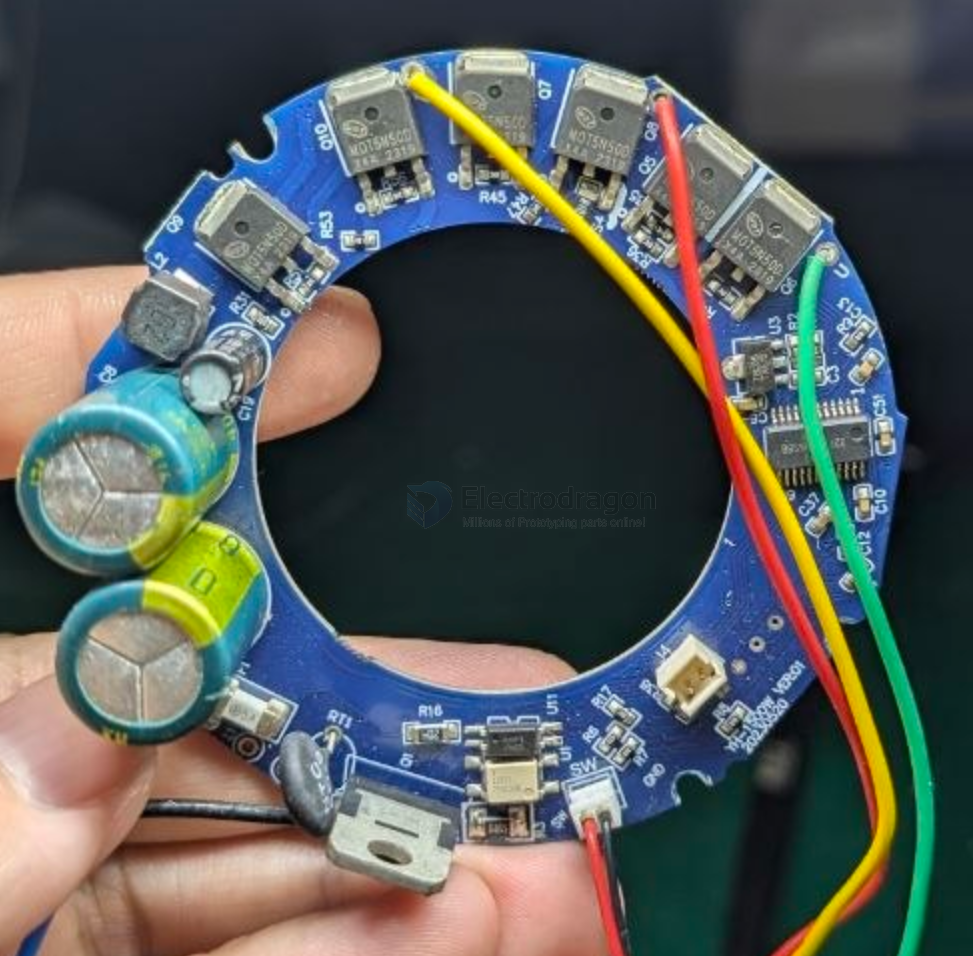
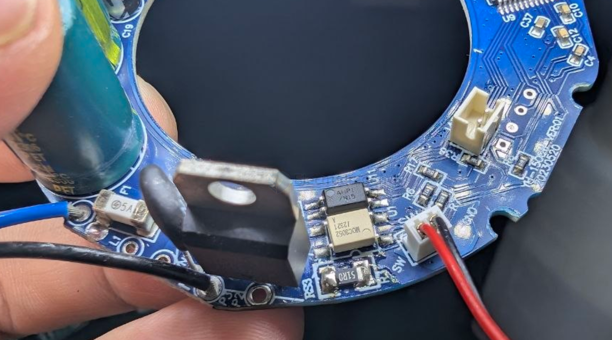
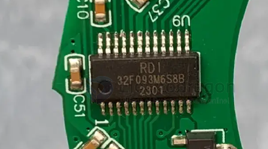
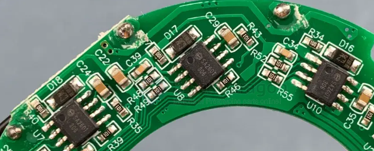
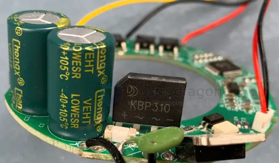

# hair-dryer-dat.md

- [[LKS620-dat]] - [[LKS-dat]]

 
- [[mosfet-dat]]

- [[optical-coupler-dat]]

- [[MOC3052-dat]] - [[triac-driver-dat]]

BTB12-800 - [[triac-dat]] - [[hair-dryer-dat]]

第一个板子和第三个板子用的MCU是中微半导体的CMS32M5710，第二个板子上MCU丝印是32F093M6S8B，根据这个没查找到具体的型号。

第一个和第三个板子用的MOS型号是华润微的CR4N65A4K，650V 4A 2.4Ω。第二个用的是来自龙腾的LNG7N65D，650V 7A 1.4Ω。

三个板子用的预驱都不一样，第一个是来自宇力半导体的`U2106`，第二个疑似是来自矽塔科技的`SA2601`，第三个是来自中微半导体的`CMS6126`。这一个个名字起的，都有1，有2，有6，但是顺序完全不一样。

- [[diode-bridge-rectifier-dat]] - [[hair-dryer-dat]]

三个板子用的整流桥都是`KBP310`，前两个厂家一致，是威旺的，后面这个厂家是晶导微电子。

[[switch-dat]] - [[hair-dryer-dat]]

## ref 

