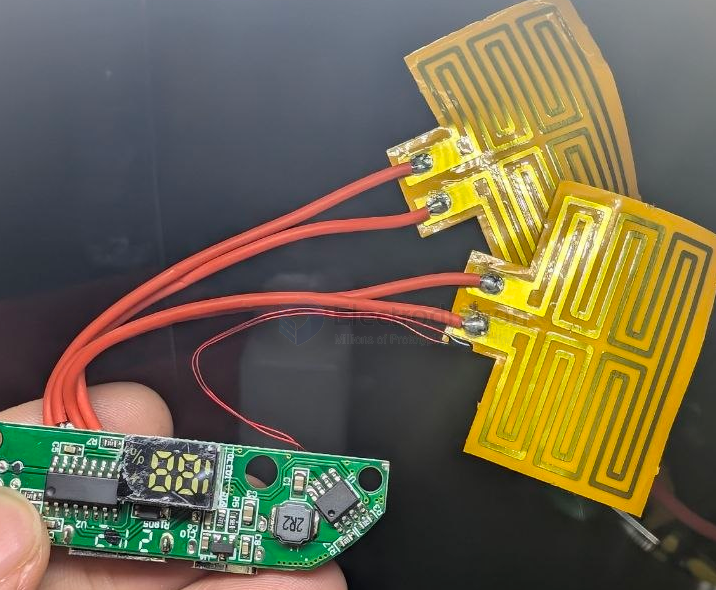
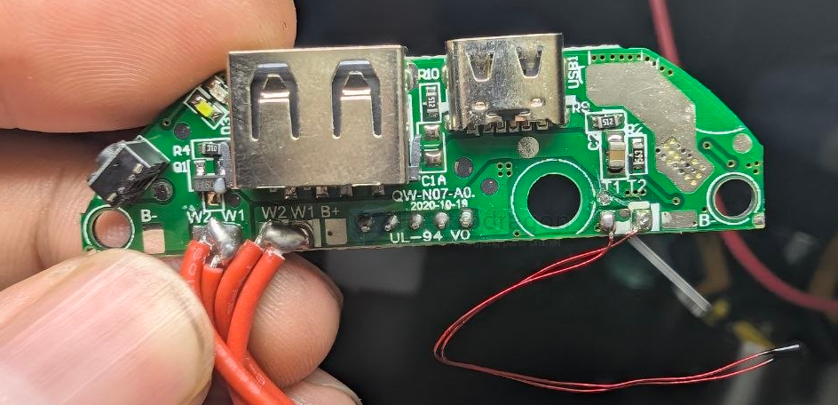

# hand-warmer-dat

- [[hand-warmer-dat]] - [[power-bank-dat]] - [[heater-dat]]

- [[ETA9742-dat]]

## build 

带充电，带加热（恒温40-45℃，有100%功率输出）。有充电宝5V输出功能。非常值得把玩，做个手套，鞋垫，或者做个40度保温杯。功率很大（满功率运行时，一节实测2500mah的电池，大约3-4分钟放完）

短按显示电量，在显示电量时长按按键，进入加热模式，注意温度传感器要与加热片放在一起，否则热失控。在加热模式时长按，指示灯变色，进入全功率模式。此时温度不恒定。以最大功率运行。做成暖手宝时，建议3-4个18650以上，并在暖手加热部位贴个铝片。如果做成保温杯，则建议外接电源。加热时耗电很大。 试验时小心烫手！

## ref 