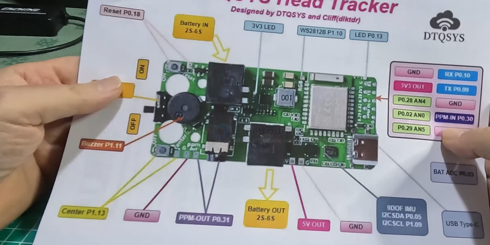

# head-track-dat

## DIY build head tracker 

- [[arduino-dat]]

https://github.com/headtracker/HeadTracker

The Nano 33 BLE + Nano 33 BLE Sense are now both obsolete. Their replacements are
**Nano 33 BLE Rev 2 and Nano 33 BLE Rev 2 Sense**

!!! There are issues with the code in v2.2 on these boards. It's not reliable. Please see Discord #test-firmware or GitHub actions for the most recent updates. We need more feedback on the state of this code. Thank you.

- [[PWM-dat]] - [[PPM-dat]]

- [[BLE-dat]] - [[webBLE-dat]]

- [[power-dat]] - [[BEC-dat]]

- [[audio-dat]] - [[CONN-audio-dat]]

- [[radiomaster-dat]] - [[servo-DSC-dat]]

## user manual 

- [[WS2812-dat]] = P1.1
- [[LED-dat]] = P0.13
- [[buzzer-dat]] = P1.11
- [[I2C-dat]] - SDA == P0.05
- [[I2C-dat]] - SCL == P1.09
- [[PPM-out]] = P0.31
- [[reset-dat]] - P0.18 
- [[button-dat]] - P1.13

extra pins 

- GND RX P0.10
- 3V3 TX P0.09 
- P0.28 AN4 GND
- P0.02 AN0 PPM-IN P0.30
- P0.29 AN3 GND

## ref 

- [[head-track]]