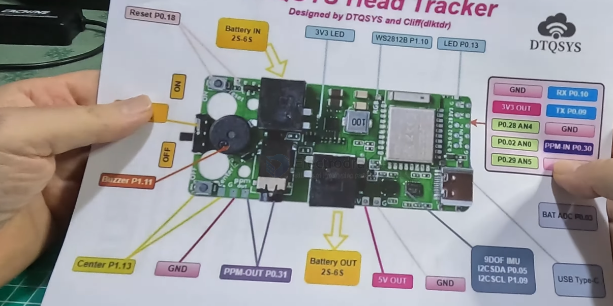
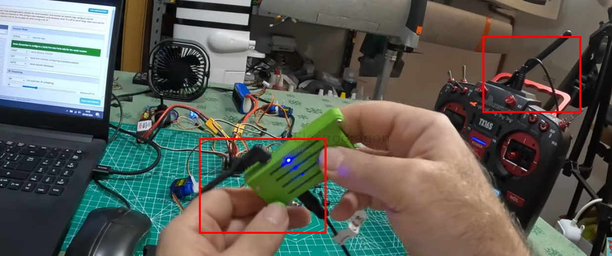

# head-track-dat

## DIY build head tracker 

- [[arduino-dat]]

https://github.com/headtracker/HeadTracker

https://headtracker.gitbook.io/head-tracker-v2.2/

The Nano 33 BLE + Nano 33 BLE Sense are now both obsolete. Their replacements are
**Nano 33 BLE Rev 2 and Nano 33 BLE Rev 2 Sense**

!!! There are issues with the code in v2.2 on these boards. It's not reliable. Please see Discord #test-firmware or GitHub actions for the most recent updates. We need more feedback on the state of this code. Thank you.

- [[PWM-dat]] - [[PPM-dat]]

- [[BLE-dat]] - [[webBLE-dat]] - [[NRF52840-dat]]

- [[power-dat]] - [[BEC-dat]] - [[CONN-DC-barrel-jack-dat]] - [[CONN-power-dat]]

- [[audio-dat]] - [[CONN-audio-dat]]

- [[radiomaster-dat]] - [[servo-DSC-dat]] - [[servo-dat]]

- [[9-axis-IMU-dat]] - [[LSM9DS1-dat]] - [[sensor-motion-dat]]

- MPU6500 6 axis, Gyrometer & Accelerometer - [[6-axis-dat]] - [[LSM6DS3-dat]] - [[BMI270-dat]]
- QMC588s 3 axis, Magnetometer - [[3-Axis-Magnetic-dat]] - [[BMM150-dat]] - [[HMC5883-dat]] - [[honeywell-dat]]

- [[APDS9960-dat]]

## user manual 

- [[WS2812-dat]] = P1.1
- [[LED-dat]] = P0.13
- [[buzzer-dat]] = P1.11
- [[I2C-dat]] - SDA == P0.05
- [[I2C-dat]] - SCL == P1.09
- [[PPM-out]] = P0.31
- [[reset-dat]] - P0.18 
- [[button-dat]] - P1.13

extra pins 

- GND RX P0.10
- 3V3 TX P0.09 

- P0.02 AN0 PPM-IN P0.30
- P0.29 AN3 GND
- P0.28 AN4 GND

HeadTracker\firmware\src\src\boards

    #define PIN_X \
    PIN(CENTER_BTN,   NRFPIN(1, 13), "") \
    PIN(VOLTMON,      NRFPIN(0,  3), "") \
    PIN(AN0,          NRFPIN(0, 29), "Analog 0 (AIN_5)") \
    PIN(AN1,          NRFPIN(0,  2), "Analog 1 (AIN_0)") \
    PIN(AN2,          NRFPIN(0, 28), "Analog 2 (AIN_4)") \
    PIN(LEDWS,        NRFPIN(1, 10), "") \
    PIN(LED,          NRFPIN(0, 13), "") \
    PIN(PPMOUT,       NRFPIN(0, 31), "") \
    PIN(PPMIN,        NRFPIN(0, 30), "") \
    PIN(BUZZ,         NRFPIN(1, 11), "") \
    PIN(TX,           NRFPIN(0,  9), "")  \
    PIN(RX,           NRFPIN(0, 10), "") \
    PIN(TXINV,        NRFPIN(0,  4), "") \
    PIN(RXINVO,       NRFPIN(0,  0), "") \
    PIN(RXINVI,       NRFPIN(0,  1), "") \
    PIN(I2CSDA,       NRFPIN(0,  5), "") \
    PIN(I2CSCL,       NRFPIN(1,  9), "")

V2 

    #define PIN_X \
    PIN(CENTER_BTN,   NRFPIN(1, 13), "") \
    PIN(VOLTMON,      NRFPIN(0,  3), "") \
    PIN(AN0,          NRFPIN(0, 29), "Analog 0 (AIN_5)") \
    PIN(AN1,          NRFPIN(0,  2), "Analog 1 (AIN_0)") \
    PIN(AN2,          NRFPIN(0, 28), "Analog 2 (AIN_4)") \
    PIN(LEDWS,        NRFPIN(1, 10), "") \
    PIN(LED,          NRFPIN(0, 13), "") \
    PIN(PPMOUT,       NRFPIN(0, 31), "") \
    PIN(PPMIN,        NRFPIN(0, 30), "") \
    PIN(BUZZ,         NRFPIN(1, 11), "") \
    PIN(TX,           NRFPIN(0,  9), "")  \
    PIN(RX,           NRFPIN(0, 10), "") \
    PIN(TXINV,        NRFPIN(0,  4), "") \
    PIN(RXINVO,       NRFPIN(0,  0), "") \
    PIN(RXINVI,       NRFPIN(0,  1), "") \
    PIN(I2CSDA,       NRFPIN(0,  5), "") \
    PIN(I2CSCL,       NRFPIN(1,  9), "")

## ref 

- [[head-track]]