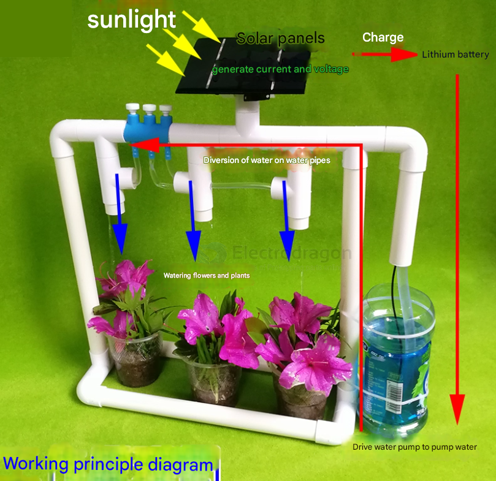

# home-plant-dat

## system and sub tech 

- [[home-plant-dat]] - [[full-spectrum-light-dat]] - [[ph-tester-dat]]

- [[sensor-moisture-dat]]

- [[humidifier-dat]]

## type 

### Mushroom 

- Mushrooms generally thrive in high humidity, often between 80% and 95%, depending on the species. 

- The temperature range for growing mushrooms is typically between 15°C to 24°C

### Temperature and Humidity 

Humidity Tray: Place a shallow tray of water with some pebbles or stones in the growing area. 

The water will slowly evaporate, increasing the humidity. You can add a small fan to circulate the air around the tray, which helps maintain airflow while boosting humidity.

### sensing 

sening by [[sensor-dat]] - [[sensor-temperature-dat]] and [[sensor-humidity-dat]]

[[actuator-dat]] to generate [[humidity-dat]]

- [[sensor-moisture-dat]]

#### cooling and warming 

- [[Peltier-dat]] - [[fan-dat]] - [[thermostat-dat]]

### Air Flow

The term "fresh air" for plants, in a technical sense, generally refers to an optimal supply of oxygen (O₂) and carbon dioxide (CO₂), along with proper air circulation, which are essential for the healthy growth and metabolism of plants. 

[[actuator-dat]] to control [[fan-dat]]

### controlling 

- [[MCU-dat]] - [[control-system-dat]]

#### timing system 

- timing relay - [[mcu-relay-dat]]

- [[full-spectrum-light-dat]] 

## mechanical structure

- [[mechnical-structure-dat]]

## apps 

solar powered dripping system 

## ref 

- [[home-plant]] - [[app]]

