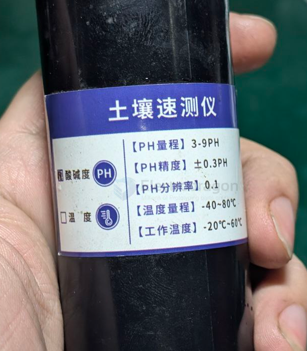
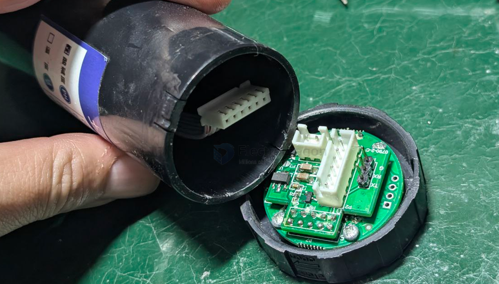
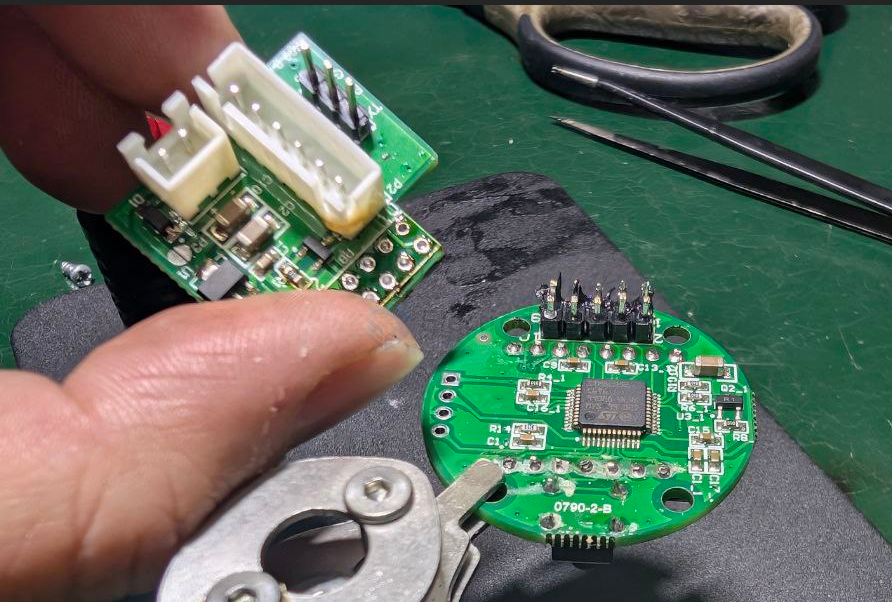
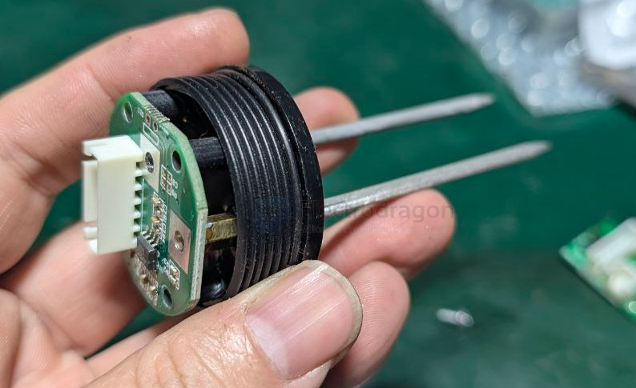

# ph-tester-dat

- [[home-plant-dat]] - [[full-spectrum-light-dat]] - [[ph-tester-dat]]

- the output should go to [[ADC-dat]]

## apps 

- [[display-dat]] and [[mcu-dat]] == [[stm8-dat]]

- [[power-dat]] - [[LDO-dat]] - [[3peak-dat]]

- [[OP-amp-dat]]

the control board 

the sense board 

[[OP-amp-dat]] for [[ph-tester-dat]] 

## What kind of op-amp IS required?

You need an **electrometer-grade or FET-input op-amp**.

### Suitable op-amps for pH measurement

| Op-amp                        | Input bias current    |
| ----------------------------- | --------------------- |
| [[LMP7721-dat]]               | 3 fA                  |
| [[LMC6001-dat]]               | 25 fA                 |
| [[TL072-dat]] / [[TL082-dat]] | ~65 pA *(borderline)* |
| [[OPA129-dat]]                | 75 fA                 |
| [[AD8605-dat]]                | 1 pA                  |

> **Rule of thumb:**  
> Input bias current should be **< 1/1000 of electrode current**

---

Typical pH front-end architecture

    pH electrode
    │
    │ (very high impedance)
    ▼
    [ FET-input buffer ]
    │
    ├─ Gain & offset
    │
    ├─ Temperature compensation
    │
    ▼
    ADC / MCU

- First stage must be **unity-gain buffer**
- Guard rings + clean PCB required
- Shielded cable mandatory

### Ibias 

- Ibias ≤ 1 pA → good pH front end
- Ibias 1–10 pA → acceptable with care
- Ibias 10–50 pA → hobby / lab demo only
- Ibias >50 pA → no

## ref 

