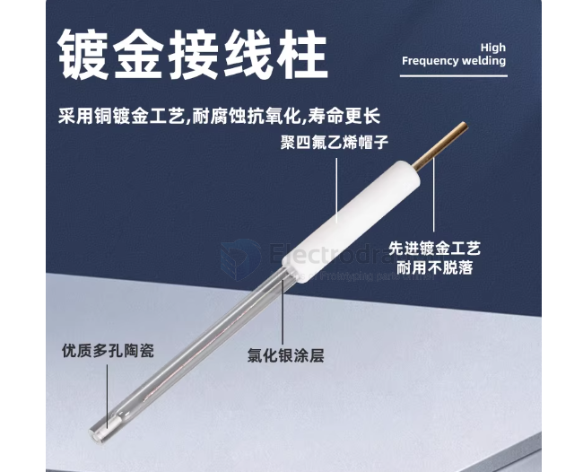

# ph-tester-dat

- [[home-plant-dat]] - [[full-spectrum-light-dat]] - [[ph-tester-dat]]

- the output should go to [[ADC-dat]]

## apps 

- [[display-dat]] and [[mcu-dat]] == [[stm8-dat]]

- [[power-dat]] - [[LDO-dat]] - [[3peak-dat]]

- [[OP-amp-dat]]

the control board 

the sense board 

[[OP-amp-dat]] for [[ph-tester-dat]] 

## What kind of op-amp IS required?

You need an **electrometer-grade or FET-input op-amp**.

### Suitable op-amps for pH measurement

| Op-amp                        | Input bias current    |
| ----------------------------- | --------------------- |
| [[LMP7721-dat]]               | 3 fA                  |
| [[LMC6001-dat]]               | 25 fA                 |
| [[TL072-dat]] / [[TL082-dat]] | ~65 pA *(borderline)* |
| [[OPA129-dat]]                | 75 fA                 |
| [[AD8605-dat]]                | 1 pA                  |

> **Rule of thumb:**  
> Input bias current should be **< 1/1000 of electrode current**

- [[AD8607-dat]] - [[analog-device-dat]]

Typical pH front-end architecture

    pH electrode
    │
    │ (very high impedance)
    ▼
    [ FET-input buffer ]
    │
    ├─ Gain & offset
    │
    ├─ Temperature compensation
    │
    ▼
    ADC / MCU

- First stage must be **unity-gain buffer**
- Guard rings + clean PCB required
- Shielded cable mandatory

### Ibias 

- Ibias ≤ 1 pA → good pH front end
- Ibias 1–10 pA → acceptable with care
- Ibias 10–50 pA → hobby / lab demo only
- Ibias >50 pA → no

## probes 

| Feature / Observation     | White / Clear Probe             | Grey / Duller Probe                |
| ------------------------- | ------------------------------- | ---------------------------------- |
| Typical role              | pH sensing electrode            | Reference electrode                |
| Sensitive to pH           | Yes                             | No                                 |
| Voltage behavior          | Changes ~59 mV per pH (25 °C)   | Nearly constant                    |
| Tip appearance            | Clear to milky white glass      | Grey / matte ceramic or dull glass |
| Internal element          | Ag/AgCl + fixed pH solution     | Ag/AgCl + KCl electrolyte          |
| Purpose                   | Converts H⁺ activity to voltage | Provides stable reference voltage  |
| Reaction to buffer change | Voltage shifts with pH          | Minimal change                     |
| Use with ADC              | Must be buffered (ultra-high Z) | Must be buffered (ultra-high Z)    |
| What happens if swapped   | pH reading flips sign           | pH reading collapses or drifts     |
| Can be used alone         | No                              | No                                 |
| Common mistake            | Connected directly to ADC       | Used as sensing electrode          |

Electrode	Function

Sensing electrode	Detects H⁺ ion concentration (pH) in soil water or moisture. Usually made from special glass or ISFET.

Reference electrode	Provides a stable, fixed voltage to compare against. Usually Ag/AgCl or a solid-state equivalent embedded in the probe.

ISFET = 离子敏感场效应晶体管

## Simplified probes

### 1) Basic principle

pH measurement depends on the activity of H+ ions, which produces a potential difference. Traditional pH probes use:

- A glass membrane: selective to H+ ions
- A reference electrode: provides a stable reference potential

If you instead use metal rods or metal-coated probes, the measured potential difference will depend on the metals and the solution composition. In this case you are not measuring true pH but rather a relative ORP (oxidation-reduction potential) or a trend in acidity/alkalinity.

Limitations:

- Very low accuracy (±1–2 pH or worse)
- Can only indicate "acidic vs alkaline" trend, not precise pH
- Electrodes oxidize or become contaminated easily; short lifetime

### 2) Example metal combinations

| Anode (positive) | Cathode (negative) | Notes                                              |
| ---------------- | ------------------ | -------------------------------------------------- |
| Platinum (Pt)    | Ag / AgCl coating  | Closest to lab ORP electrodes; corrosion resistant |
| Copper (Cu)      | Zinc (Zn)          | Shows electrochemical reactions; trends observable |
| Nickel (Ni)      | Copper (Cu)        | Inexpensive but short-lived                        |

Key points:

- Use one electrode as a reference (Ag/AgCl preferred for stability)
- Use one electrode as the sensing probe (inserted into soil or water)
- Adding a small amount of saline improves conductivity

### Color-based identification

| Electrode color | Common materials                                                       | Notes                                                                              |
| --------------- | ---------------------------------------------------------------------- | ---------------------------------------------------------------------------------- |
| White / silver  | Silver (Ag), silver-plated copper, platinum (Pt), nickel (Ni)          | Bright, corrosion-resistant; often used for reference or coated sensing surfaces   |
| Gray / dark     | Lead (Pb), titanium (Ti), stainless steel, zinc (Zn), galvanized metal | Darkens with oxidation; hard; often used for sensing probes or protective housings |

### Parallel two-probe operation (side-by-side probes)

Typical setup:

- One white probe (likely Ag/AgCl or silver-plated)
- One gray probe (stainless steel, copper, or platinum)
- Insert both into soil or into the sample liquid

How it works:

- Soil/water contains moisture and dissolved ions (H+, OH-, Na+, Cl-, etc.).
- A small electrochemical potential forms between the two metal surfaces, like a tiny battery.
- The potential difference depends on metal types, conductivity, and acidity/alkalinity.
- Measure the voltage between the two probes with a high-impedance ADC or electrometer. The voltage trend roughly reflects soil acidity/alkalinity.

Important: this is not a true pH measurement because the system lacks a glass membrane or ISFET that selectively responds to H+ activity.

### Characteristics of side-by-side placement

| Feature                   | Description                                                                                                 |
| ------------------------- | ----------------------------------------------------------------------------------------------------------- |
| Potential difference      | Local half-cell potentials form between each metal and the sample, creating a measurable voltage difference |
| Soil moisture sensitivity | High moisture → lower resistance → more stable signal. Low moisture → high drift and unstable readings      |
| Probe spacing             | Too close → electrochemical interference. Too far → weaker signal. Optimize spacing for your setup          |
| Durability                | Metals oxidize, especially the non-coated (darker) probe, reducing lifetime                                 |

如果你一定要用金属棒 + ADC：

银棒 → 尽量做成 Ag/AgCl（表面氯化）

不锈钢 → 作为测量电极

前端必须加 超高阻缓冲运放

用 2–3 个已知 pH 缓冲液做校准

接受 ±1~2 pH 的巨大误差

这仍然 不是标准 pH 计。

## ref

- [[ph-tester]] - [[home-plant]]