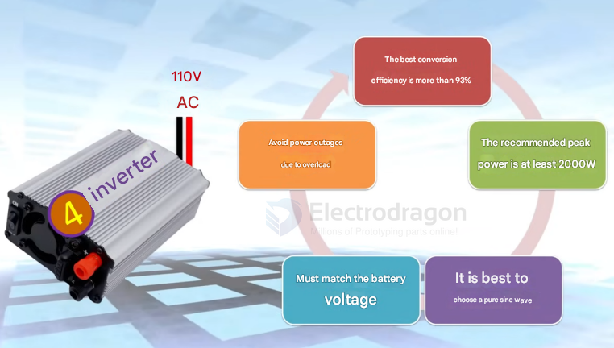

# inverter-dat

how to select a suitable inverter 

## 4. Inverters

The inverter converts the DC electricity stored in the batteries into AC electricity for your appliances.

### Functions:

*   Converts DC to AC power.
*   Can offer system monitoring and protection.

### Key Considerations:

*   **Efficiency:** Choose high-efficiency inverters **(preferably >93%)** to maximize power supply.
*   **Type:** Pure sine wave inverters are recommended to avoid damaging sensitive electronic appliances.
*   **Voltage:** Must match the battery bank voltage (e.g., a 12V battery requires a 12V inverter).
*   **Capacity (Watts):**
    *   **Continuous Power:** The power the inverter can supply continuously.
    *   **Peak Power:** The maximum power the inverter can supply for a short period. If your appliances total 1kW, you might need an inverter with a peak power of over 2kW, as some manufacturers label with peak power. For continuous loads, ensure the inverter's continuous rating is sufficient.

## ref 

- [[power-storage-dat]]
