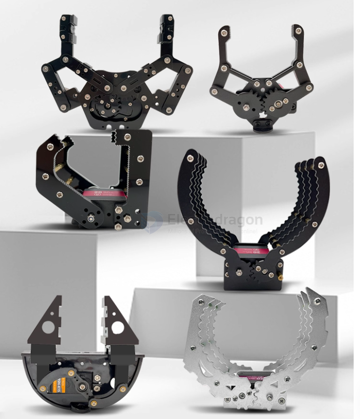
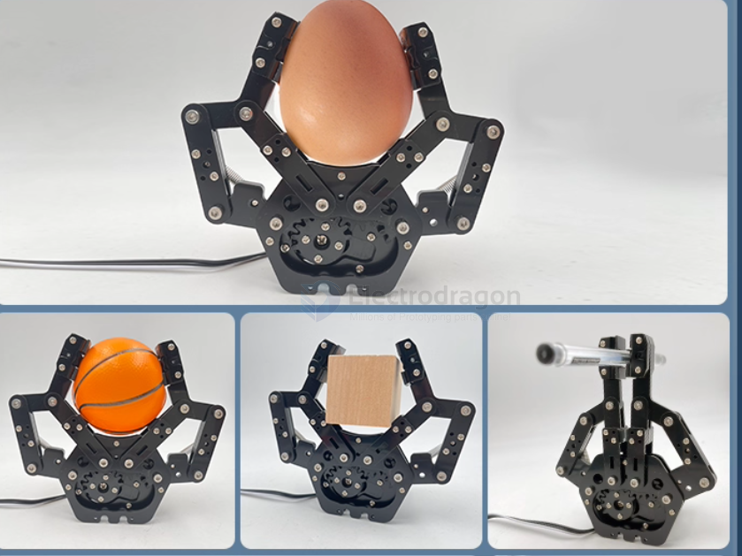
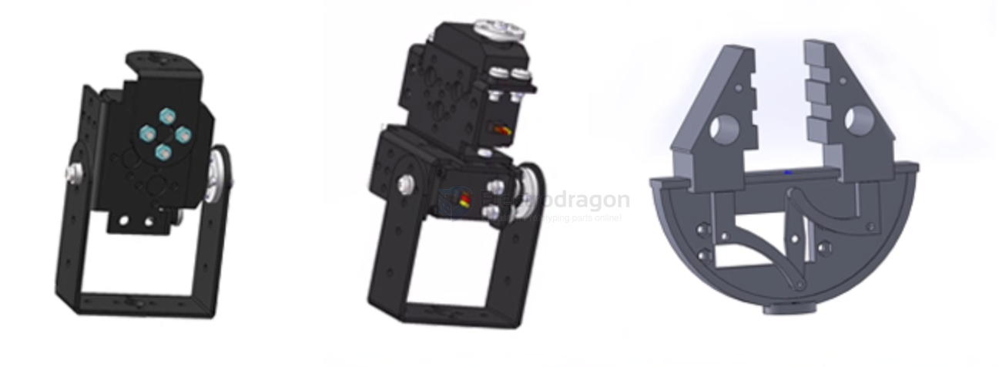
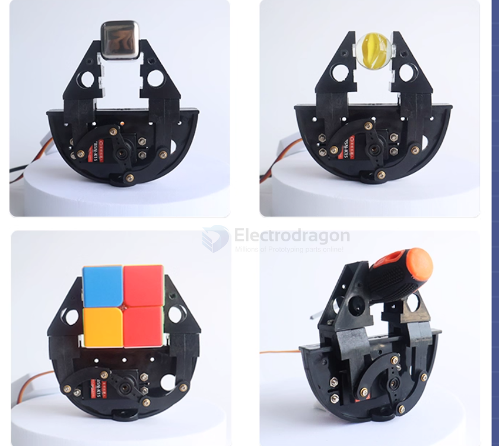
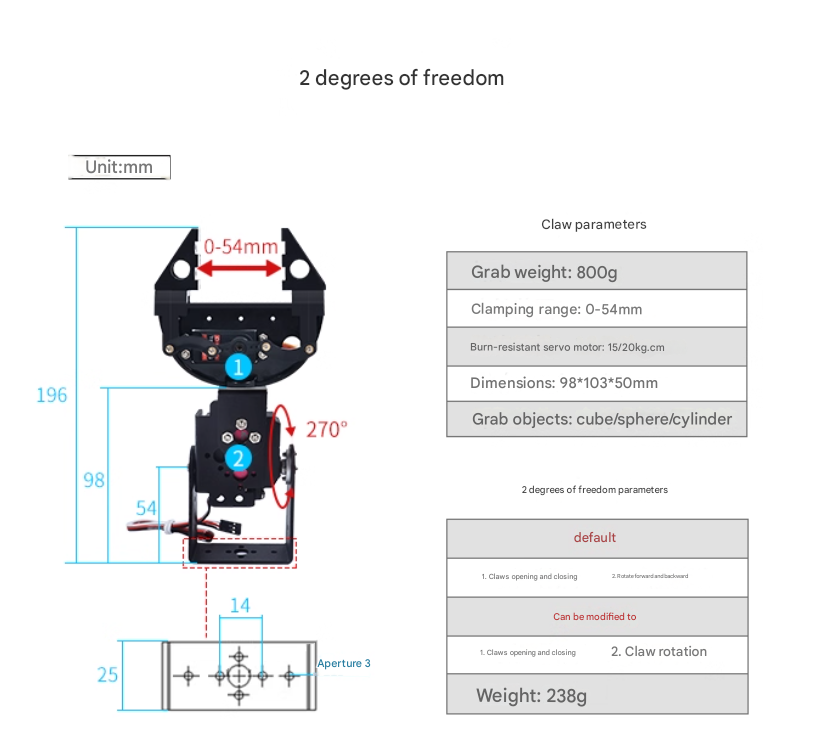
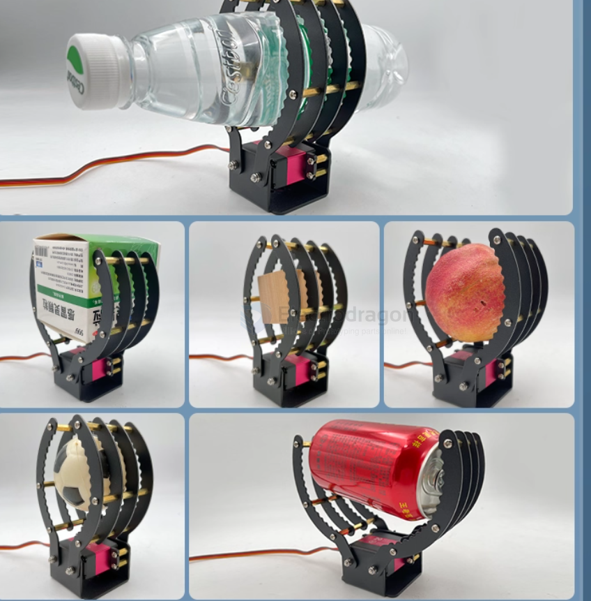
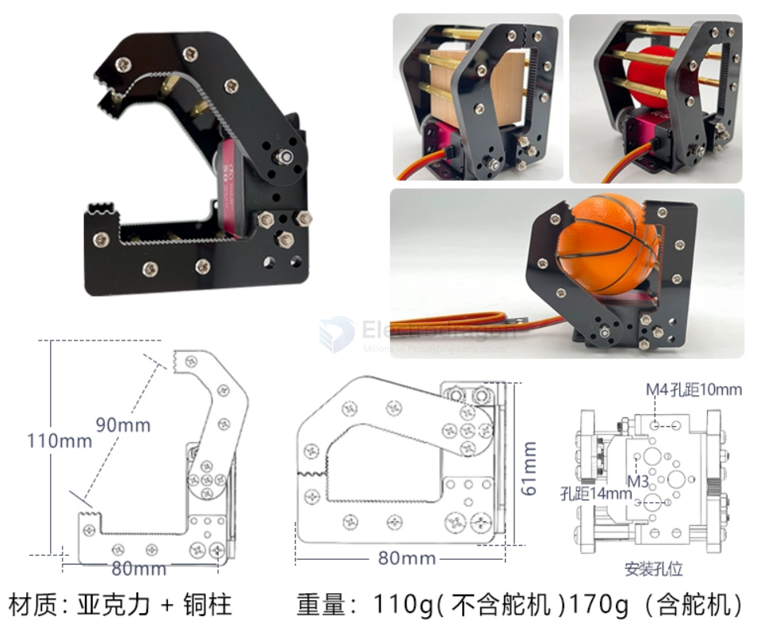
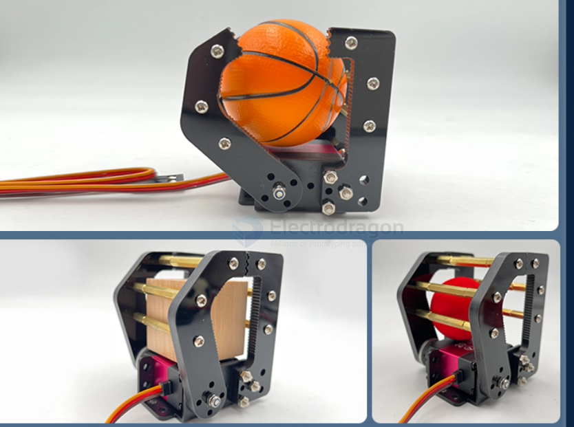

# mechanical-claw-dat

- [[3d-print-dat]] 

- [[servo-dat]]

## overview 

## flexible holder 

## structures 

right == single motor control == 1DOF 

## version 3 

https://t.me/electrodragon3/414

爪子内部带有波浪形牙齿结构，夹取物体时更稳定。可用于夹取方体，球体圆柱体和不规则形状物体。

length == 230 mm take 600g 

## version 2 

good at carrying ball types 

take 90 mm 800g 

## ref 

- [[rc-submarine-dat]]