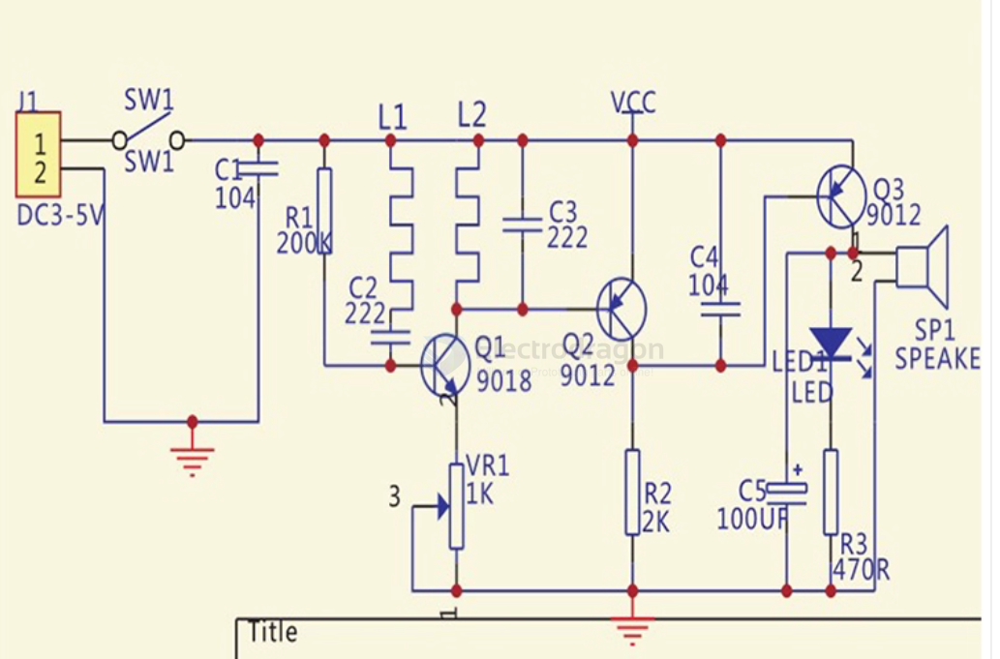

# metal-detector-dat

## toy basic version 

### Debugging After Soldering

- The inductors L1 and L2 are formed by copper traces on the PCB, so you do not need to make them yourself. This is simple and has a very high success rate!
- The circuit uses only a dozen components. As long as everything is installed correctly, it should work normally.
- After assembly, connect the power supply.
- Adjust the potentiometer until there is no sound (when not near metal).
- Bring the PCB antenna close to metal; it should make a sound. Move it away from metal; the sound should stop.
- If the sound does not stop when moving away from metal, turn the potentiometer slightly counterclockwise and try again until it works as expected.

### Common Issues

- If it keeps sounding after powering on, the oscillator stage may not be working. Possible causes:
  - Incorrect placement of resistors, transistors, or other components.
  - Short circuit or open circuit in the PCB coil. Check carefully with a magnifying glass.
  - If Q2’s amplification is too low, Q3 cannot turn off, which also causes continuous sound.

## ref 

- [[training-board-dat]] - [[app-dat]]