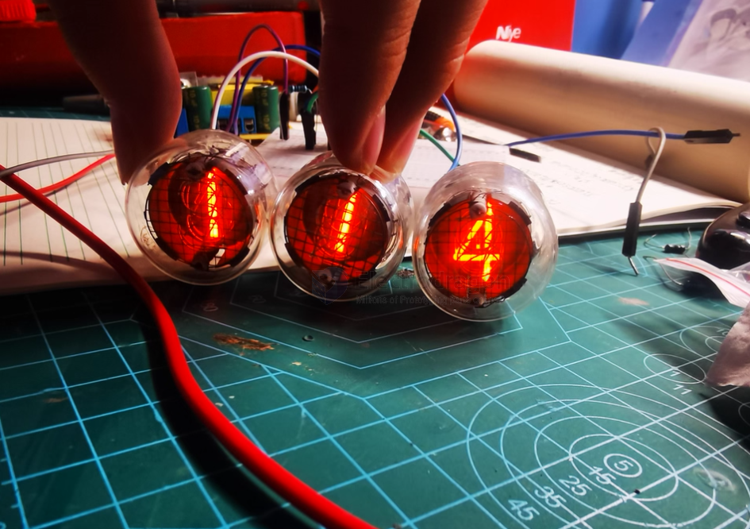

# nixie-tube-dat

- [[VFD-dat]]

A **Nixie tube** is an electronic display device that uses **cold cathode glow discharge** to show numbers or symbols. It was widely used in the 1950s–1970s for calculators, instruments, counters, and clocks — before LED and LCD displays became common.

---

## 🧩 Working Principle

A Nixie tube is filled with a low-pressure inert gas (usually **neon**, sometimes with a little mercury or argon) and contains multiple **cathodes** shaped like numbers (0–9), plus a **common anode grid**.

When a **high DC voltage** (typically around **170V**) is applied between the anode and one of the cathodes, the gas near that cathode becomes ionized and glows with an **orange-red discharge**, illuminating the selected number.

---

## ⚙️ Structure

| Component | Description |
|------------|--------------|
| Glass envelope | Sealed tube, filled with inert gas |
| Anode mesh | A grid at the front, controlling current flow |
| Cathode digits | Metal wire shapes (0–9), stacked at different depths |
| Gas filling | Usually neon (Ne) with traces of mercury or argon |
| Pins | Electrical leads for circuit connection |

---

## ⚡ Electrical Characteristics

| Parameter | Typical Value |
|------------|----------------|
| Ignition voltage | 150–180 V DC |
| Maintaining voltage | 120–140 V DC |
| Current per digit | 1–3 mA |
| Light color | Orange-red (from neon glow) |

---

## 💡 Applications

- Old digital instruments  
- Counters and frequency meters  
- **Nixie clocks** (retro electronic clocks)  
- Retro art and design projects  

---

## 🕰️ History and Modern Revival

- Commercialized by **Burroughs Corporation** in the 1950s.  
- Replaced by LED and LCD displays in the 1970s.  
- Revived in modern times for **vintage-style Nixie clocks** and electronic art.

---

## 🔬 Nixie Tube vs. Vacuum Fluorescent Display (VFD)

| Feature | Nixie Tube | VFD |
|----------|-------------|-----|
| Light source | Gas discharge | Electron-excited phosphor |
| Voltage | High (~170V) | Low (~30V) |
| Color | Orange-red | Green or blue-green |
| Drive type | Individual cathode control | Grid + cathode matrix |
| Lifetime | Moderate (a few thousand hours) | Longer (tens of thousands of hours) |

---

## 🧠 Summary

A **Nixie tube** is a **gas-discharge-based numeric display** famous for its warm, vintage orange glow.  
Though technologically obsolete, it remains popular among hobbyists and designers for its nostalgic beauty and craftsmanship.

## ref 

- [[high-voltage-dat]]