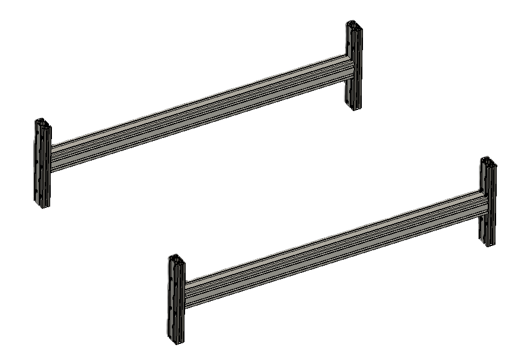

# PixiePlacer-frames-dat

- [3D_view](https://cad.onshape.com/documents/5e890b89298a697f7602c354/w/0c6531c398b6b31c88cb0ec1/e/174e4411811158364858aed9?renderMode=0&uiState=67b5bb42ac092153de7a5309)

## knowledge 

1. [[structure-dat]] - [[Alu_Extrusion-dat]] 

2. [[mechanics-dat]] - [[Linear-Rail-dat]]

3. [[NUT-dat]] - [[screws-dat]] 

4. electronics - [[power-supply-dat]] ..

- [[PixiePlacer-dat]]

## grouped BOM 

#### Alu_Extrusion

#### Alu Bracket and Angle 

- [Alu_L_Bracket](https://www.aliexpress.us/item/2251832777050255.html?aff_fcid=388174e438b640cea70579ce37609551-1701597353795-06839-_DeD1psH&tt=CPS_NORMAL&aff_fsk=_DeD1psH&aff_platform=portals-tool&sk=_DeD1psH&aff_trace_key=388174e438b640cea70579ce37609551-1701597353795-06839-_DeD1psH&terminal_id=c38732c4f6c34e588ce9d3f81f8d192c&afSmartRedirect=y&gatewayAdapt=deu2usa4itemAdapt)
- [Alu_Angle](https://de.aliexpress.com/item/1005003196587624.html?aff_fcid=7a90d7f234324893bed31a4f0884a4e7-1701597240651-00481-_DeD1psH&tt=CPS_NORMAL&aff_fsk=_DeD1psH&aff_platform=portals-tool&sk=_DeD1psH&aff_trace_key=7a90d7f234324893bed31a4f0884a4e7-1701597240651-00481-_DeD1psH&terminal_id=c38732c4f6c34e588ce9d3f81f8d192c&afSmartRedirect=y)

#### Linear Rails

#### buttons and switches

back panel 
- RJ45 socket 
- Power Cable Gland 
front panel
- Emergency_Stop_Button
- PC_Button = ON / OFF Switch
- VAC_Pump_Switch = Manual Override ON / OFF Vacuum Pump Switch = 16mm

- [Power_Socket](https://www.aliexpress.us/item/2251832670748663.html?aff_fcid=fdd77c6df1dd4c17b35cfa4af02e1a69-1701597512706-03549-_DeD1psH&tt=CPS_NORMAL&aff_fsk=_DeD1psH&aff_platform=portals-tool&sk=_DeD1psH&aff_trace_key=fdd77c6df1dd4c17b35cfa4af02e1a69-1701597512706-03549-_DeD1psH&terminal_id=c38732c4f6c34e588ce9d3f81f8d192c&afSmartRedirect=y&gatewayAdapt=deu2usa4itemAdaptt)
- [Emergency_Stop_Button](https://www.aliexpress.us/item/3256804062129662.html?aff_fcid=3bd97c4749ca4743a44367336b63bd70-1701597510867-09236-_DeD1psH&tt=CPS_NORMAL&aff_fsk=_DeD1psH&aff_platform=portals-tool&sk=_DeD1psH&aff_trace_key=3bd97c4749ca4743a44367336b63bd70-1701597510867-09236-_DeD1psH&terminal_id=c38732c4f6c34e588ce9d3f81f8d192c&afSmartRedirect=y&gatewayAdapt=deu2usa4itemAdapt)

Power Supply

I am using a 24V 10A switching power supply from MeanWell. I decided to run the machine on 24 Volts, since the higher Voltage allows the Stepper Motors to run cooler and faster. At the places where 12V is needed Step-Down-Modules are used.

#### 3D printed Parts 
- Power_Socket_Cover  
- Front_Panel        

## Optimized table 

### frame 1 
| Sub_Assembly_Name | Category       | Part_Name                       | Part Description                            | Dimensions | Quantity | Keywords |
| :---------------- | :------------- | :------------------------------ | :------------------------------------------ | :--------- | -------: | :------- |
| Machine Frame     | Standard Part  | Alu_Extrusion_Leg_200mm         | 2040 Aluminium Extrusion 6 Slot             | 200 mm     |        4 | -        |
| Machine Frame     | Standard Part  | Alu_Extrusion_Crossbeam_724mm   | 4040 Aluminium Extrusion 6 Slot             | 724 mm     |        2 | -        |
| Machine Frame     | Standard Part  | Alu_Extrusion_Bed_Support_520mm | 2040 Aluminium Extrusion 6 Slot             | 520mm      |        2 | -        |
| Machine Frame     | Standard Part  | Alu_Extrusion_Y-Axis_600mm      | 2040 Aluminium Extrusion 6 Slot             | 600mm      |        - | -        |
| Machine Frame     | Standard Part  | Alu_L_Bracket                   | L Bracket for connection the Alu Extrusions | 58x58x3    |        4 |          |
| Machine Frame     | Standard Part  | Alu_Angle                       | Alu Angle for connecting the Alu Extrusions | -          |       10 |          |
| Machine Frame     | Nuts and Bolts | M5_T_Nut                        | Connecting Alu Extrusions Nuts              | -          |       50 | -        |
| Machine Frame     | Nuts and Bolts | Socket_Cap_Screw_M5x10mm        | Connecting Alu Extrusions Screws            | -          |       50 | -        |

Alu_L_Bracket == Joint Board Plate Corner Angle Bracket Connection Joint Strip

Alu_Angle == 2020 Aluminium Corner Bracket

- [[Alu_Extrusion-dat]] 

### y axis 

| Sub_Assembly_Name | Category       | Part_Name                | Part Description                   | Dimensions | Quantity | Keywords |
| :---------------- | :------------- | :----------------------- | :--------------------------------- | :--------- | -------: | :------- |
| Machine Frame     | Standard Part  | MGN12H_600mm             | Y-Axis Linear Rails                | 600 mm     |        2 | -        |
| Machine Frame     | Nuts and Bolts | Socket_Cap_Screw_M3x10mm | Y-Axis Linear Rail Mounting Screws | -          |       24 | -        |
| Machine Frame     | Nuts and Bolts | M3_T_Nut                 | Y-Axis Linear Rail Mounting Nuts   | -          |       24 | -        |

- [[Linear-Rail-dat]]

### frame bed 

| Sub_Assembly_Name | Category    | Part_Name             | Part Description                                                                       | Dimensions      | Quantity | Keywords |
| :---------------- | :---------- | :-------------------- | :------------------------------------------------------------------------------------- | :-------------- | -------: | :------- |
| Machine Frame     | Custom Part | Top_Machine_Bed       | Steel Sheet Magnetic for the Top of the Machine Bed. Glued onto the Bottom_Machine_Bed | (574x600x1) mm  |        4 | -        |
| Machine Frame     | Custom Part | Bottom_Machine_Bed    | MDF Sheet for the Bottom of the Machine Bed                                            | (574x600x20) mm |        1 | -        |
| Machine Frame     | Custom Part | Bottom_Mounting_Plate | MDF Sheet for the Machine Base                                                         | (834x600x10) mm |        1 | -        |

### back and front cover 

| Sub_Assembly_Name | Category        | Part_Name                | Part Description                            | Dimensions     | Quantity | Keywords |
| :---------------- | :-------------- | :----------------------- | :------------------------------------------ | :------------- | -------: | :------- |
| Back_Panel        | Custom Part     | Back_Panel_Cover         | Plexiglas Cover for back of the machine     | (759x123x3) mm |        1 | -        |
| Back_Panel        | Standard Part   | Cable_Gland_PG16         | Power Cable Gland                           | -              |        1 | -        |
| Back_Panel        | Standard Part   | Power_Socket             | Power Input to Machine                      | -              |        1 |          |
| Back_Panel        | Standard Part   | RJ45_Panel_Mount         | Internet Input to Machine                   | -              |        1 | -        |
| Back_Panel        | 3D Printed Part | Power_Socket_Cover       | Cover Power Socket                          | -              |        1 | -        |
| Back_Panel        | Nuts and Bolts  | Socket_Cap_Screw_M3x20mm | Mounting the Power Socket Cover             | -              |        2 | -        |
| Back_Panel        | Nuts and Bolts  | M3_Nut                   | Mounting the Power Socket Cover             | -              |        2 | -        |
| Front_Panel       | 3D Printed Part | Front_Panel              | Front Panel for the Switches                | -              |        1 | -        |
| Front_Panel       | Standard Part   | VAC_Pump_Switch          | Manual Override ON / OFF Vacuum Pump Switch | 16mm           |        1 | -        |
| Front_Panel       | Standard Part   | Emergency_Stop_Button    | E-Stop Switch                               | -              |        1 |          |
| Front_Panel       | Standard Part   | PC_Button                | PC ON / OFF Switch                          | -              |        1 | -        |

Power_Socket == 10A 250V Power Switch AC Power Outlet With Red Triple Rocker Switch Fused Module Plug

Emergency_Stop_Button == Emergency Stop Metal Button Mushroom Head Push Button Stop Switch

### all-in table 

| Sub_Assembly_Name | Category        | Part_Name                       | Part Description                                                                       | Dimensions      | Quantity | Keywords                                                                              |
| :---------------- | :-------------- | :------------------------------ | :------------------------------------------------------------------------------------- | :-------------- | -------: | :------------------------------------------------------------------------------------ |
| Machine Frame     | Standard Part   | Alu_Extrusion_Leg_200mm         | 2040 Aluminium Extrusion 6 Slot                                                        | 200 mm          |        4 | -                                                                                     |
| Machine Frame     | Standard Part   | Alu_Extrusion_Crossbeam_724mm   | 4040 Aluminium Extrusion 6 Slot                                                        | 724 mm          |        2 | -                                                                                     |
| Machine Frame     | Standard Part   | Alu_Extrusion_Bed_Support_520mm | 2040 Aluminium Extrusion 6 Slot                                                        | 520mm           |        2 | -                                                                                     |
| Machine Frame     | Standard Part   | Alu_Extrusion_Y-Axis_600mm      | 2040 Aluminium Extrusion 6 Slot                                                        | 600mm           |        - | -                                                                                     |
| Machine Frame     | Standard Part   | Alu_L_Bracket                   | L Bracket for connection the Alu Extrusions                                            | 58x58x3         |        4 | Joint Board Plate Corner Angle Bracket Connection Joint Strip                         |
| Machine Frame     | Standard Part   | Alu_Angle                       | Alu Angle for connecting the Alu Extrusions                                            | -               |       10 | 2020 Aluminium Corner Bracket                                                         |
| Machine Frame     | Nuts and Bolts  | M5_T_Nut                        | Connecting Alu Extrusions Nuts                                                         | -               |       50 | -                                                                                     |
| Machine Frame     | Nuts and Bolts  | Socket_Cap_Screw_M5x10mm        | Connecting Alu Extrusions Screws                                                       | -               |       50 | -                                                                                     |
| Machine Frame     | Standard Part   | MGN12H_600mm                    | Y-Axis Linear Rails                                                                    | 600 mm          |        2 | -                                                                                     |
| Machine Frame     | Nuts and Bolts  | Socket_Cap_Screw_M3x10mm        | Y-Axis Linear Rail Mounting Screws                                                     | -               |       24 | -                                                                                     |
| Machine Frame     | Nuts and Bolts  | M3_T_Nut                        | Y-Axis Linear Rail Mounting Nuts                                                       | -               |       24 | -                                                                                     |
| Machine Frame     | Custom Part     | Top_Machine_Bed                 | Steel Sheet Magnetic for the Top of the Machine Bed. Glued onto the Bottom_Machine_Bed | (574x600x1) mm  |        4 | -                                                                                     |
| Machine Frame     | Custom Part     | Bottom_Machine_Bed              | MDF Sheet for the Bottom of the Machine Bed                                            | (574x600x20) mm |        1 | -                                                                                     |
| Machine Frame     | Custom Part     | Bottom_Mounting_Plate           | MDF Sheet for the Machine Base                                                         | (834x600x10) mm |        1 | -                                                                                     |
| Back_Panel        | Custom Part     | Back_Panel_Cover                | Plexiglas Cover for back of the machine                                                | (759x123x3) mm  |        1 | -                                                                                     |
| Back_Panel        | Standard Part   | Cable_Gland_PG16                | Power Cable Gland                                                                      | -               |        1 | -                                                                                     |
| Back_Panel        | Standard Part   | Power_Socket                    | Power Input to Machine                                                                 | -               |        1 | 10A 250V Power Switch AC Power Outlet With Red Triple Rocker Switch Fused Module Plug |
| Back_Panel        | Standard Part   | RJ45_Panel_Mount                | Internet Input to Machine                                                              | -               |        1 | -                                                                                     |
| Back_Panel        | 3D Printed Part | Power_Socket_Cover              | Cover Power Socket                                                                     | -               |        1 | -                                                                                     |
| Back_Panel        | Nuts and Bolts  | Socket_Cap_Screw_M3x20mm        | Mounting the Power Socket Cover                                                        | -               |        2 | -                                                                                     |
| Back_Panel        | Nuts and Bolts  | M3_Nut                          | Mounting the Power Socket Cover                                                        | -               |        2 | -                                                                                     |
| Front_Panel       | 3D Printed Part | Front_Panel                     | Front Panel for the Switches                                                           | -               |        1 | -                                                                                     |
| Front_Panel       | Standard Part   | VAC_Pump_Switch                 | Manual Override ON / OFF Vacuum Pump Switch                                            | 16mm            |        1 | -                                                                                     |
| Front_Panel       | Standard Part   | Emergency_Stop_Button           | E-Stop Switch                                                                          | -               |        1 | Emergency Stop Metal Button Mushroom Head Push Button Stop Switch                     |
| Front_Panel       | Standard Part   | PC_Button                       | PC ON / OFF Switch                                                                     | -               |        1 | -                                                                                     |

## main frames 

four legs + crossbeam

2. add two supports 

3. Y axis and rails 

4. working bed and base 

5. real look 

## Testing 

## ref 

- [[PixiePlacer-frames-front-panel-dat]] - [[PixiePlacer-frames-back-panel-dat]]

- [[PixiePlacer-Frame]] - [[PixiePlacer]]