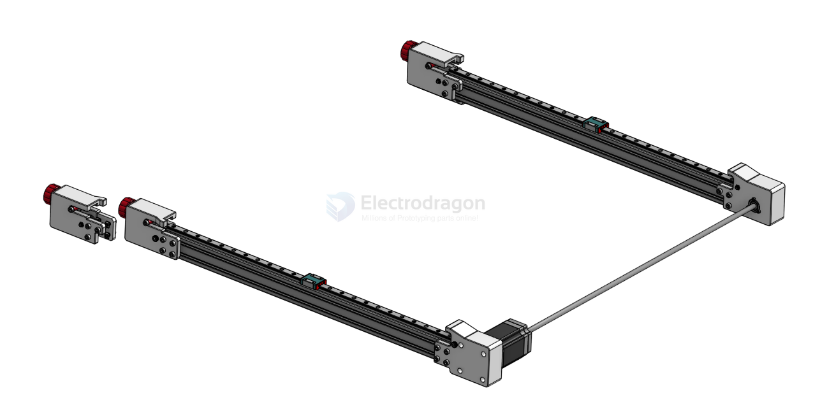
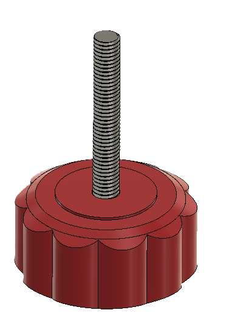
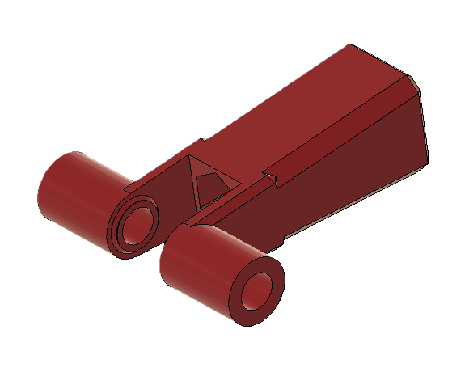

# PixiePlacer-Y-dat.md

- [[motion-system-dat]]

[assembly video ](https://www.youtube.com/watch?v=StzaezD6ANE)

## Tension Slider Assembly 

| Category        | Part_Name                | Part Description                  | Quantity |
| :-------------- | :----------------------- | :-------------------------------- | -------: |
| Nuts and Bolts  | Hex_Screw_M5x35mm        | Tensioning Screw for Belt Tension |        3 |
| 3D Printed Part | Star_Knob_Base           | -                                 |        3 |
| 3D Printed Part | Star_Knob_Cover          | -                                 |        3 |
| Standard Part   | GT2_Idler_20T_5B_6mm     | -                                 |        3 |
| Nuts and Bolts  | M5_Nut                   | -                                 |        6 |
| Nuts and Bolts  | Socket_Cap_Screw_M5x45mm | -                                 |        3 |
| 3D Printed Part | Tension_Slider           | Tensions the Belt                 |        3 |

Standard Part
GT2_Idler_20T_5B_6mm == [[timing-pulley-dat]]

Nuts and Bolts
- Hex_Screw_M5x35mm 
- M5_Nut - [[nut-dat]]
- Socket_Cap_Screw_M5x45mm

3D Printed Part - [[3d-print-service-dat]]
- Star_Knob_Base == star_knob v7 == https://cad.onshape.com/documents/ff9d1e3bb0c6648192bdf385/v/70ff96265c3a5c65e5e93ef9/e/10f29c1435693a48f4ed55a7
- Star_Knob_Cover == can not find this file 
- Tension_Slider == https://cad.onshape.com/documents/e640485c664452ef18221338/v/ecf6a991a8286a17a6f28085/e/1d506c43d62b8f4e412e0560?renderMode=0&uiState=67d019d4668a6a59b71b9bf7

## steps by steps 

[explanation in github ](https://github.com/PixiePlacer/PixiePlacer/wiki/Y%E2%80%90Axis)

### Tension Slider

- [[timing-pulley-dat]] - [[glue-dat]]

- The Tension_Slider tensions the belt on the X-Axis and Y-Axis. In total three are needed in the machine. The Hex_Screw_M5x35mm is pressed into the Star_Knob_Base and the Star_Knob_Cover glued on inorder to encapsulate the screw.
- A M5_Nut is dropped into the Tension_Slider.
- The Socket_Cap_Screw_M5x45mm is pushed through the hole of the Tension_Slider and the GT2_Idler_20T_5B_6mm and secured with a M5_Nut.
- Pass the belt through the center of the aluminum extrusion before mounting both mounting plates to the aluminum extrusion.

## Y-axis 

| Category        | Part_Name                         | Part Description                                              | Dimensions | Quantity |
|:----------------|:----------------------------------|:--------------------------------------------------------------|:-----------|---------:|
| 3D Printed Part | Left_Front_Mounting_Plate_Y-Axis  | -                                                             | -          |        1 |
| 3D Printed Part | Right_Front_Mounting_Plate_Y-Axis | -                                                             | -          |        1 |
| 3D Printed Part | Left_Back_Mounting_Plate_Y-Axis   | -                                                             | -          |        1 |
| 3D Printed Part | Right_Back_Mounting_Plate_Y-Axis  | -                                                             | -          |        1 |
| Standard Part   | GT2_Idler_20T_5B_6mm              | -                                                             | -          |        4 |
| Nuts and Bolts  | M5_T_Nut                          | Mounting Mounting Plates to Alu Extrusions                    | -          |       30 |
| Nuts and Bolts  | M5_Nut                            | Motor Mounting Nuts and Idler Mounting Nuts                   | -          |        6 |
| Nuts and Bolts  | Socket_Cap_Screw_M5x12mm          | Mounting Mounting Plates to Alu Extrusions                    | -          |       30 |
| Nuts and Bolts  | Socket_Cap_Screw_M5x40mm          | Holding the Idle in place                                     | -          |        2 |
| Standard Part   | GT2_Timing_Pulley_20T_8B_6mm      | Driving Pulley for Belt                                       | -          |        2 |
| Nuts and Bolts  | Socket_Cap_Screw_M5x16mm          | Motor Mounting Screws                                         | -          |        4 |
| Standard Part   | 608_Bearing                       | Bearing to keep the Shaft align on the left back side         | -          |        1 |
| Nuts and Bolts  | Socket_Cap_Screw_M3x6mm           | Mount Bearing Screws                                          | -          |        3 |
| Standard Part   | Nema23_Motor                      | Dual Shaft Motor Nema 23;  84mm; 2,4Nm; 8mm Dual Shaft        | -          |        1 |
| Standard Part   | Shaft_8mm                         | 8mm Shaft for transfering the Motor rotation to the left side | 630mm      |        1 |
| Standard Part   | Shaft_Coupler_8mm                 | Couples the Motor Shaft to the long shaft to the left side    | -          |        1 |
| Standard Part   | GT2_Belt_6mm                      | Y-Axis Belt                                                   | 1355mm     |        2 |

3D Printed Part

- Left_Front_Mounting_Plate_Y-Axis 
- Right_Front_Mounting_Plate_Y-Axis
- Left_Back_Mounting_Plate_Y-Axis  
- Right_Back_Mounting_Plate_Y-Axis 

- [[motor-dat]]

- [[mechanics-dat]] - [[bearing-dat]] - [[shaft-dat]] - [[belt-dat]]

## CAD images 

## images 

