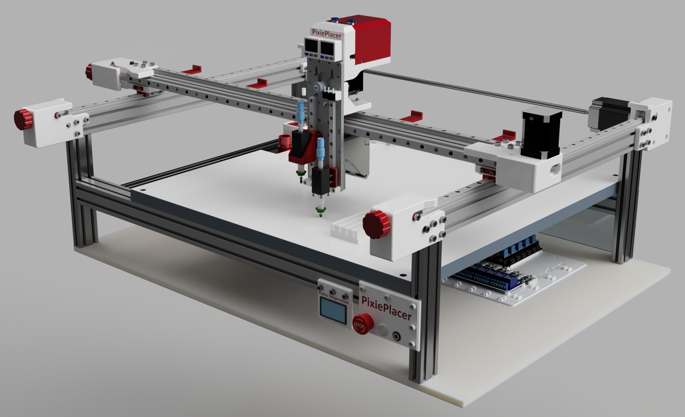

# PixiePlacer-dat

- raw BOM file [[PixiePlacer-BOM-dat]]

- [[PixiePlacer-Frame-dat]] - [[ALU_extrusion-dat]]

- [[PixiePlacer-Y-dat]]

## all resources info 

- [github](https://github.com/PixiePlacer/PixiePlacer) / [youtube](https://www.youtube.com/@pixieplacer)

BOM 

- [PixiePlacer/PixiePlacer/wiki/Bill-of-Materials](https://github.com/PixiePlacer/PixiePlacer/wiki/Bill-of-Materials)

- [google sheet BOM](https://docs.google.com/spreadsheets/d/1CWFQ7bArdYDCNkc-MHFDlqN6pdHpugMOtVum4YUrMk8/edit?gid=0#gid=0)

- [copied BOM V2](https://docs.google.com/spreadsheets/d/18583qxF1q-lbWCTlZ11vYUZMCIv_e09sAsYIaguiR-M/edit?gid=0#gid=0)

CAD 

- [full assembly 3D file at here](https://cad.onshape.com/documents/cba5ff23b34f56cdb8d56e29/w/70635aee323f77b7c3b4f3ff/e/d64d0dd6226f687165828220)

- [frame assembly at here](https://cad.onshape.com/documents/5e890b89298a697f7602c354/w/0c6531c398b6b31c88cb0ec1/e/174e4411811158364858aed9)

## building logs 

- [3d prints and frames](https://t.me/electrodragon3/337)

## ref 

- [[CAD-dat]]