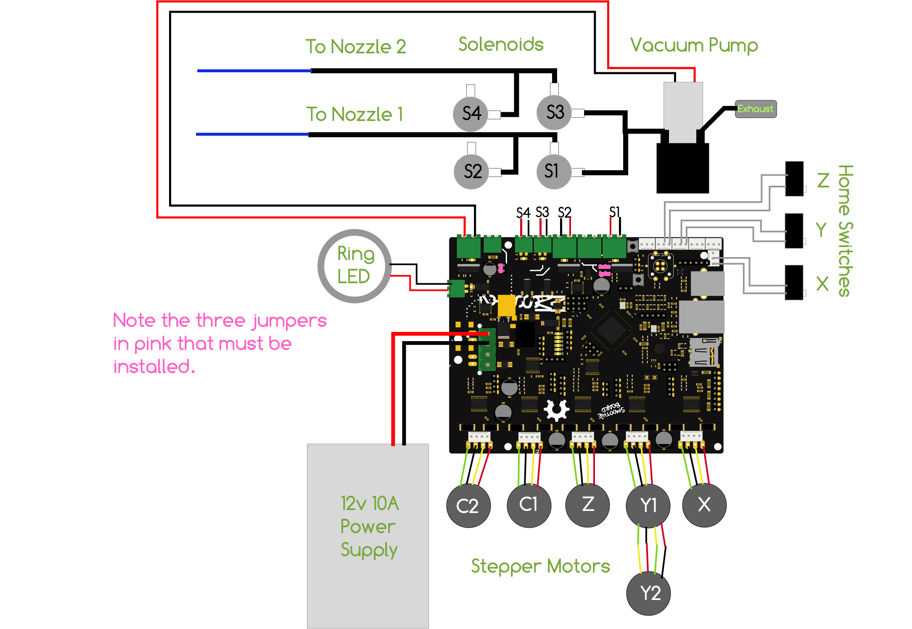

# openpnp-dat

- [[openpnp-dat]] is a great opensource project, benefit worldwide people who want to make stuff! hopefully we can some ready to use product this year 2025!

- [https://openpnp.org](https://openpnp.org)

- [disscussion](https://groups.google.com/g/openpnp) 

At it's core, OpenPnP is a Computer Numerical Control (CNC) controller. 

It reads a job file and then sends commands to a machine to execute. Unlike common CNC controllers for 3D printers, milling machines, and lathes, OpenPnP also uses cameras for feedback, and allows you to completely configure a job within it's user interface.

The definitions and explanations below will introduce you to the terminology used in OpenPnP, and in pick and place in general.

- [[CNC-dat]] - [[pnp-machine-dat]]

## guide 

- [quck start guide ](https://github.com/openpnp/openpnp/wiki/Quick-Start)
- [user manual](https://github.com/openpnp/openpnp/wiki/User-Manual)

## software 

- [software download](https://openpnp.org/downloads/)

## hardware 

The current recommendation for a build guideline is:

### Hardware: frame and X/Y

#### PixiePlacer

- [[PixiePlacer-dat]]

#### richardklingler == openpnp

- https://github.com/richardklingler/openpnp

#### openpnp-openbuilds

- Bill of Materials at: https://docs.google.com/spreadsheets/d/1Jt3jb6zsk9aa-5eUBTdAOFm7u1YypV3FqZMti7bdn9s/edit?usp=sharing

overview 

#### DIY Pick and Place by Teton Technology

DIY Pick and Place by Teton Technology – An Open Source DIY cartesian PnP machine using Rails / Carriages for high speed and accurate part placement.

- [DIY Pick and Place for frame and X/Y.](https://hackaday.io/project/9319-diy-pick-and-place)
  - demo video - [DIY picking and placing a pcb](https://www.youtube.com/watch?v=Ril6AWOdqfg&t=76s)
  - [PNP Bill of material](https://docs.google.com/spreadsheets/d/1ijdlkk7pOZnqEVCU9lDlx2OBI44QKNkokIkmXVnPd3g/edit?gid=0#gid=0)
  - files not working 

#### other not maintaining 

- liteplacer
- [TVM920driver](https://github.com/glenenglishgithub/TVM920driver/tree/dev)

### Head

- ICEpick Direct Drive Head for the head.

### nozzle holders and nozzles

- Quick Change Juki Nozzle Holders for nozzle holders and nozzles.

### electronics 

- [[motion-control-system-dat]]

#### Smoothieboard

- Smoothieboard for motion control. The Motion Controllers page also has additional information about this important component.

### Vision System 
- ELP Model USB100W03M, 720p USB Cameras which can be purchased on Amazon, AliExpress and eBay. Lenses are standard M12 mount and can be replaced to customize for your machine's geometry. See below for lens and positioning recommendations.

### Yamaha CL Feeders
- Yamaha CL Feeders (available on Aliexpress and Robotdigg) if you want auto feeders. Make sure to get a mounting block, too.

## Commerialized Options 

- [demo video 1](https://t.me/electrodragon3/333)

### ref 

- [build FAQ](https://github.com/openpnp/openpnp/wiki/Build-FAQ)

- [[PNP-machine-dat]] 

- [[openpnp]] - [[CNC]]