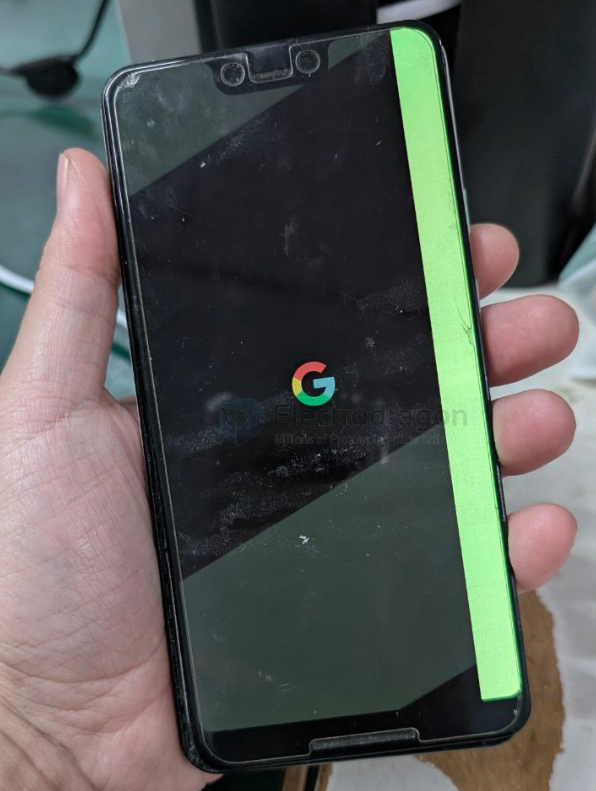
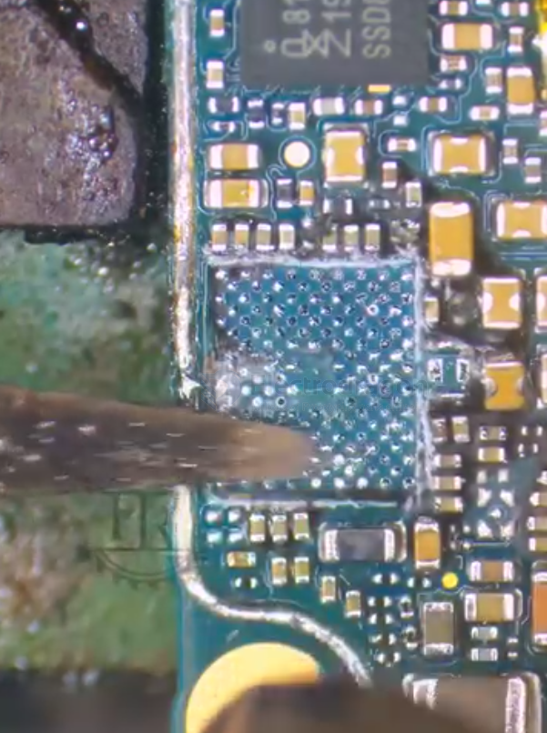

# phone-pixel-dat

- [[pixel-7-dat]] - [[pixel-3xl-dat]]
 
- [[usb-type-c-dat]] - [[type-c-to-ethernet-dat]] - [[displayPort-dat]]

## 📱 Google Pixel 7 — Charging Support Overview

- [[battery-charger-dat]] - [[CONN-power-dat]] - [[conn-dat]]

### ⚡ Wired Charging
- **Connector:** USB-C (USB-PD 3.0 compliant)
- **Max Power:** Up to **20 W** (official spec; Google’s 30 W charger delivers ~20–22 W actual)
- **Protocol:** USB Power Delivery (PD 3.0) PPS (Programmable Power Supply)
- **Backward Compatible:** Works with standard USB-C PD chargers at lower power

- [[USB-PD-dat]]

### 🔋 Wireless Charging
- **Standard:** Qi wireless charging
- **Max Power:**
  - **21 W** (using **Google Pixel Stand 2**)
  - **Up to 12 W** (with other Qi-certified chargers)
- **Reverse Wireless Charging:** Yes — called **Battery Share**
  - Can charge accessories like earbuds or other phones (up to ~5 W)

- [[QI-wireless-charge-dat]]

## fix note 

screen is very fragile, be careful when prying it open.

## pixel 4xl 

power ic 

## ref 

- [[app-dat]]