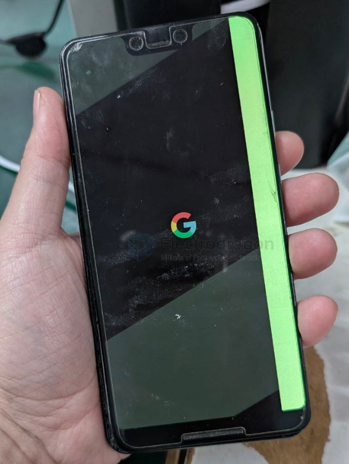
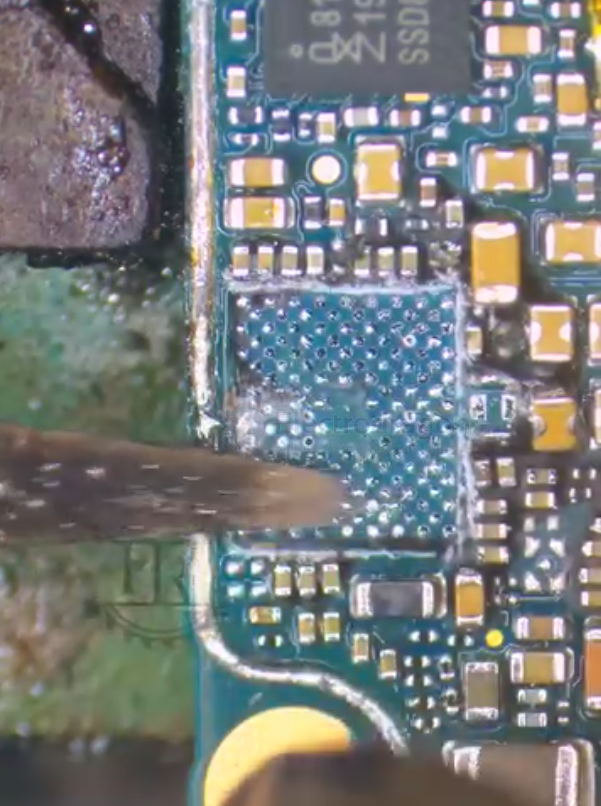

# phone-pixel-dat

- [[network-dat]] - [[carrier-dat]] - [[LTE-dat]] - [[voLTE-dat]] - [[phone-pixel-dat]]

- [[pixel7-dat]] - [[pixel3-dat]] - [[pixel8-dat]]
 
- [[android-app-dat]] - [[android-dat]]

- [[USB-type-c-dat]] - [[type-c-to-ethernet-dat]] - [[displayPort-dat]]

- [[android-dat]] - [[ADB-dat]] - [[phone-dat]]

- [[phone-dat]]

## chip overview  

Pixel 1 到 5 系列全系搭载高通骁龙（Qualcomm Snapdragon）处理器，具体型号配置如下：
 * Pixel 1 系列 (2016)
   * Pixel / Pixel XL： 骁龙 821（Snapdragon 821）
 * Pixel 2 系列 (2017)
   * Pixel 2 / Pixel 2 XL： 骁龙 835（Snapdragon 835）
 * Pixel 3 系列 (2018–2019)
   * Pixel 3 / Pixel 3 XL： 骁龙 845（Snapdragon 845）
   * Pixel 3a / Pixel 3a XL： 骁龙 670（Snapdragon 670）
 * Pixel 4 系列 (2019–2020)
   * Pixel 4 / Pixel 4 XL： 骁龙 855（Snapdragon 855）
   * Pixel 4a： 骁龙 730G（Snapdragon 730G）
   * Pixel 4a 5G： 骁龙 765G（Snapdragon 765G）
 * Pixel 5 系列 (2020)
   * Pixel 5： 骁龙 765G（Snapdragon 765G）
   * Pixel 5a 5G： 骁龙 765G（Snapdragon 765G）
> 关键变化： 从 Pixel 5 开始，Google 暂停在数字旗舰上使用高通顶级 8 系列芯片，转而采用中端 7 系列芯片；直至 Pixel 6 系列，Google 才正式切换为自研的 Tensor 芯片。

## 📱 Google Pixel 7 — Charging Support Overview

- [[battery-charger-dat]] - [[CONN-power-dat]] - [[conn-dat]]

### ⚡ Wired Charging
- **Connector:** USB-C (USB-PD 3.0 compliant)
- **Max Power:** Up to **20 W** (official spec; Google’s 30 W charger delivers ~20–22 W actual)
- **Protocol:** USB Power Delivery (PD 3.0) PPS (Programmable Power Supply)
- **Backward Compatible:** Works with standard USB-C PD chargers at lower power

- [[USB-PD-dat]]

### 🔋 Wireless Charging
- **Standard:** Qi wireless charging
- **Max Power:**
  - **21 W** (using **Google Pixel Stand 2**)
  - **Up to 12 W** (with other Qi-certified chargers)
- **Reverse Wireless Charging:** Yes — called **Battery Share**
  - Can charge accessories like earbuds or other phones (up to ~5 W)

- [[QI-wireless-charge-dat]]

## fix note 

screen is very fragile, be careful when prying it open.

## pixel 4xl 

power ic 

## ref 

- [[app-dat]]