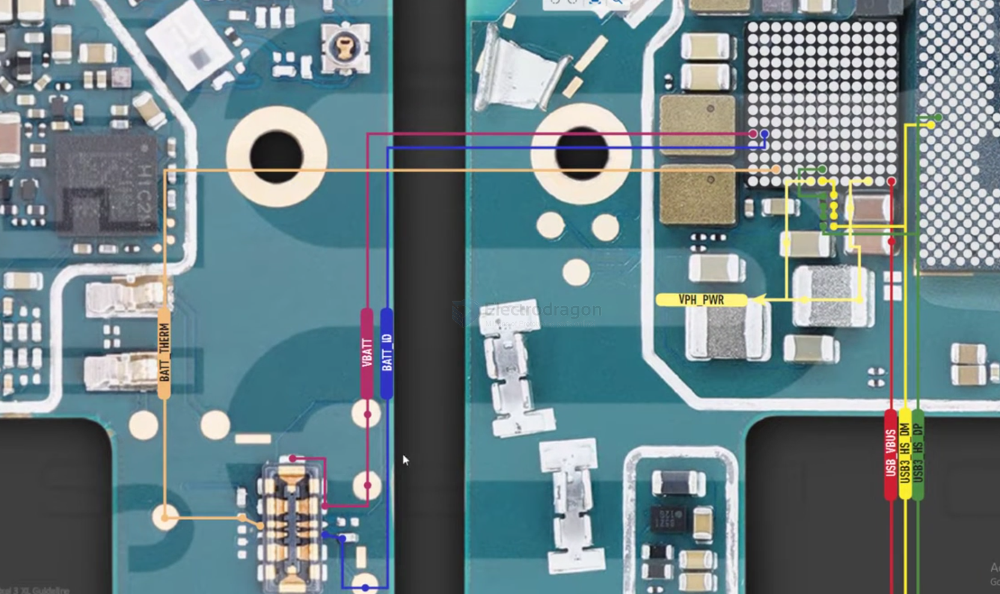
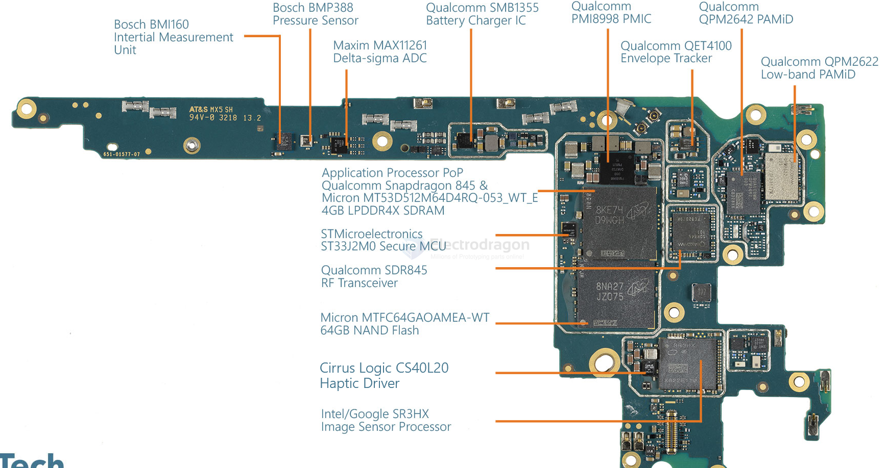

# pixel3-dat.md

## specs 

FDD-LTE: B1/2/3/4/5/7/8/12/13/17/18/19/20/25/26/28/29/32/66/71

TD-LTE:  B38/39/40/41/42/46  

- [[network-carrier-dat]] - [[carrier-dat]]

Pixel 3 是"中国信号完全可用"的谷歌机——TD-LTE 全频段支持，移动/联通/电信 4G 都能用（电信需要开通 VoLTE）。

## info 

- Model-G013C

For Schematic Diagram

- Qualcomm Snapdragon 845

- the Fitbit Charge 3 incorporates the Integrated Device Technology IDTP9221 wireless charger receiver IC

For audio processing, Fitbit employs Qualcomm's WCD9340 Audio Codec, complemented by Cirrus Logic's CS35L36 and CS40L20 Audio Amplifiers for enhanced sound quality. Qualcomm also provides a suite of Power Amplifiers and Front-Ends, including QPM2622, QPM2642, QPM2635, QDM3620, QDM3670, and QDM3671, contributing to efficient power management and signal processing.

## ref 

https://www.techinsights.com/blog/google-pixel-3-xl-teardown

[Google Pixel 3 Xl All Solution For Schematic Diagram || Google Pixel 3 XL Teardown || Model-G013C](https://www.youtube.com/watch?v=4Pe9qGOL_mo)

