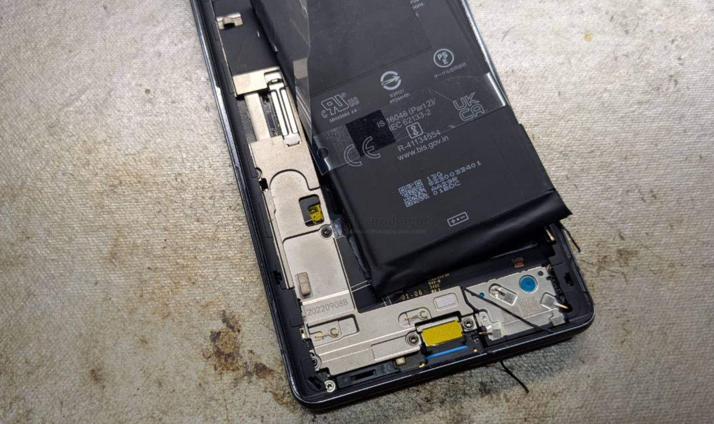
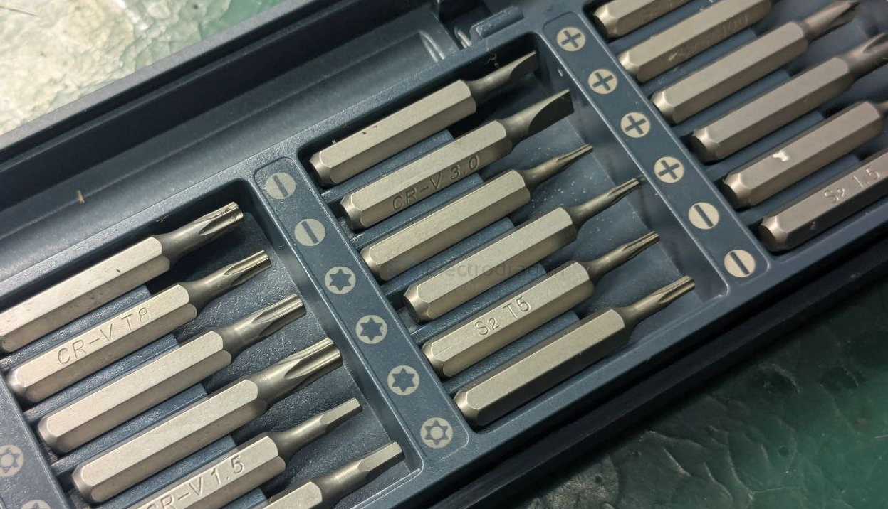
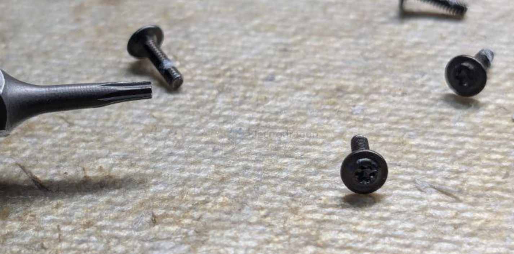
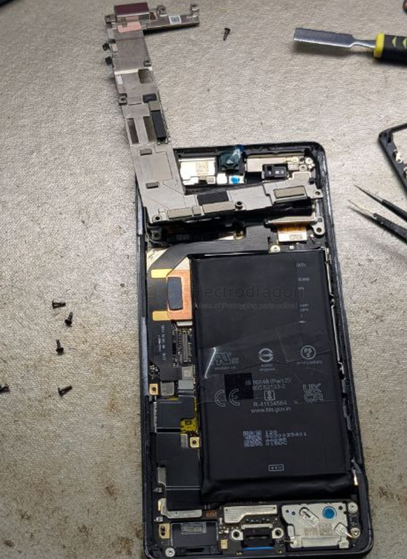
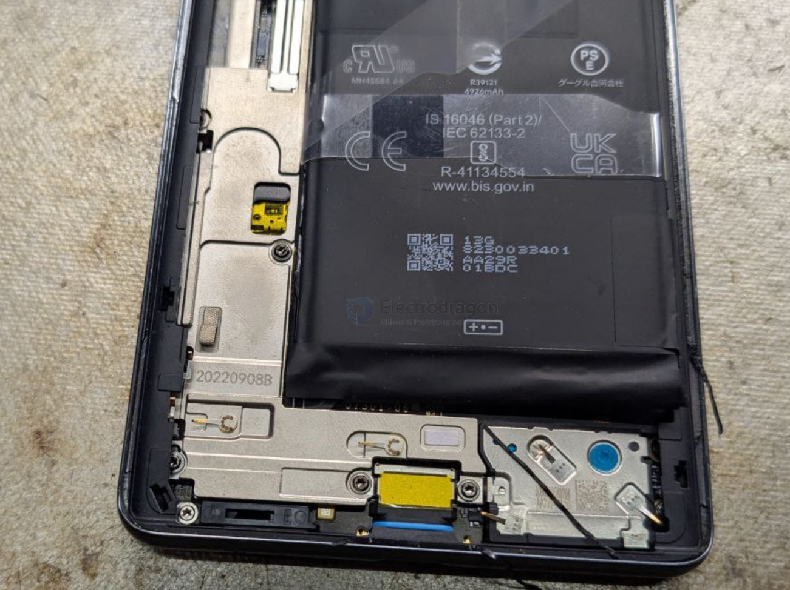
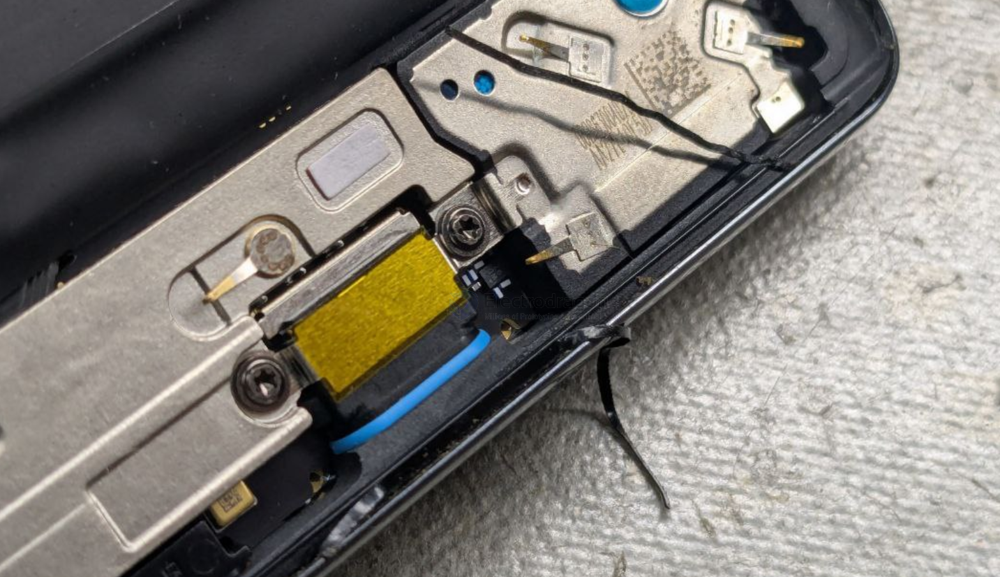

# pixel-7-dat

middle display screen rack 

## phone fix screwdriver set

## burned power unit 

## battery and battery connector

lifted the battery up 

## this looks like a back cover 

## inside first layer 

## detailed look 

## frame rack and glue or seals 

## ref 

- [[pixel-phone-dat]]