# power-adapter-dat

- [[power-adapter-dat]] - [[power-dat]] 

## chip 

- [[SI6021-dat]] - [[SiFirst-dat]] - [[SI6051-dat]] - [[power-adapter-dat]] - [[acdc-dat]] - [[SI5928-dat]] - [[power-switch-dat]] 

## build 

### build 6

- [[SCT-dat]] - [[SCT2650-dat]] == STC2650 == 4.5V-60V Vin, 5A, High Efficiency Step-down DCDC Converter with
Programmable Frequency - [[DCDC-down-dat]]

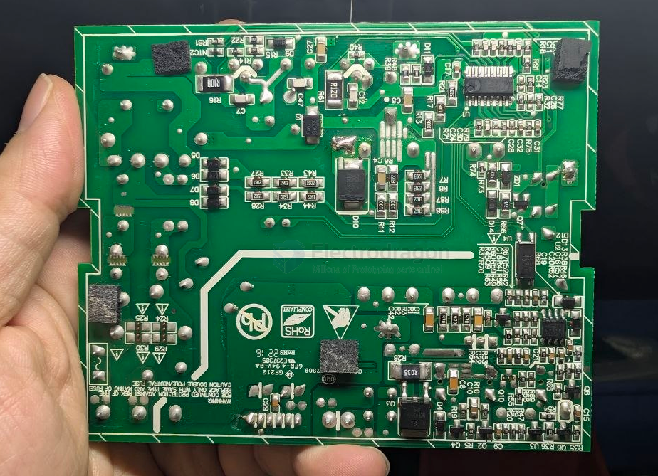

- M20839 unknown 

- [[LM358-dat]] - [[power-adapter-dat]]

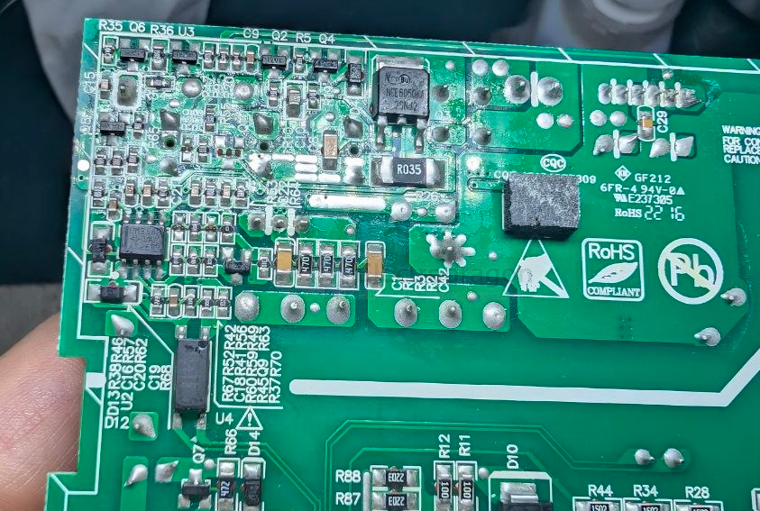

- [[mosfet-dat]] - [[NCEpower-dat]] - [[NCEpower-mosfet-dat]] - [[mosfet-dat]] - [[NCE6050-dat]]

### build 5 

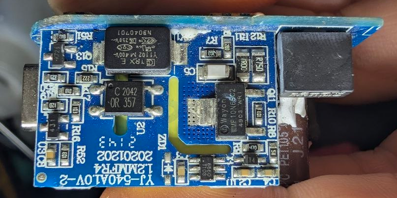

- [[wayon-dat]] - [[power-adapter-dat]] - [[power-dat]] - [[acdc-dat]] - [[capacitor-safety-dat]]

- [[wayon-dat]] - [[wayon-mosfet-dat]] - [[mosfet-dat]] - [[WMF10N65C2-dat]]

- [[optical-coupler-dat]]

- [[power-adapter-dat]] - [[PCB-form-dat]]

### build 4 

- [[CRE6255-dat]] - [[CRE6905-dat]] - [[cresemi-dat]] - [[power-adapter-dat]]

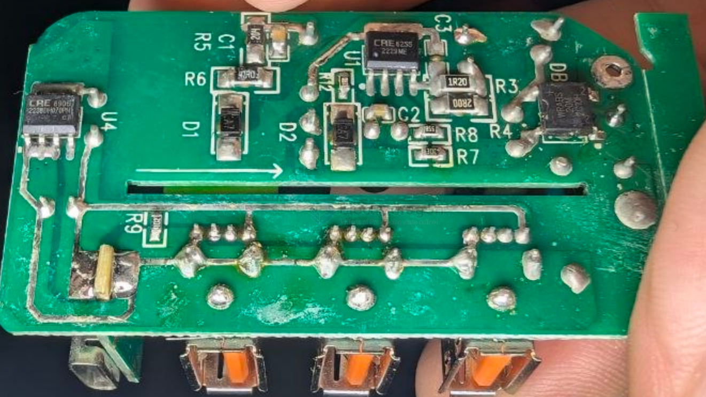

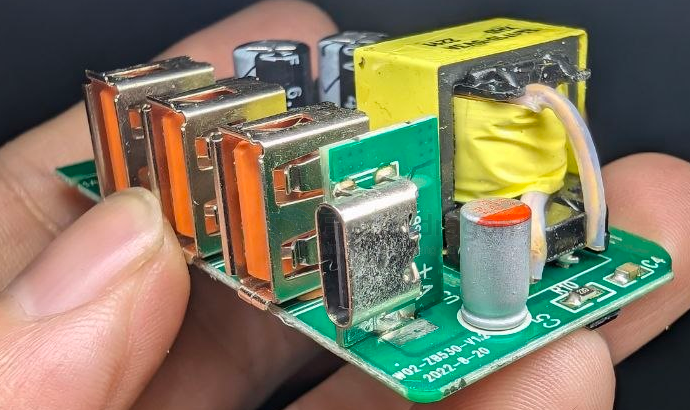

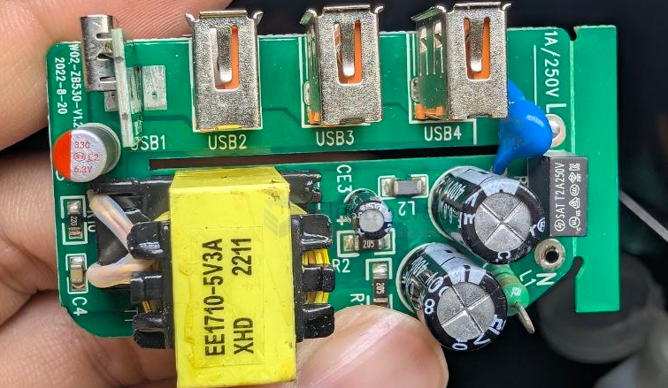

- [[transformer-dat]] - [[power-adapter-dat]] - [[power-dat]] - [[acdc-dat]]

### build 3 

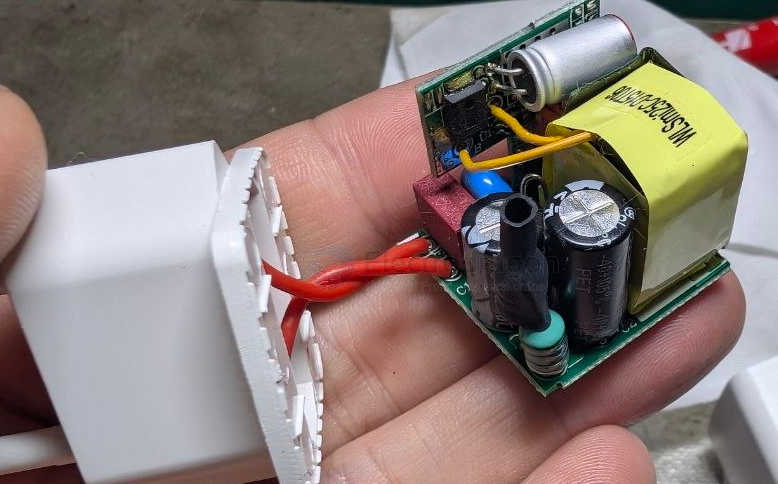

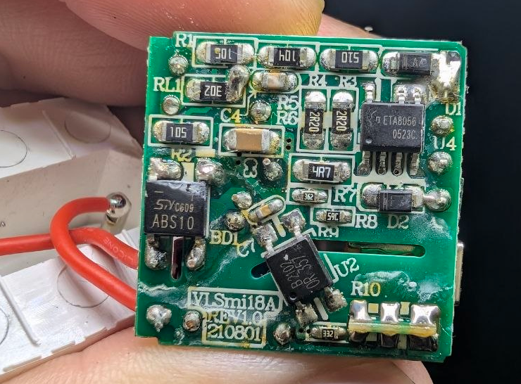

- [[ETA8056-dat]] - [[ACDC-dat]] - [[power-adapter-dat]] - [[ETA-solutions-dat]]

ZJNOG ZJN0G unknown 

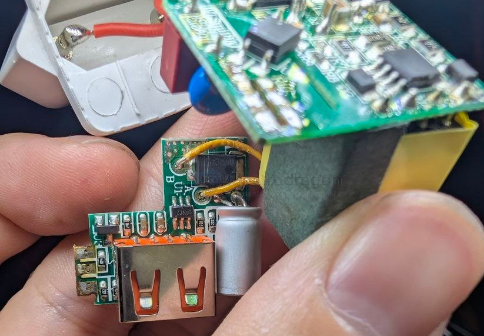

### build 2 

- [[sheet-dat]] - [[sheet-metal-dat]] - [[power-adapter-dat]]

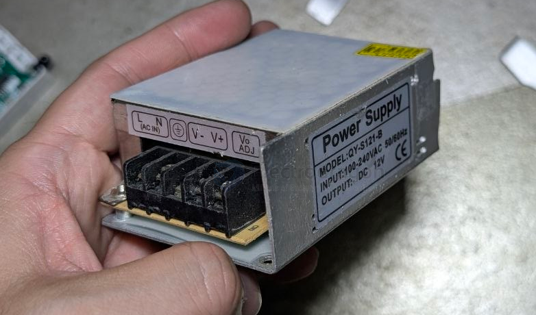

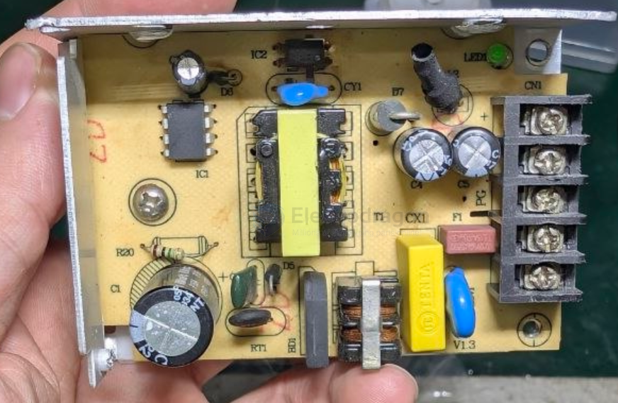

### build 1

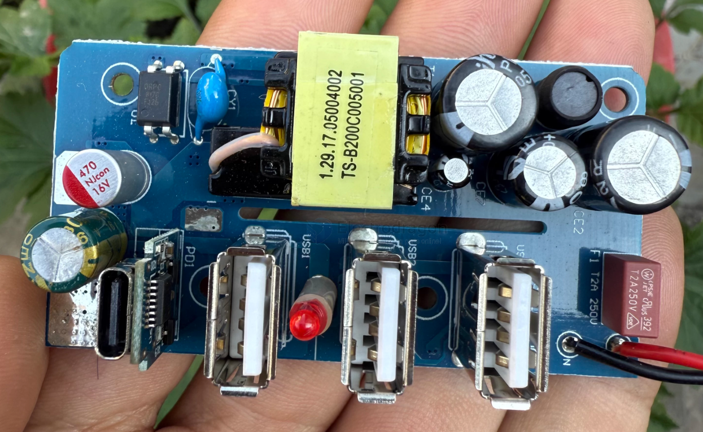

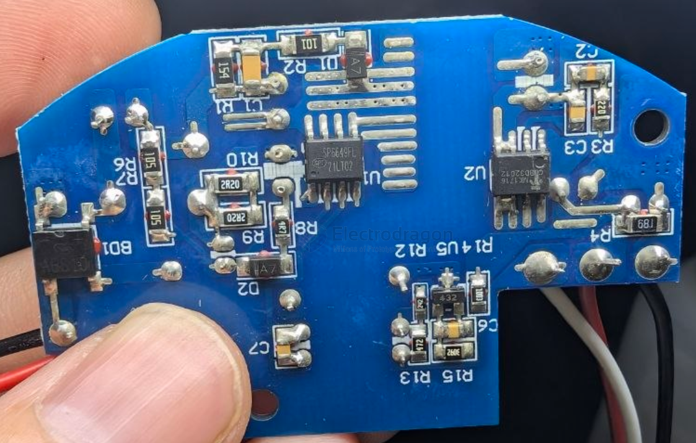

- [[SP6649-dat]] - [[sipex-dat]]

- [[MT1718-dat]]

FS8623

- [[fastsoc-dat]] - [[FS8623-dat]] - [[fast-charge-protocols-dat]] - [[power-bank-dat]] - [[power-adapter-dat]] - [[power-dat]] - [[acdc-dat]]

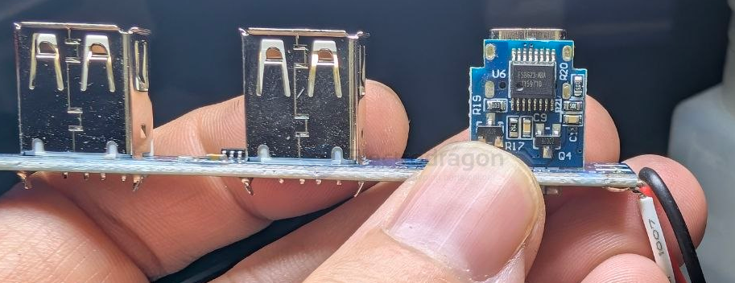

SOT23-5 

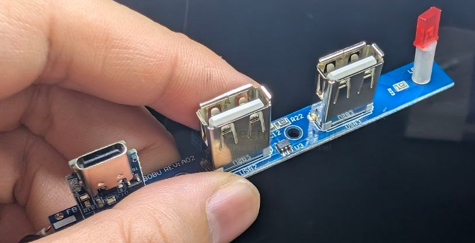

## ref 

