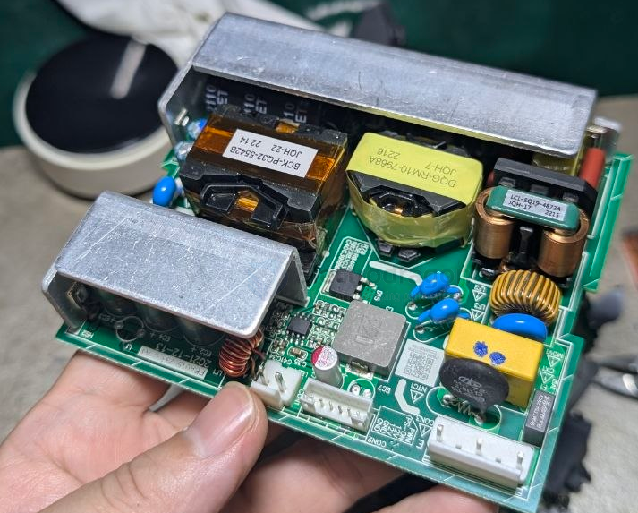
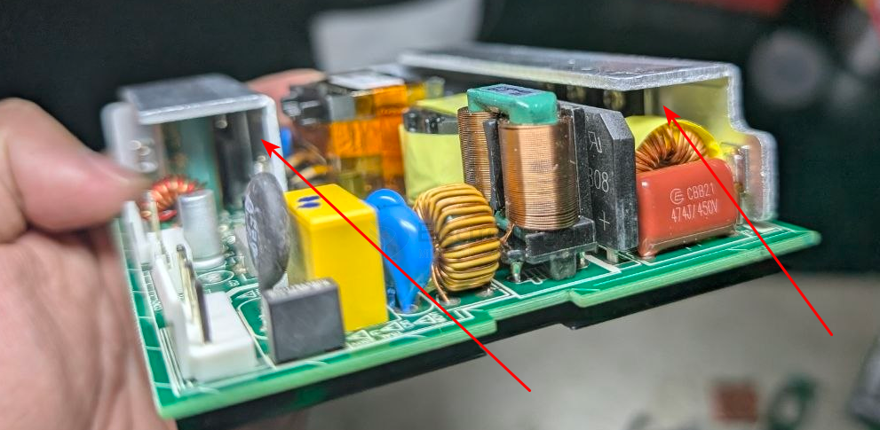
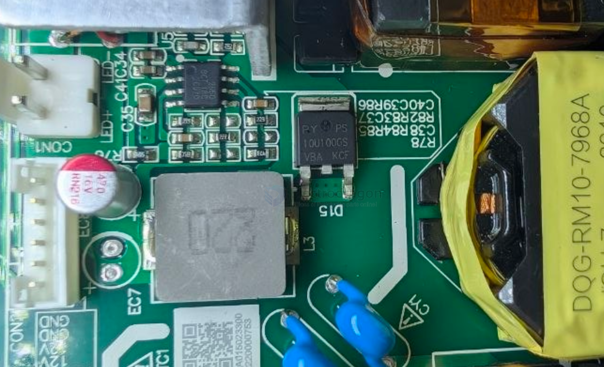
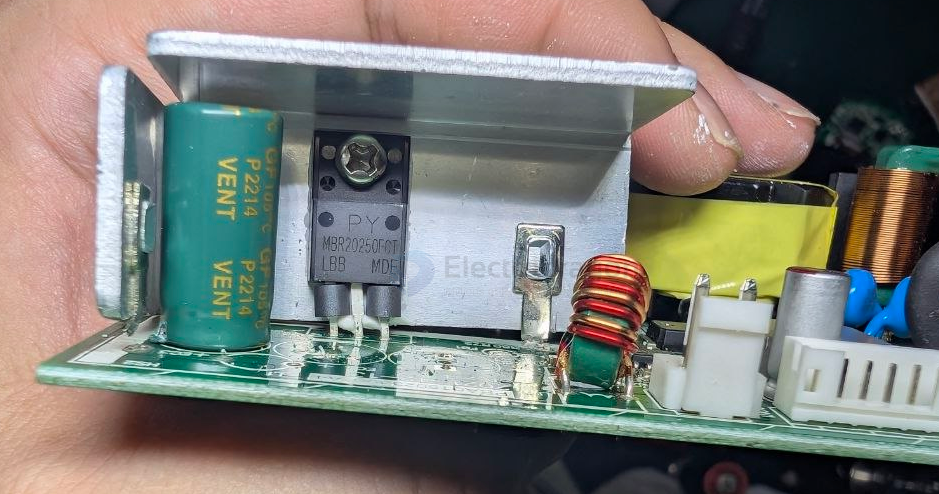
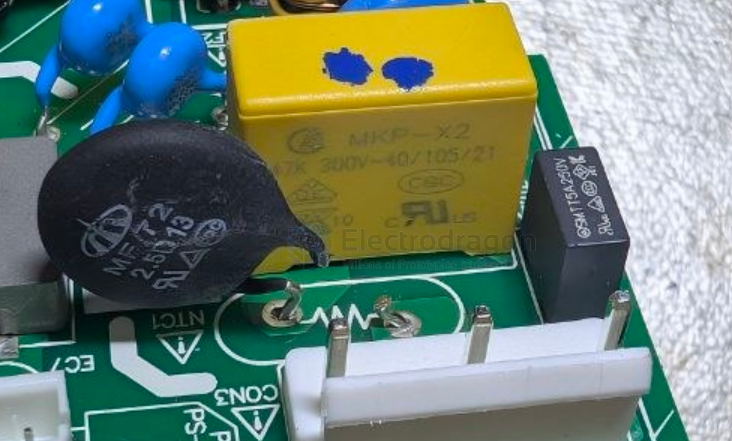
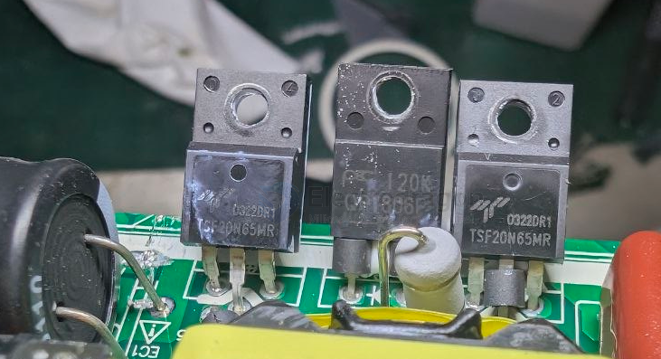
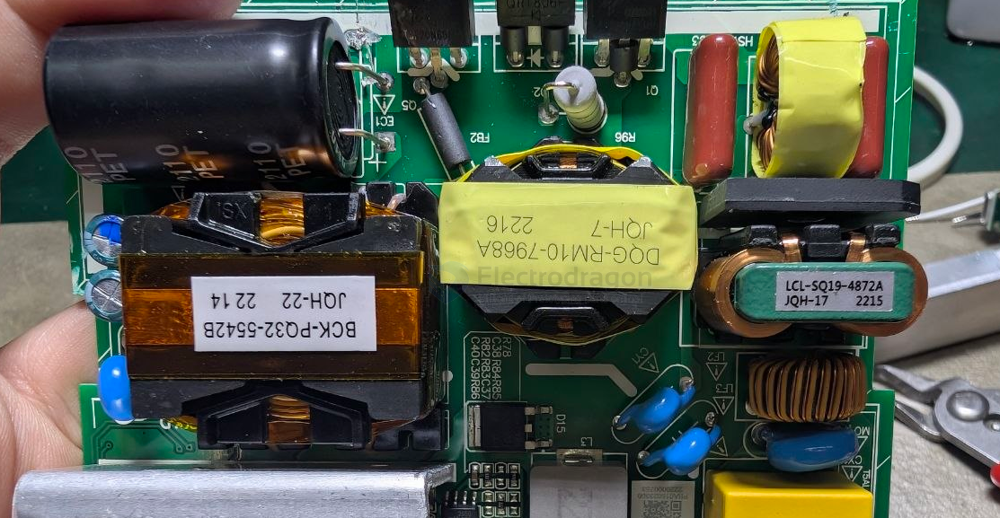
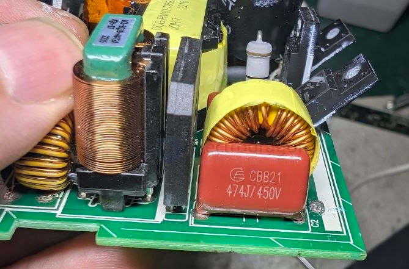
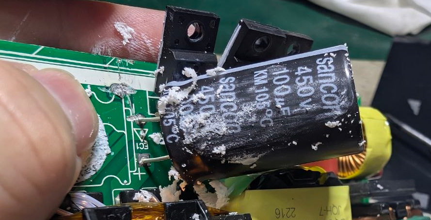
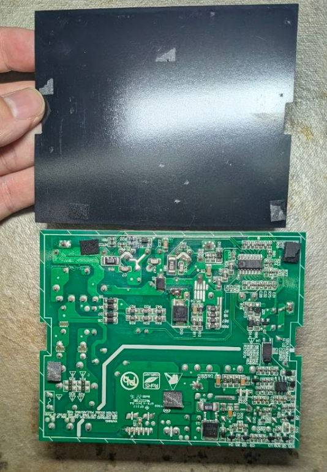

# power-adapter-dat

- [[power-adapter-dat]] - [[power-dat]] 

## chip 

- [[SI6021-dat]] - [[SiFirst-dat]] - [[SI6051-dat]] - [[power-adapter-dat]] - [[acdc-dat]] - [[SI5928-dat]] - [[power-switch-dat]] 

## build 

### build 6

front side 

- [[diode-rectifier-dat]] - [[diode-dat]]

- [[mospec-dat]] - PY - [[MBR20250-dat]] == Schottky Barrier Rectifiers == 20 AMPERES 250 VOLTS - [[power-adapter-dat]]

- [[capacitor-dat]] == 470UF/50V

- [[resistor-ICL-dat]] - [[power-adapter-dat]] == MF72 2.5D13

- [[capacitor-X2-dat]] - [[power-adapter-dat]] == 47K 300V-40/105/21 - [[capacitor-x-y-dat]]

SMTT5A 250V - [[fuse-dat]] - [[power-adapter-dat]]

TSF20N65 - 0322dr1 - [[mosfet-dat]]

JQH-17 2215 LCL-SQ19-4872A

JOH-7 2216 DQG-RM10-7968A

JQH-22 2214 BCK-PQ32-5542B

- [[capacitor-CBB-dat]] == CBB21 - 474J 450V - [[power-adapter-dat]]

- [[varistor-dat]] - 561KD10 - Varistors MOV Disc 10mm, 560V 2.5KA, Bulk - [[power-adapter-dat]]

- [[capacitor-x-y-dat]] - SHM X1400~ Y1250~ B 331K - [[power-adapter-dat]]

- [[capacitor-dat]] - 100UF / 450V - [[power-adapter-dat]]

back side

- [[SCT-dat]] - [[SCT2650-dat]] == STC2650 == 4.5V-60V Vin, 5A, High Efficiency Step-down DCDC Converter with
Programmable Frequency - [[DCDC-down-dat]]

- M20839 unknown 

- [[LM358-dat]] - [[power-adapter-dat]]

- [[mosfet-dat]] - [[NCEpower-dat]] - [[NCEpower-mosfet-dat]] - [[mosfet-dat]] - [[NCE6050-dat]]

### build 5 

- [[wayon-dat]] - [[power-adapter-dat]] - [[power-dat]] - [[acdc-dat]] - [[capacitor-safety-dat]]

- [[wayon-dat]] - [[wayon-mosfet-dat]] - [[mosfet-dat]] - [[WMF10N65C2-dat]]

- [[optical-coupler-dat]]

- [[power-adapter-dat]] - [[PCB-form-dat]]

### build 4 

- [[CRE6255-dat]] - [[CRE6905-dat]] - [[cresemi-dat]] - [[power-adapter-dat]]

- [[transformer-dat]] - [[power-adapter-dat]] - [[power-dat]] - [[acdc-dat]]

### build 3 

- [[ETA8056-dat]] - [[ACDC-dat]] - [[power-adapter-dat]] - [[ETA-solutions-dat]]

ZJNOG ZJN0G unknown 

### build 2 

- [[sheet-dat]] - [[sheet-metal-dat]] - [[power-adapter-dat]]

### build 1

- [[SP6649-dat]] - [[sipex-dat]]

- [[MT1718-dat]]

FS8623

- [[fastsoc-dat]] - [[FS8623-dat]] - [[fast-charge-protocols-dat]] - [[power-bank-dat]] - [[power-adapter-dat]] - [[power-dat]] - [[acdc-dat]]

SOT23-5 

## ref 

