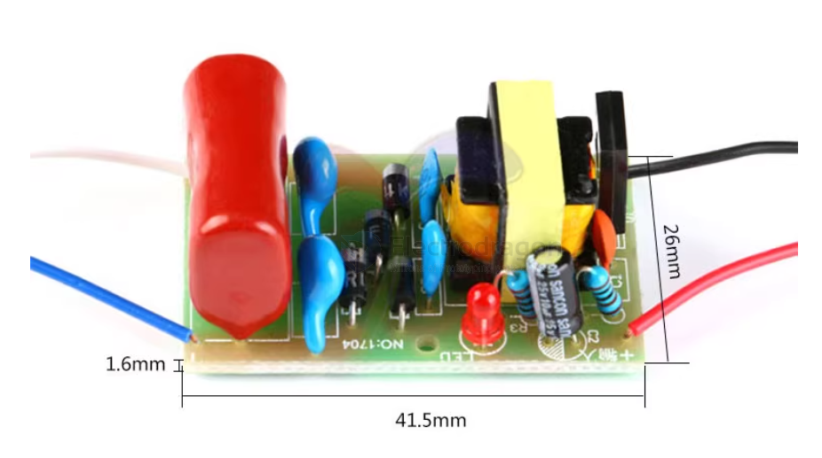

# power-booster-dat

## tech 

- [[DCDC-dat]]

## boards 

- [[ODC1002-dat]]

## board 2 

- 直流 3.7V
- 放电距离max 约1.5MM
- 升压 2000V
- 输入电压 3-4.2V
- 输入电流 约2A
- 空载电流 130MA(4.2V电压下 )
- 外观尺寸 41.5mm X 26mm X 1.6mm
- 输出电压 2000V（电池电压低，输出电压也会变低）

- 3V电压输入时候输出大约1500V，3.7V输入大约输出大约1800V,4.2V输入时候大约输出2000V.
- 输出电路为倍压整流
- 带高压放电电容，2000V223.
- 这款是高电压小电流，小功率的升压模块，如果想增加瞬间放电电流，可在输出并联大容量，高电压的电容（推荐用四只空调压缩机CBB65电容，450V的串联使用，容量大小自己根据需要选择）

注意事项

板子有高压电容，会在使用后可能电容会留有余电高压危险，使用需要注意安全

用途：中学科普实验、电子仪器、负离子发生器、科学小制作等。

看到有朋友购买后测输出电压，普通方用表的是没有这么高电压量程的，直接用1000V档测试，第一测不准确，第二高压可能造成万用表烧坏，可以采用电阻分压测量，用两三个3M欧电阻串联后并联在输出端，用数字万用表测其中一个电阻上的电压，三个电阻串联，测量电压读数乘以三，两个的用测出结果乘以2.指针表因为测量时候表的内阻低，对高压小电流测试会产生较大误差（测试电压偏小），不推荐使用指针表测量