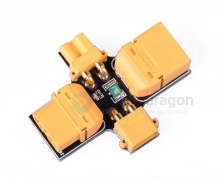

# power-smoke-stopper-dat

- [[power-smoke-stopper-dat]] - [[power-dat]] - [[FPV-build-dat]]

A smoke stopper is a safety device plugged between a LiPo battery and an RC drone or model to prevent electrical shorts from burning out expensive electronics

How It Works

`Current Limitation`: Traditional models use a lightbulb or resettable fuse to limit excess current flow during a short circuit.Smart 

`Cutoff`: Advanced versions (like the VIFLY ShortSaver V2) use electronic fuses to completely cut power within milliseconds.

`Visual Warning`: LEDs or lit bulbs indicate normal status or alert you to an abnormal high-current draw. 

## ref 

