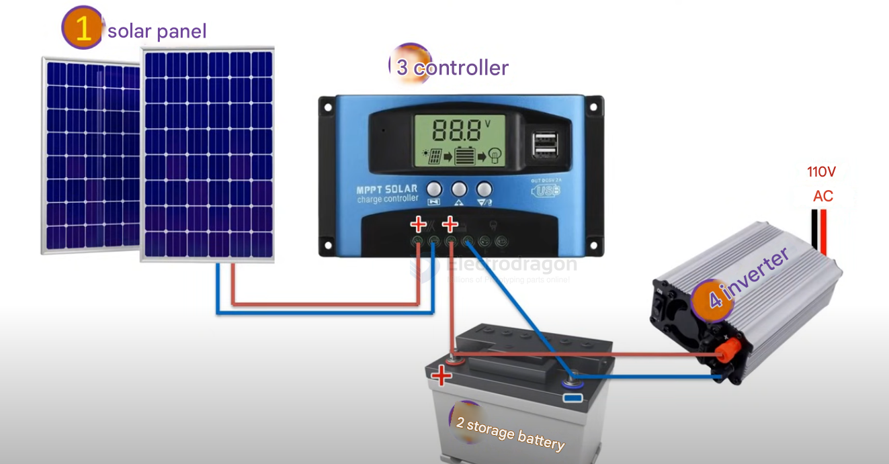
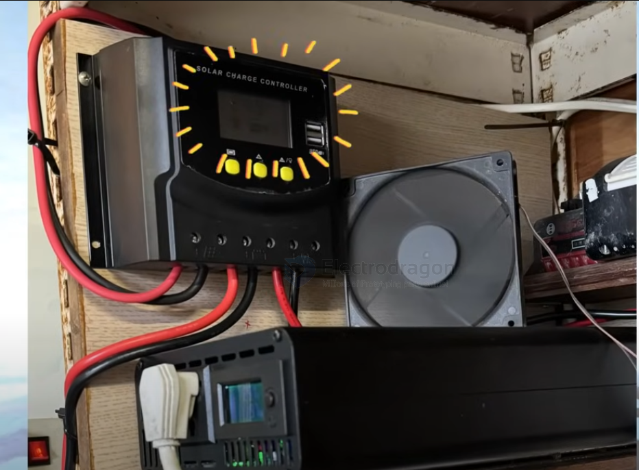

# power-storage-dat

- [[solar-panel-dat]] - [[solar-charge-controller-dat]] - [[battery-dat]] ( [[lead-acid-battery-dat]] )- [[inverter-dat]]

## Building Your Own Solar Power System: A DIY Guide

Power outages, especially during peak consumption periods, can be a significant inconvenience. A personal solar power system offers a reliable backup and a step towards energy independence. This guide will walk you through the components, design considerations, and assembly of a DIY solar power system.

### Understanding the Core Components

A basic solar power system comprises four main components:

1.  **Solar Panels:** Convert sunlight into electrical energy (DC power). 
2.  **Battery:** Stores the energy generated by the solar panels.
3.  **Solar Charge Controller:** Regulates the power from the solar panels to the battery, preventing overcharging and over-discharging.
4.  **Inverter:** Converts the DC power from the battery into AC power, suitable for household appliances.

### System Design and Sizing: A Practical Example

Let's design a system capable of supplying 500 Watts per hour, intended as a backup for temporary power outages (e.g., to keep a refrigerator running for 3-4 hours).

*   **Energy Demand:** A refrigerator consuming ~200W/hour needs 800Wh for 4 hours.
*   **Battery Sizing:**
    *   A 12V 100Ah battery provides 12V * 100Ah = 1200Wh. This is sufficient for the 800Wh demand.
*   **Inverter Sizing:**
    *   Continuous power required: >500W.
    *   Instantaneous peak power: >1kW (or choose based on continuous power needs if clearly specified).
*   **Solar Panel Sizing (to charge a 100Ah battery):**
    *   Assume a 12V 100W solar panel generates ~6A per hour.
    *   With an average of 4 hours of sunshine per day, one panel generates 6A * 4h = 24Ah per day.
    *   Two such panels in parallel would generate 48Ah per day.
    *   This means a 100Ah battery could be fully charged in approximately two days (100Ah / 48Ah/day ≈ 2 days).
    *   *Alternative Charging:* For faster charging or during cloudy weather, a 12V AC charger (e.g., >10A) can be used to charge the battery from mains electricity.
*   **Controller Sizing:**
    *   A 100W 12V solar panel has a maximum current of about 7A (100W / 12V ≈ 8.33A, but often rated lower for charging). If using two panels, the total current would be around 14A.
    *   A 20A MPPT controller would suffice.
    *   For scalability, consider a 40A or 50A controller.

### Connecting Your Solar Power System

**Important:** Ensure correct polarity at all times. Misconnections can damage components.

1.  **Battery to Controller:** Connect the positive (+) and negative (-) terminals of the battery to the corresponding battery terminals on the solar charge controller.
2.  **Solar Panel(s) to Controller:** Connect the positive (+) and negative (-) leads from the solar panel(s) to the corresponding solar panel input terminals on the controller.
3.  **Inverter to Battery:** Connect the positive (+) and negative (-) input terminals of the inverter to the positive (+) and negative (-) terminals of the battery respectively.

### Maintenance for Longevity

Regular maintenance ensures your system operates efficiently and lasts longer.

*   **Solar Panels:**
    *   Regularly clean the surface to remove dust, bird droppings, leaves, etc., using a soft brush or water. Avoid corrosive cleaners or scratching the surface.
    *   Check the stability of mounting structures and ensure bolted joints are secure and not corroded.
    *   Ensure panels are not shaded by plants or buildings.
*   **Controller and Inverter:**
    *   Periodically check their operation and any display data.
    *   Ensure vents are not blocked to maintain good heat dissipation.
    *   Clean the exterior to prevent dust accumulation.
*   **Cables and Connectors:**
    *   Regularly check for loose connections, corrosion, or damage.
*   **Battery:**
    *   Monitor its status. Avoid over-discharge or leaving it in a low battery state for extended periods.
    *   Check terminals for leakage, expansion, or corrosion.
    *   Ensure the battery is installed in a well-ventilated area to avoid overheating.

### Conclusion

Building your own solar power system can be a rewarding project, providing energy independence and a reliable power backup. With careful planning and attention to detail, you can create a system tailored to your needs.

If you have any questions or ideas, feel free to discuss them!

## ref 

- [[power-storage]]