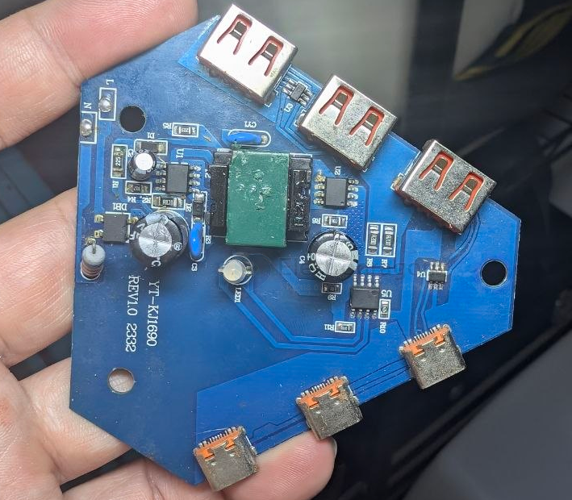
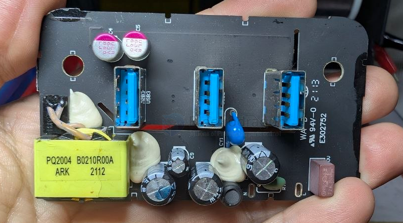
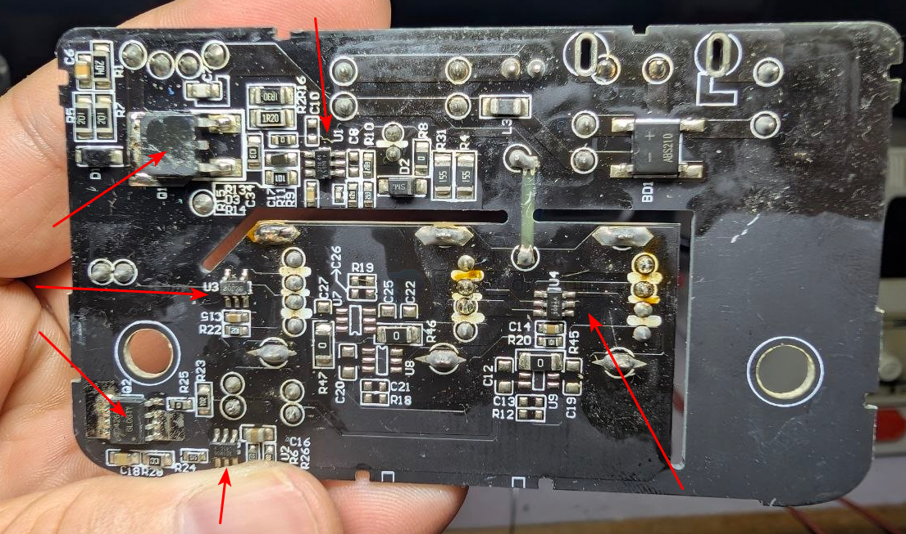

# power-usb-charger-dat

- [[OPM1160-dat]]

- [[fast-charge-protocols-dat]] - [[power-usb-charger-dat]] - [[power-bank-dat]]

- [[ACDC-dat]]

## build 

build 2 == [[hcwsemi-dat]] - [[power-usb-charger-dat]] - [[LM358-dat]]

build 1 

- [[cellwise-dat]] - [[CW3004-dat]] - [[fast-charge-protocols-dat]]

- [[CW3002-dat]] - [[power-usb-charger-dat]] 

- [[mosfet-dat]] - [[AOSMD-mosfet-dat]]

- unknown chip - 371L44 979 SOT23-6

## ref 