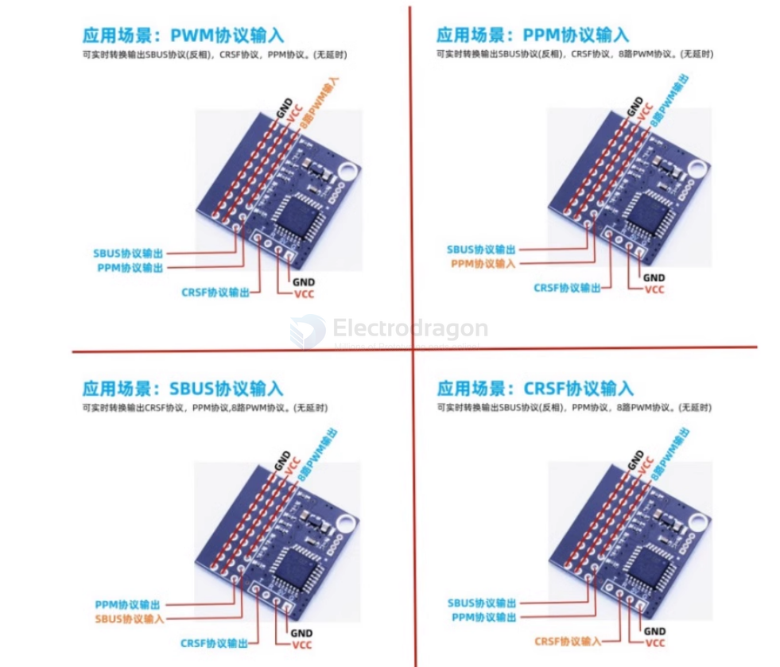

# ArduPilot-dat

## Radio Control Systems

- [Radio Control Systems](https://ardupilot.org/rover/docs/common-rc-systems.html)

Compatible RC Protocols

ArduPilot autopilots are compatible with the following receiver output protocols:

PPM-Sum receivers - [[PPM-dat]]

SBus receivers - [[SBUS-dat]]

Fast SBus (from DJI HDL video/RC systems)

i-BUS receivers - [[IBUS-dat]]

FPort Receivers

Spektrum SRXL2,DSM, DSM2, and DSM-X Satellite receivers

Multiplex SRXL version 1 and version 2 receivers

CRSF receivers (including ExpressLRS systems) - [[ELRS-dat]] - [[CRSF-dat]]

mLRS (with telemetry) (MAVLink)

Graupner SUM-D

IRC Ghost

DroneCAN peripherals can decode these RC protocols on a peripheral and pass to the autopilot

MAVLink connected RC (not to be confused with MAVLink RC Overrides used for CS joystick control of RC functions)

Parallel PWM outputs encoded to PPM-Sum using an external encoder (see below, not supported on many autopilots now)

## specs 

| Original Manu   | Range  | Telemetry       | Telem Speed | TX Display  | RC Protocol          | Notes |
| --------------- | ------ | --------------- | ----------- | ----------- | -------------------- | ----- |
| Flysky          | Short  | Yes             |             | yes         | i-BUS/SBUS           | 7     |
| FrSky X series  | Short  | Bi-dir          | Medium      | yes         | PPM-SUM/SBUS/ FPort  | 2     |
| Futaba          | Short  | No              |             |             | SBus                 |       |
| Graupner        | Short  | Yes             | Medium      | yes         | SUM-D                |       |
| Multiplex       | Short  | No              |             |             | SRXL                 |       |
| Spektrum        | Short  | Vendor Specific |             | yes         | DSM/DSM2 DSM-X/ SRXL |       |
| FrSky R9 series | Medium | Bi-dir          | Medium      | yes         | PPM-SUM/SBUS/ FPort  | 2     |
| IRC Ghost       | Medium | Vendor Specific |             | yes         | IRC Ghost            |       |
| [[CRSF-dat]]    | Long   | Bi-dir          | Variable    | yes         | SBUS/CRSF            | 3     |
| DragonLink      | Long   | Bi-dir          | 56K         | via MTP/LUA | PPM_SUM/SBUS         | 1     |
| [[ELRS-dat]]    | Long   | Bi-Dir          | Variable    | optional    | SBUS/CRSF Mavlink    | 4     |
| HereLink        | Long   | Bi-dir          | 56K         | integrated  | SBUS                 | 8     |
| mLRS            | Long   | Bi-dir          | 12K - 91K   | via LUA     | SBUS/CRSF            | 5     |
| SIYI            | Long   | Bi-dir          | 56K         | integrated  | SBUS                 | 8     |

Note 1: DragonLink provides a 56Kbaud transparent link for telemetry, allowing full MAVLink telemetry to/from the vehicle from the transmitter module. Dragonlink is an add-on module to the transmitter, such as an FRSky Taranis or RadioMaster T16. See DragonLink RC Systems. MTP (Mavlink to Passthru) converters are available to allow direct display of MAVLink Telemetry data on OpenTX transmitters using Yaapu Telemetry LUA Script.

Note 2: See Yaapu FrSky Telemetry Script for OpenTX. The ability to change parameters over FRSky telemetry from an Open TX compatible transmitter in addition to displaying the telemetry data is possible. Most FRSky compatible transmitters use OpenTX. Note that R9 systems are not quite Long Range, but much further range than normal FRSky systems, themselves at the very high end of the Short Range category at 1.6-2km range.

Note 3: ArduPilot provides a means to send its telemetry data via CRSF such that it can be displayed on OpenTX transmitters using the Yaapu Telemetry LUA Script. The ability to change parameters over CRSF telemetry from an Open TX compatible transmitter in addition to displaying the telemetry data is also possible. See TBS Crossfire Telemetry

Note 4: ELRS (ExpressLRS) is a flexible open-source system that can output CRSF, SBUS, or MAVLink (with embedded RC) protocols. Telemetry requires the use of CRSF or Mavlink, and the receiver must be wired to a full UART. See ExpressLRS site <https://www.expresslrs.org/> and TBS CRSF/ ELRS for more information.

Note 5: The mLRS project is firmware designed specifically to carry both RC and MAVLink. The usable telemetry speed varies by the chosen mode and is managed via RADIO_STATUS flow control. It uses the CRSF (TBS Crossfire) RC protocol on both the receiver and Tx module. It also integrates full MAVLink telemetry via serial connections on the Tx module and the receiver.

Note 6: Vendor Specific Telem means that they accomodate sensor additions to the vehicle and can display the information on certain Vendor specific TXs but do not send ArduPilot telemetry from the vehicle to ArduPilot compatible GCS or OpenTX display scripts.

Note 7: The receiver must support i-BUS telemetry (look for a SENS port on the receiver or check the product specifications).

Note 8: These systems have integrated HD video transmission from Ethernet or HDMI camera systems in addition to RC control and vehicle telemetry.

## protocol converter 

## ref 

- [[ardupilot-dat]] - [[FPV]]