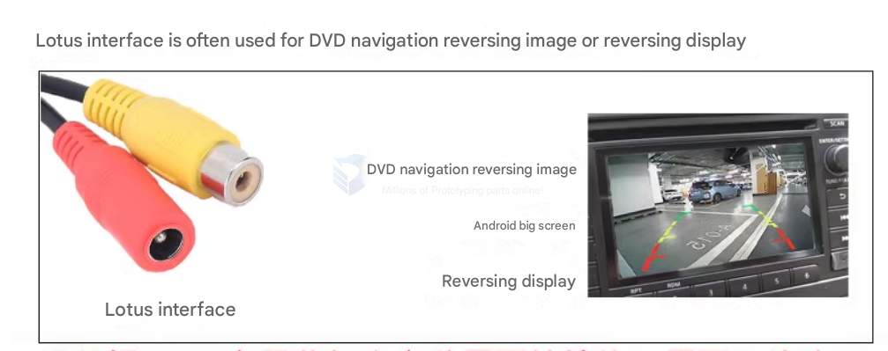
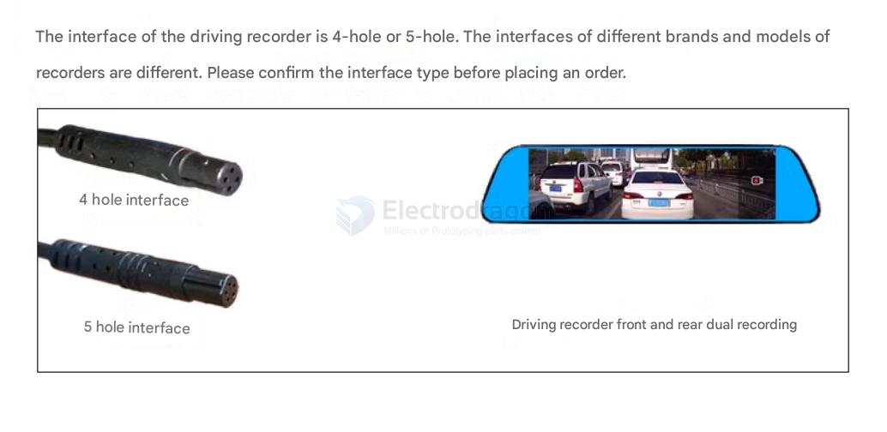

# recorder-dat

## APPs 

- Surveillance Camera / CCTV Camera / Security Camera / IP Camera

## interface 

### DC Power and BNC Connector (Analog CCTV Cameras)

lotus interface == [[BNC-dat]]

4-hole connectors may refer to DC power connectors (e.g., 2.1mm/5.5mm DC Jack for power) combined with BNC for video.

Often used in analog surveillance cameras.

### Aviation Connector (M12, GX12, GX16, GX20)

- 4 or 5 hole interface == [[GX12-dat]]

Often used in CCTV and IP cameras, especially for weatherproof or industrial-grade applications.

4-pin, 5-pin, and more variations exist.

Also called aviation plugs or circular connectors.

Example: GX12-4, GX16-5 (where the number after the dash indicates pin count).

### M12 Industrial Connector (A-coded, D-coded, X-coded)

[[M12-dat]] 4-pin or 5-pin connectors are common in IP67/IP68-rated outdoor cameras.

Found in Ethernet-based surveillance cameras (e.g., PoE cameras).

Example: M12 A-coded 4-pin for power & data.

### RJ45 with PoE (IP Cameras)

If the camera is [[PoE-dat]] (Power over Ethernet), the RJ45 (Ethernet) connector might be used, sometimes with a waterproof 4-pin or 5-pin adapter.

## Surveillance Camera Extension Solutions (100m - 1000m)

If you need to **extend a surveillance camera connection** up to **100 meters or even 1000 meters**, here are the best solutions:

### Solutions for Up to 100 Meters:
#### 1. Ethernet (PoE – Power over Ethernet)
- Uses **Cat5e/Cat6 cables**.
- Maximum length: **100 meters** per standard.
- Uses **PoE switches/injectors** to power the camera.
- If you need more than **100m**, use:
  - **PoE Extenders** (each adds ~100m).
  - **Fiber optic converters** for longer distances.

#### 2. HD-TVI / HD-CVI / AHD over Coaxial Cable

- [[coaxial-cable-dat]]

- Uses **RG59 or RG6 coaxial cable**.
- Can reach up to **300-500 meters** without signal loss.
- Requires **baluns or signal boosters** for longer distances.

### Solutions for 1000 Meters (1 km) and Beyond:
#### 1. Fiber Optic Transmission
- **Best for long distances** (up to 20-40 km).
- Uses **fiber optic converters** on both ends.
- Supports **IP cameras, analog cameras, and PoE**.
- Requires **fiber optic cables (single-mode or multi-mode)**.

#### 2. Wireless Point-to-Point Transmission
- Uses **wireless bridges** (e.g., **Ubiquiti AirFiber, TP-Link Pharos**).
- Can extend cameras up to **several kilometers**.
- Best for locations where running cables is difficult.

#### 3. Coaxial with Signal Amplifiers
- For **HD-TVI, HD-CVI, AHD** cameras, **coaxial amplifiers** can push the range up to **1000 meters**.

### Best Choice Based on Distance:

| Distance       | Best Solution                        |
| -------------- | ------------------------------------ |
| **<100m**      | PoE over Ethernet                    |
| **100-500m**   | Coaxial HD-TVI/CVI/AHD with boosters |
| **500m-1000m** | Fiber optic or wireless transmission |
